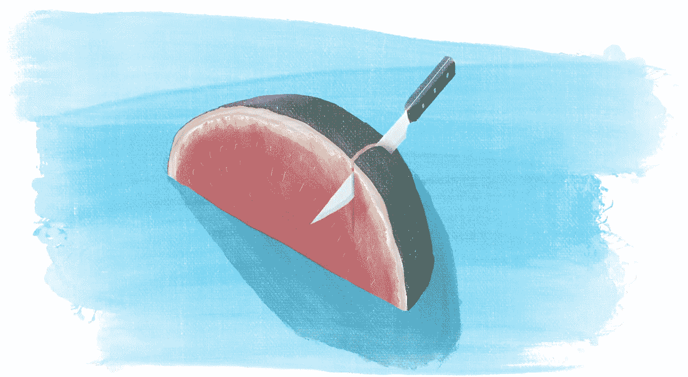

# HTML + CSS 项目:网站切片

> 原文：<https://javascript.plainenglish.io/html-css-project-website-slicing-501b037d572a?source=collection_archive---------4----------------------->

## 在一个简单的项目中集成前端的可视部分。

Illustration by the author

让我们从跟随课程和做在线练习中休息一下:相反，让我们从零开始做一个项目！当你开始学习前端技术时，HTML 变得清晰最快，其次是 CSS——而 JS 本身就是一个大旅程。这里我们将 JS 的挑战留到以后，我们将重点关注在一个简单的项目中集成前端的可视部分。

# 为什么你应该做项目

参与项目是一项很好的锻炼，它让你在更接近真实工作的环境中练习技能。项目:

*   专注于结果:人们期望你完成的事情；
*   将技术作为实现目标的工具:这迫使你专注于重要的事情；和
*   通常比你在课程或书中发现的挑战要大得多。

项目允许你运用你的技能去创造一些有意义的东西。它们让你对自己的技能有信心，它们是你可以炫耀的有形的东西，让别人知道你能做什么。从课程中获得基础知识后，项目是提高技能的重要一步。

# 什么是切片？

切片就是把一个设计变成一个网站。你得到一个图形设计者的输出，很可能是 PSD 文件或 Figma 设计的形式，然后你用这个外观制作一个 HTML + CSS 网站。它需要你一直在使用的调整网站元素外观的所有技能，加上建立网站的主要结构——保持页眉、页脚和菜单在适当的位置。

# 模板来源

对于一个锻炼项目，你不需要一个定制的设计-你只需要一些设计。幸运的是，在一些网站上，人们分享免费的设计文件，你可以用在你的项目中:[例 1](https://freebiesbug.com/psd-freebies/website-template/) ，[例 2](https://www.templatefreebies.com/?s=template) 。

确保检查您使用的文件的许可。许可证可能会要求您:

*   向设计的作者致谢
*   在同一许可证上发布您的作品。

不管许可证是什么，你都可以在本地玩这个设计，但是最好确保你也可以公开分享你的作品。

# Git & GitHub

当你在做你的项目时，你可以在 GitHub 上分享它。如果你碰巧和一位导师一起工作，这是让你的努力得到一些关注和得到反馈的好方法。如果你还没有使用 GitHub，那么在你开始学习编程的时候注册是有意义的。

# 用自述文件描述您的项目

你的项目的另一个很好的补充是分享关于它的上下文的信息。这样做的标准地方是一个自述文件，你可以按照[这个指南](https://how-to.dev/the-readme-file-how-to-help-others-understand-your-project)让它脱颖而出。

# 部署到 GitHub 页面

有了 GitHub，你可以让你的项目很容易地被 GitHub 页面测试。你可以在这里了解更多[。](https://pages.github.com/)

有没有 HTML + CSS 的项目？分享到评论里，让我和其他读者看一看！

*最初发布于*[*https://how-to . dev*](https://how-to.dev/html-css-project-website-slicing)*。*

*更多内容看* [***说白了。报名参加我们的***](https://plainenglish.io/) **[***免费周报***](http://newsletter.plainenglish.io/) *。关注我们关于* [***推特***](https://twitter.com/inPlainEngHQ) ，[***LinkedIn***](https://www.linkedin.com/company/inplainenglish/)*，*[***YouTube***](https://www.youtube.com/channel/UCtipWUghju290NWcn8jhyAw)*，以及* [***不和***](https://discord.gg/GtDtUAvyhW) *。对增长黑客感兴趣？检查* [***电路***](https://circuit.ooo/) *。***