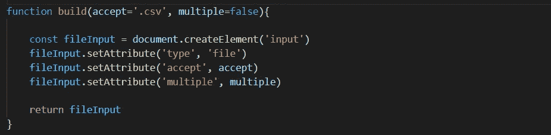
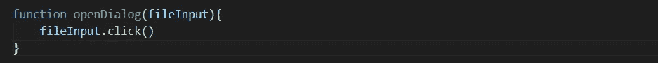

# 用 JavaScript 简单地个性化你自己的用户界面

> 原文：<https://javascript.plainenglish.io/html-input-type-file-personalize-your-own-ui-simply-with-javascript-1a9eea459a74?source=collection_archive---------5----------------------->

## 不要使用 HTML ，只使用 JavaScript 来个性化你的 UI。

在 HTML 的历史上，HTML `input type=“file”` UI 一直是个令人厌烦的东西。的确，今天存在一些你可以使用的 CSS 库或 JS 框架。但是，完全自由地个性化你的输入用户界面怎么样？在本文中，我将向您展示如何用 JavaScript 简单地做到这一点。

## 步骤 1:创建 HTML 输入

我使用`document.createElement()` *+* `element.setAttribute()` 创建一个 HTML `input type=“file”`，接受多个 CSV 文件作为输入。



build the HTML input

## 步骤 2:打开文件对话框

`function openDialog()` 模拟用户 onclick 事件。我用`element.click()`来做。



open file dialog

## 第三步:最终用户会看到什么

最终用户会看到你想要的东西(按钮、图标等)。).你只需要一个 HTML 元素来定位`fileInput`。我选择一个图标。

```
<i class=”material-icons” onclick=”openFileSystem()”>open-folder</i>function openFileSystem(){const fileInput = build()fileInput.openDialog()}
```

就是这样！只需在`fileInput`上添加 onchange 事件处理程序来读取选中的文件。

```
fileInput.onchange=()=>{…return fileInput.files}
```

这个题目到此为止。感谢您的阅读。

*更多内容看* [***说白了就是***](https://plainenglish.io/) *。报名参加我们的* [***免费每周简讯***](http://newsletter.plainenglish.io/) *。关注我们*[***Twitter***](https://twitter.com/inPlainEngHQ)*和*[***LinkedIn***](https://www.linkedin.com/company/inplainenglish/)*。加入我们的* [***社区不和谐***](https://discord.gg/GtDtUAvyhW) *。*