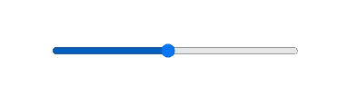
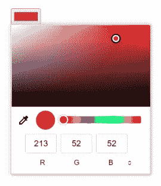
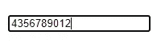
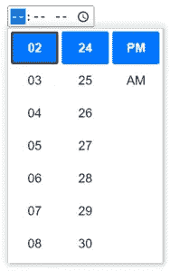
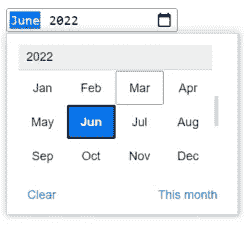
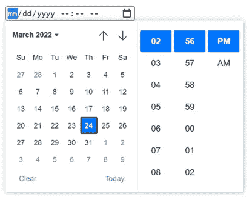
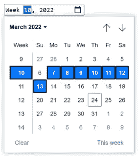

# 你不知道的 HTML 输入类型

> 原文：<https://javascript.plainenglish.io/html-input-types-you-dont-know-about-e885142a0506?source=collection_archive---------12----------------------->

## 让我们学习一些新的和令人惊奇的 HTML 输入类型


Photo by [Erik-Jan Leusink](https://unsplash.com/@ejleusink?utm_source=medium&utm_medium=referral) on [Unsplash](https://unsplash.com?utm_source=medium&utm_medium=referral)

作为 web 开发人员，我们都知道 HTML 对我们的 Web 应用程序有多重要。没有 HTML，我们将无法构建我们的网页。

当我们开发一个网页时，大多数时候我们需要用户提供一些信息。例如用于登录页面。通常，登录页面有两个输入，用户名和密码，用户必须输入才能继续。这些是简单的文本输入。但是可能会有一些需要，我们需要向用户询问不同类型的输入。

多亏了 HTML `input`元素，它接受多种类型的数据。在这篇文章中，我们将讨论 HTML 为我们的日常工作提供的一些输入类型。

## 1.范围

这种`input`类型允许用户从给定的范围内选择一个数值。用户不必手动输入数值，但他们可以使用滑块从指定的范围内选择一个值。

```
<input type="range">
```



Output

0 到 100 是范围`input`类型的默认范围。但是，您可以使用下面的属性来限制允许的数量。

*   **max** : 指定允许的最大值
*   **最小值** : 指定允许的最小值
*   **步骤**:指定合法的编号间隔
*   **值**:指定默认值

有关范围`input`类型及其支持的属性的更多信息，请访问此。

## 2.颜色

该输入类型为用户提供了从调色板中选择或挑选颜色的界面，或者用户甚至可以以`#rrggbb`十六进制格式输入颜色值。

```
<input type="color">
```



Output

虽然 CSS 颜色提供了各种格式，比如颜色名称、函数符号和带有 alpha 通道的十六进制格式；使用颜色`input`类型时，只允许纯色(没有 alpha 通道)。

更多关于颜色`input`类型及其支持属性的信息，请[访问此](https://developer.mozilla.org/en-US/docs/Web/HTML/Element/input/color)。

## **3。电话**

这种输入类型允许用户输入甚至编辑电话号码。与`<input type=”email”>`和`<input type=”url”>`不同，在电话`input`类型中输入的值不会以特定格式自动验证，因为不同国家的电话号码格式可能大不相同。

*“不支持‘电话’的浏览器退回到标准的‘文本’输入。”*

```
<input type="tel">
```



Output

有关 tel `input`类型及其支持属性的更多信息，请访问此。

## 4.时间

此输入类型为用户定义了一个输入字段，用户可以在其中输入或选择小时、分钟和可选的秒格式的时间。此输入类型不基于任何特定时区。

```
<input type="time">
```



Output

有关时间`input`类型及其支持的属性的更多信息，请访问此。

## 5.月

该输入类型为用户定义了一个输入字段，用户可以在此输入或选择`yyyy mm`格式的年和月。

```
<input type="month">
```



Output

有关月份`input`类型及其支持的属性的更多信息，请访问此。

## 6.当地日期时间

此类型创建用于输入日期和时间的输入控件，包括年、月和日，以及以小时和分钟表示的时间。

```
<input type="datetime-local">
```



Output

有关 datetime-local `input`类型及其支持的属性的更多信息，请访问此。

## 7.周

这种类型表示它是一周输入的字段。这些字段可以在支持浏览器中用小部件来表示，这些小部件允许用户以图形形式(如日历)修改它们的值，而不必以字符串形式输入。

```
<input type="week">
```



Output

有关周`input`类型及其支持属性的更多信息，请访问此。

还有一些输入类型对我们非常有用。这些措施如下:

*   [**隐藏**](https://developer.mozilla.org/en-US/docs/Web/HTML/Element/input/hidden) :对用户隐藏数据
*   [**重置**](https://developer.mozilla.org/en-US/docs/Web/HTML/Element/input/reset) :定义一个重置按钮，将所有表单值重置为初始值
*   [**日期**](https://developer.mozilla.org/en-US/docs/Web/HTML/Element/input/date) :创建一个输入字段，让用户选择或输入特定格式的日期
*   [**url**](https://developer.mozilla.org/en-US/docs/Web/HTML/Element/input/url) :创建一个输入字段，用于输入和编辑 url

这就是这篇文章的内容。我希望你今天学到了一些新东西。您可以在[媒体](https://gouravkajal.medium.com/membership)上[关注我](https://gouravkajal.medium.com/)或者在 [LinkedIn](https://www.linkedin.com/in/gouravkajal/) 上与我联系。想看更多这样的文章，敬请期待！

感谢阅读！

*更多内容看* [***说白了。报名参加我们的***](https://plainenglish.io/) **[***免费每周简讯***](http://newsletter.plainenglish.io/) *。关注我们* [***推特***](https://twitter.com/inPlainEngHQ) *和*[***LinkedIn***](https://www.linkedin.com/company/inplainenglish/)*。加入我们的* [***社区不和谐***](https://discord.gg/GtDtUAvyhW) *。***