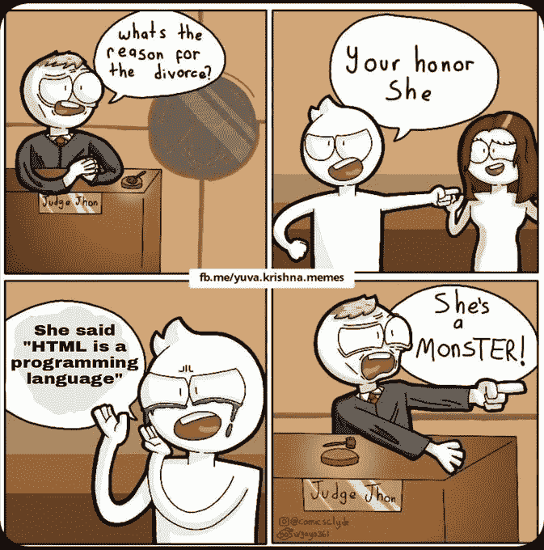
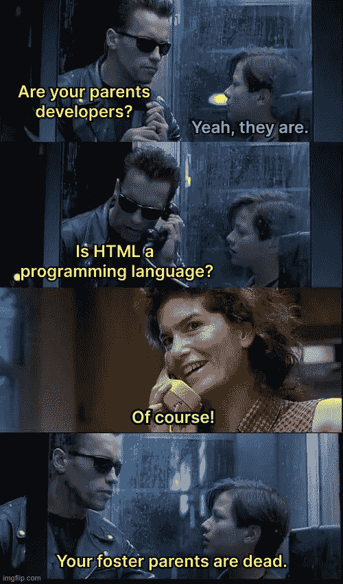
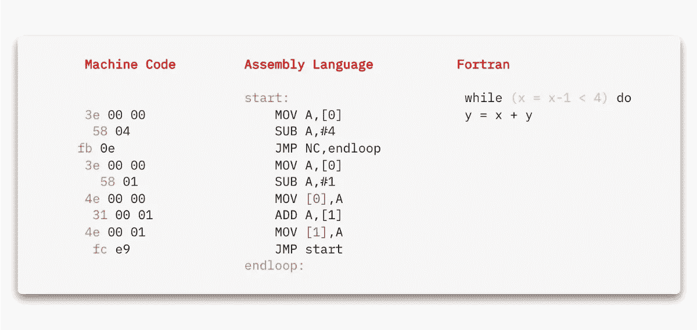

# HTML 是一种编程语言——证明我错了！

> 原文：<https://javascript.plainenglish.io/html-is-a-programming-language-prove-me-wrong-7c1ab0c9b8f9?source=collection_archive---------7----------------------->

HTML 过去、现在和将来都是一种编程语言。

[📷](https://unsplash.com/@vorosbenisop)

这是温暖的一天清晨的愉快感觉。我坐在书桌旁，听着外面鸟儿啁啾。

一切都很好，直到我看到一条推文。

***HTML 是一种非编程语言——*证明我错了！**

这不是我第一次看到这样的声明，但这些回复让我大吃一惊。

一些人嘲笑 HTML 的存在——一些人说它是最没用的东西。

我们似乎生活在一个人们只是根据感觉编造自己的事实的世界里。

HTML 和 CSS 是有价值的技能。专门了解它们的人和了解 JavaScript 或任何其他语言的人一样有价值。

人们认为他们知道自己在做什么。他们认为他们知道什么是编程——这就是编程；那不是编程。

作为一个有创造力的人，最危险的想法就是认为自己知道自己在做什么。因为一旦你认为你知道你在做什么，你就不再四处寻找其他的做事方式——你就变成了*盲人*。

# 有没有想过？

我们将进入一场永不过时的辩论——HTML 是(或不是)一种编程语言。

生活中的事情不是二元的——它更多的是一种灰色阴影。

当我们想到编程语言时，我们会想到 JavaScript 或 Python。我们从来没有想到 CSS 或 HTML——是吗？

有什么区别？我们真的知道: ***什么是编程语言吗？***

维基百科说: ***编程语言是一种正式语言，由一组产生各种输出的指令组成。***

*CodeAcademy 说:****编程语言由我们用来编写指令供计算机遵循的工具组成。***

这两个听起来都是相当全面的定义，对吗？

包容性足以将 HTML 视为一种编程语言。

当你问社区里的人时，你不会听到这些定义。对于什么是编程语言，他们都有自己的定义——他们会告诉你为什么 HTML 不是编程语言。

当你问三个不同的程序员原因时，他们会给你五个不同的，有时是相互矛盾的原因。

您会遇到类似这样的陈述:

# 这个词本身说的是标记语言——是标记语言，不是编程语言！

TeX 和 [LaTeX](https://www.quora.com/Is-LaTeX-a-programming-language) 是标记语言的例子，也被认为是编程语言。

用它们开发可能不实际，但有可能。我们可以在网上找到例子，比如基本的解释器或者火星探测器控制器。

说 HTML 不是编程语言*因为*它是一种标记语言是基于一个错误的陈述，无论你从这个前提得出什么结论都是绝对错误的。

# 你不能做出合乎逻辑的决定

HTML 不是一种编程语言，因为它缺乏逻辑，是一种误导。

我们知道 HTML 确实能够根据用户输入做出决定。HTML 有逻辑，但它本质上不同于其他设计用来操作数据的语言的逻辑。

我们需要一个更强有力的论据来证明 HTML 不是一种编程形式。

# 我们不能用它来解决问题！

在教授编程语言时，我们经常要求人们在命令行上实现井字游戏。

这类问题对于教人们如何用编程语言写作是有用的，但我们不是在那里用编程语言来解决“编程问题”——我们也可以用四行和一支铅笔来解决“实施井字游戏”，这不算编程语言。

这是一个非常模糊的论点。

有些人认为，只有当某种东西可以用来解决编程问题时，它才算编程语言。

我们经常把接受终端用户输入的应用程序的开发算作*编程问题。*我们将算法实现视为一个*编程问题。*

但当涉及到应用布局或设计时，我们通常不会将那些算作编程问题——为什么？而且，我们不把我们用来执行它们的工具算作编程语言。

数据结构使用和类设计——比如继承——经常被归类为编程问题，直到我们谈到 CSS 类和混合。

CSS 采用了继承和类设计原则，但是 CSS 作为一种编程语言并没有得到普遍的认可——为什么？

当你挖得足够深时，你会注意到每一个论点似乎都带有某种偏见。

# 伙计，这不是图灵完成！

人们鹦鹉学舌“HTML 不是图灵完全的”甚至不知道或不理解图灵完全是什么意思。

因为大多数现代编程语言都是图灵完备的，所以人们把它作为编程语言的定义。

但是图灵完备性不是这样。它是识别一个系统(或其规则集)是否能模拟一个[图灵机](https://en.wikipedia.org/wiki/Turing_machine)的标准。

*它可以用来对编程语言进行分类——它并没有定义它们。*

反正有了 CSS，HTML 就成了图灵完全语言——这是毫无疑问的。

Some insightful points covered

# 如果你说是，你就是对的，如果你说不是，你就是对的！

这种争论，像许多其他永恒的争论一样，更多的是一种语境冲突。这里没有谁对谁错。更多的是一个人的信仰和另一个人的信仰。

背景很重要，尤其是在不同领域中建模相似性和差异性的时候。

## ***我说的上下文是什么意思？***

我成长的地方是一个*背景*。

我居住的城市是一个*背景*。

我工作的行业是一个*语境*。

我工作的软件类型是*上下文*。

我在成长过程中学习的语言是一种语境。

我们需要认识这些描述符，因为它们传达并表征了我们的视角。

那些关于我们的事会影响我们如何看待每件事。

我*看待事物的方式可能很难与真理分开，因为它是我 视为真理的 ***。****

*当我们意识不到我们所处的环境时，我们可能会意外地将我们的具体情况、我们的视角误认为适用于所有人的假想的一般情况——一个假想的事实。*

*大多数争论 HTML 是否是编程语言的人这样做是因为他们的背景。*

*很少有人这样做是为了贬低别人的技能，让自己感觉更好。*

# ***变化是唯一不变的***

*编程是什么(或不是什么)的定义随着时间而变化。*

*编程没有真正的定义。没有什么是通用的或一成不变的。*

*一开始，我们用绝对二进制编程。*

*多年后我们开发了一个*符号* *汇编程序*，但大多数程序员还是继续用绝对二进制编程编码。*

> *在[汇编程序]第一次出现的时候，我猜想大约有 1%的老程序员对它感兴趣——使用[汇编程序]是“娘娘腔的东西”,一个真正的程序员不会堕落到浪费机器容量来进行汇编。*
> 
> *—理查德·海明，《做科学和工程的艺术》*

*一段时间后，Fortran 出现了，这是一种高级语言，你可以写出你的公式，就像你在写数学符号一样，你还可以写出循环。*

*这个给汇编程序员看了，他们又一次不感兴趣。他们认为这没有任何价值。他们就是不接受。*

**

*People who wrote machine code didn’t accept AL as a programming language, and those who wrote in AL felt the same way about Fortran.*

*我们不需要追溯到很久以前，就能回忆起开发人员(主要是后端)将前端编程(包括 JavaScript 和 PHP)斥为“不是真正的编程”的时候。*

*时不时还能听到，但已经褪色了，含糊不清，喃喃自语。*

# *我们真的知道自己在做什么吗？*

*一旦你相信你知道你在做什么，你就不再四处寻找做事情的其他方式——你变得*盲目*。*

*我认为第一步是你必须对自己说，“我不知道我在做什么。”*

> *只有头脑才是真正能够独立的，从不属于任何团体、任何党派、任何团体、任何教条、信仰、结论的意义上来说，只有这样的头脑才是有创造力的。*
> 
> *—J·克里希那穆提*

*我们作为一个领域不知道我们在做什么。*

*我觉得你要说，“*我们不知道什么是编程*。我们不知道*计算*是什么。我们甚至不知道什么是*电脑**

****我不是提倡无知。我在暗示一种知情的怀疑主义——一种谦逊。****

*一旦你真正明白这一点——你是自由的——你可以想任何事情。*

*我们在自己周围建造的观点之墙也会成为我们创造力的障碍——它会有效地扼杀我们所有的创造力。*

# *结论*

*我的天 Som，请告诉我，HTML 到底是不是编程语言？*

*这是个错误的问题，我的朋友。正确的问题是问自己能用它做什么。*

*当我们甚至不知道某个术语是什么意思的时候，把它归类为编程语言是荒谬的。*

> *对一流智力的测试是同时在头脑中持有两种相反的想法，并且仍然保持工作能力的能力。*
> 
> ***—弗·斯科特·菲茨杰拉德***

*“HTML 不是编程语言”是“HTML 作者没用”的委婉说法。*

*有这种心态的人必须明白， **HTML** *是*互联网的组成部分之一。那些只精通 HTML 或 CSS 的人和那些用花哨的编程语言编码的人一样重要。*

*我从未见过任何有创造力的人参与这样的辩论。*

*作为程序员，你的工作是解决问题，而不是制造问题！*

*进行这样的辩论不会有任何结果。请不要在这一切中浪费你的生命，生命是短暂的。在你的时钟里滴答作响的不是时间，而是你的生命——浪费它是不明智的。*

# *感谢信*

*我想利用这最后的机会说声谢谢。*

*感谢您的光临！*

*如果没有像你这样的人跟随并带着信念阅读我的帖子，我将无法做我所做的事情。*

*我希望你能 [**加入我的**](https://polymathsomnath.medium.com/subscribe) **[**未来博客**](https://polymathsomnath.medium.com/subscribe) 中的** 并留下来，因为我们这里有一些伟大的东西。*

*我希望在未来的许多年里，我能在你的职业生涯中帮助你！*

*下次见。再见！*

**更多内容请看*[***plain English . io***](http://plainenglish.io/)*。报名参加我们的* [***免费周报***](http://newsletter.plainenglish.io/) *。在我们的* [***社区***](https://discord.gg/GtDtUAvyhW) *获得独家获得写作机会和建议。**