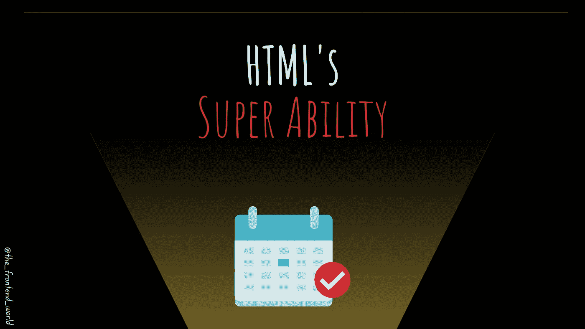
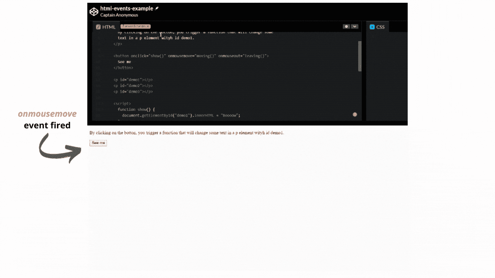
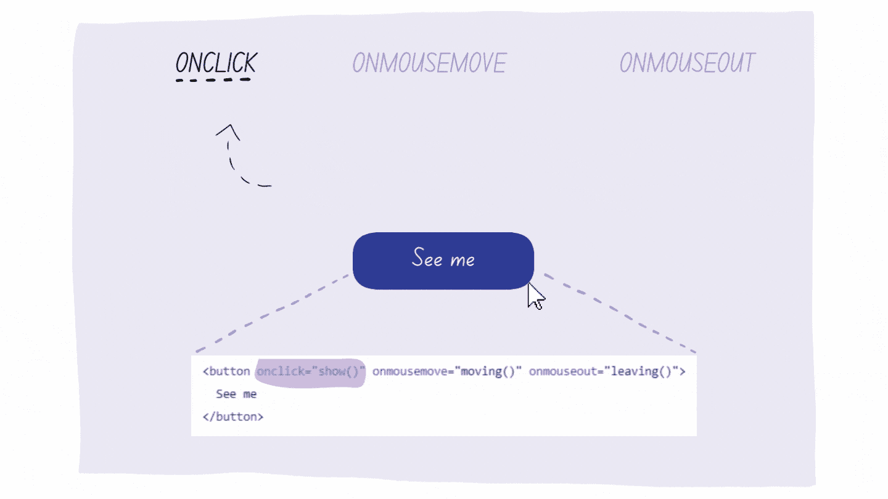
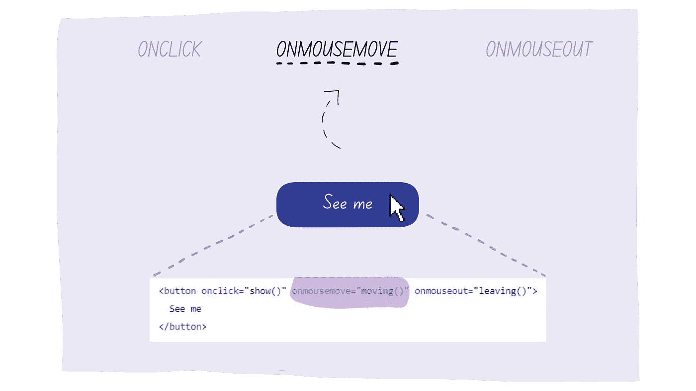
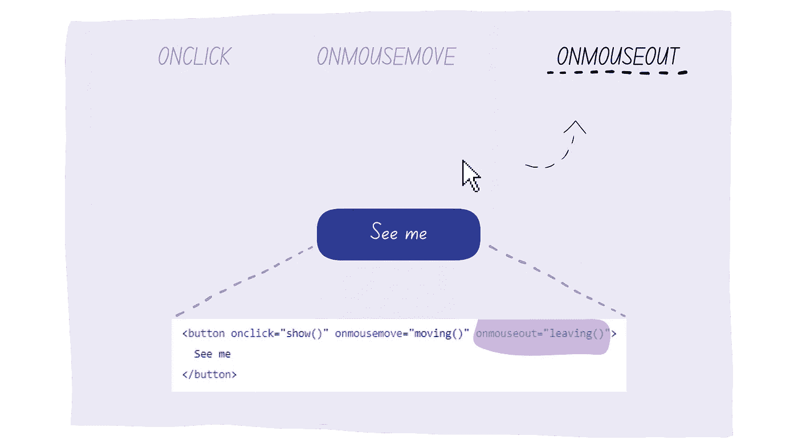

# HTML 的超能力

> 原文：<https://javascript.plainenglish.io/htmls-super-ability-1eb41726096e?source=collection_archive---------22----------------------->

## 什么是 HTML 事件？有哪些例子？

By FAM

> 在开始这篇文章之前，我想感谢你，[皮耶罗·萨比努](https://medium.com/u/aa260d298713?source=post_page-----1eb41726096e--------------------------------)成为我最近新推荐的会员。非常感谢你信任我，让我的文章有价值❤

到目前为止，我们已经了解了 HTML 结构及其内容支柱。恭喜你，因为你现在可以用获得的知识建立一个网页了。(这需要一些时间，但我们所有人(开发者)都是这么开始的。所以，不用担心！)

# HTML 的超能力

我们知道 HTML 构建网页内容。但我没有告诉你们所有人。其实故事里还藏着一个 part hold，muaha 哈哈。事实上，HTML 最大的能力是让事件在浏览器中触发动作。

JavaScript 用于网站交互和行为。但是，事实上，没有 HTML，JavaScript 就无法工作。它让事件触发行动。当事件被触发时，JavaScript 就会接管。现在，我们将把重点放在整个事情的 HTML 工作上。JavaScript 随后就到！

# 什么是事件，它是如何工作的？

HTML 事件就像生活中的事件。我们称一个事件为“事件”,因为它是一个有趣的变化，不同于常规的事情——结婚、生日、工作等等。

HTML 事件可能来自用户交互，比如移动鼠标、改变窗口大小、点击等等。它也可以通过编程来触发(我们将在 JavaScript 章节中看到如何触发)

在生活中，一个事件是一个纪念品，一次经历。在技术上，它在物体上😜。对象提供关于发生了什么的信息(事件数据)。

事件示例:

*   ***剪贴板事件***
*   ***鼠标***
*   ***网络/连接***
*   ***打印…***

若要查看更多事件:

 [## 事件参考| MDN

### 事件被触发以通知代码可能影响代码执行的“有趣的变化”。这些可能来自用户…

developer.mozilla.org](https://developer.mozilla.org/en-US/docs/Web/Events) 

# 现在，让我们试验一些事件

下面的例子使用:`***onclick***`*`***onmousemove***`，`***onmouseout***` 事件。*

*   *`***onclick***` 是我们点击 HTML 元素时触发的*
*   *`***onmousemove***` 当鼠标指针在元素上移动时触发。*
*   *`***onmouseout***` 当鼠标指针移出一个元素时被触发*

*同样，让我们从一个用户故事开始。我需要在一个 HTML 按钮上触发这三个事件。*

*   *当我点击按钮时，我想显示文本:“ ***Boooow。****
*   *当鼠标指针移动到按钮上时，显示文本:“ ***哦，我看到你在移动*** ”*
*   *最后，当我的光标移出底部元素时，显示文本:“**你要离开:(**)*

*该代码使用 JavaScript 在事件触发时执行一些操作。别介意。从例子中学到的重要的一点是，没有 HTML，我们什么也做不了。这是我们让事件被触发的入口点。接下来发生的事情来自 JS 代码。*

**

# *它在代码中是如何工作的？*

*HTML 元素(在这个用例中是一个按钮)能够说*，如果有人点击我*，那么就启动我被赋予的功能(`onclick="show()”`)。如果没有 HTML 元素监听 click 事件并触发您给它的函数的能力，什么都不会发生。*

*您所需要的只是将您想要的事件(在本例中为 click)添加到 HTML 元素(在本例中为 button)中，并在事件被触发时为其提供您想要执行的功能:*

**

*onclick event*

*这同样适用于其他事件:*

**

*onmousemove event*

**

*onmouseout event*

*要自己尝试，这里是完整的代码。同样，当事件被触发后会发生什么将在 JS 章节中讨论，所以不要介意😉*

*[代码回购:](https://github.com/famzila/2022-WEB-PROGRAM/blob/main/Chapter2/html-events.html)*

*今天就到这里，看阿雅🙋*

*如果您有任何问题或反馈，请点击评论或通过 LinkedIn 联系我— **我洗耳恭听！***

*[**想请我喝杯咖啡吗？☕️**](https://www.buymeacoffee.com/fatimaamzil)*

> *让我们为 2022 年打造一个更好的‘我们’！*

## *了解有关 2022 年网络快车计划的更多信息:*

## *I- [通用网络知识](https://medium.com/geekculture/2022-web-program-chapter-n-1-is-done-499fb0707220?source=your_stories_page----------------------------------------)*

# *II-网页框架:HTML*

*   *[HTML 和页面结构](/the-foundation-of-any-web-page-78ebdcb6d874?source=your_stories_page----------------------------------------)*
*   *[元素&属性](https://levelup.gitconnected.com/what-are-elements-and-attributes-in-html-1cd709c3a418?source=your_stories_page----------------------------------------)*
*   *[表单、输入、图像、](https://medium.com/geekculture/html-content-essentials-that-every-web-developer-should-know-dcb8b8715125?source=your_stories_page----------------------------------------) …*
*   *[列表&表格](https://medium.com/codex/html-content-essentials-that-every-web-developer-should-know-a1e7b966698a)*

> ***事件***

*   *网络存储*
*   *语义 HTML*
*   *易接近*

* [## 2022 网络计划启动！

### 改变来自心态和习惯

medium.com](https://medium.com/geekculture/2022-web-program-is-launched-f38a3280af1a) 

与想成为 web 开发人员的人分享该程序！这将有助于保持进步，并在旅途中互相帮助。

> 如果你喜欢我的文章， [**订阅**](https://famzil.medium.com/subscribe) 获取我的最新。如果你自己喜欢体验媒介，可以考虑通过[**注册会员**](https://famzil.medium.com/membership) 来支持我和其他成千上万的作家。它每月仅花费 5 美元，它支持我们，作家，你也有机会通过你的写作赚钱。当然，你可以随时取消会员资格。通过注册[这个链接](https://famzil.medium.com/membership)，你将直接用你的一部分费用来支持我，不会花你更多的钱。如果你这样做了，万分感谢！

让我们在 [**上**](https://medium.com/@famzil/)**[**Linkedin**](https://www.linkedin.com/in/fatima-amzil-9031ba95/)**[**脸书**](https://www.facebook.com/The-Front-End-World)**[**insta gram**](https://www.instagram.com/the_frontend_world/)**[**YouTube**](https://www.youtube.com/channel/UCaxr-f9r6P1u7Y7SKFHi12g)**或**上**取得联系吧**************

 [## 通过我的推荐链接——FAM 加入 Medium

### 作为一个媒体会员，你的会员费的一部分会给你阅读的作家，你可以完全接触到每一个故事…

famzil.medium.com](https://famzil.medium.com/membership) 

*更多内容请看*[***plain English . io***](http://plainenglish.io/)*。报名参加我们的* [***免费周报***](http://newsletter.plainenglish.io/) *。在我们的* [***社区***](https://discord.gg/GtDtUAvyhW) *获得独家获得写作机会和建议。**