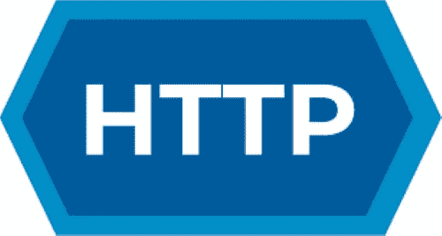
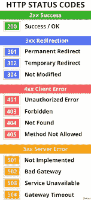

# HTTP 协议:您需要知道的一切

> 原文：<https://javascript.plainenglish.io/http-protocol-everything-you-need-to-know-d313b5544c93?source=collection_archive---------8----------------------->

如果你曾经在浏览器上搜索过网页，你肯定至少使用过一次这种特殊的协议，这可能是全世界最著名的协议之一。

因此，在本文中，我们将介绍这个故事、方法以及您需要了解的一切，以便对这个流行的协议有一个基本的了解。让我们深入研究一下

[HTTP](https://en.wikipedia.org/wiki/Hypertext_Transfer_Protocol)

# 故事

HTTP 于 1980 年首次发布了 0.9 版本，它是旧 FTP 协议的继承者。它是由当时地球上最好的地方最好的开发人员开发的:由蒂姆·伯纳斯·李在欧洲核子研究中心开发的。

有趣的事实:HTTP 最初是在物理社区中共享数据和文件的一种方式，特别是对于能源研究人员。它现在被认为是万维网的三大核心之一，与 HTML 和 URL 并列。

1.0 版本是由创建第一个版本的同一个开发人员 Berners-Lee 在 1991 年实现的。这个版本已经变得非常流行和使用。但是，随着使用的增长，也出现了许多问题和衰退。例如，不可能将多个站点放在同一个服务器上，安全机制非常差，并且它没有重用连接，使得它没有得到优化。

这个问题在 1997 年发布的 1.1 版协议中已经解决了。在这一点上，该协议几乎是优化和成熟的。它强大到足以成为文件共享和网页浏览的标准。

2015 年，时代更加成熟，这个协议需要新的特性和功能来避免过时。因此，在这一年，2.0 版本已经实现并发布，成为实际上最流行的协议，最适合主流用户使用，但可能不是性能最好的。

# 它是如何工作的

**简介**

HTTP 是一个应用层协议(第 7 层)，它基于客户机-服务器体系结构。有两种类型的“消息”，客户端发送的请求和服务器发送的响应。

**请求消息语法**

请求由四部分组成:

*   请求行
*   标题(包含主机信息)
*   空行
*   最终主体(如有需要，包含额外信息)

**请求线路和 HTTP 方法**

在请求行部分，您必须放置用于发送请求的方法。对于不同的用例，有许多不同的方法。以下是其中最重要的几个:

*   获取(从服务器获取信息)
*   发布(向服务器发布和提供信息)
*   HEAD(向服务器请求请求的报头)
*   PUT(修改服务器中的数据，一种 post 替代方法)
*   删除(删除服务器中的数据)
*   修补(对资源应用部分修改)
*   跟踪(提供了一种有用的调试机制)
*   选项(为给定 URL 请求允许的通信选项)
*   连接(启动客户端和服务器之间的双向通信)

**响应消息语法**

另一方面，响应与上一个相似。它是这样建造的:

*   状态线
*   标题(包含服务器信息)
*   空行
*   最终主体(如有需要，包含额外信息)

**状态行和状态代码**

在状态行中，有一个三位数的简单代码。该代码给出了关于请求如何执行以及结果是成功还是失败的信息。可能的代码类型如下:

*   1xx:信息
*   2xx:成功
*   3xx:重定向
*   4xx:客户端错误
*   5xx:服务器错误

有些代码很有名，并且使用了很多次。最著名的有以下几个:

*   200:好，成功
*   301 永久移动
*   400 错误请求
*   404 未找到
*   500 内部服务器错误
*   错误网关；无效网关

Most famous codes

# 改善安全:HTTPS

浏览网页时的安全和隐私是至关重要的保证。HTTP 的第一个版本无法做到这一点，因为它们过去的工作方式存在一些缺陷。随着网络使用的增长，对更安全的东西的需求也越来越强烈。

为了使所有需要的安全成为可能，HTTPS 诞生了。它是由一家实力雄厚的公司开发的:网景公司。它使用通信的传输层来加密消息。为此使用了 SSL 或 TSL，即使最后一个没有使用。

这些机制可以保证消息发送者的身份，使所有用户的通信更加安全和可信，用户可以确信没有隐藏的恶意发送者。

# **结论**

最后，您在本文中了解了什么是 HTTP 以及它是如何工作的。您还知道更多关于方法和状态代码的知识，这些是在网上冲浪或构建 web 应用程序时经常出现的东西。所以，这些信息真的很有帮助。

知道了这篇文章写的所有东西，就意味着你知道了世界上几乎 99%以上的人关于 HTTP 的知识。这项技术似乎将伴随我们很长一段时间，因此有必要了解它。

希望这篇文章对你有所帮助，并且你喜欢它。如果你有，请考虑鼓掌和分享。

*更多内容请看*[***plain English . io***](https://plainenglish.io/)*。报名参加我们的* [***免费周报***](http://newsletter.plainenglish.io/) *。关注我们关于*[***Twitter***](https://twitter.com/inPlainEngHQ)*和*[***LinkedIn***](https://www.linkedin.com/company/inplainenglish/)*。加入我们的* [***社区不和谐***](https://discord.gg/GtDtUAvyhW) *。*