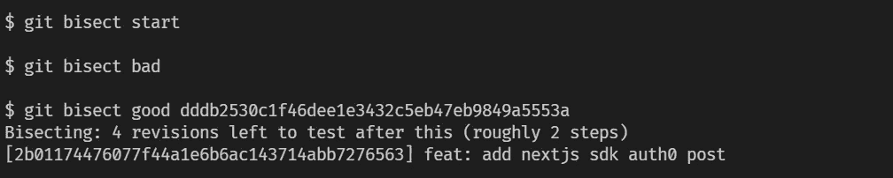
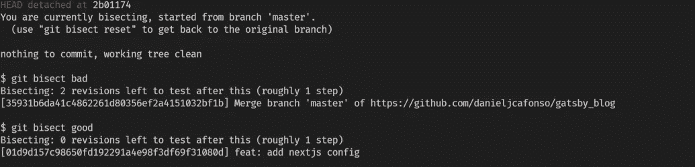
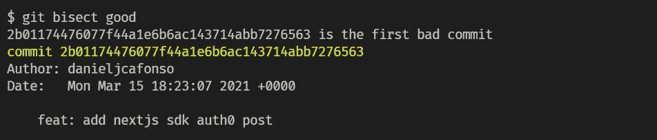

# 如何像专业人士一样追捕虫子

> 原文：<https://javascript.plainenglish.io/hunting-bugs-like-a-pro-75d91fbf25a9?source=collection_archive---------23----------------------->

## Git 平分救援

Photo by [Agence Olloweb](https://unsplash.com/@olloweb?utm_source=medium&utm_medium=referral) on [Unsplash](https://unsplash.com?utm_source=medium&utm_medium=referral)

不管我们喜欢与否，bug 是每个开发人员日常生活的一部分。作为开发人员，我们可以花费无数的时间来追踪问题的起源。有时候你可能很幸运。其他时候，在失去了无数个小时和头发后，你可能会放弃，可能会考虑辞职。

如果我告诉你，git 通过使用一个叫做`git bisect`的奇妙命令，让你有可能使用二分搜索法来找到引入 bug 的提交，那会怎么样呢？

# 使用二等分

让我们想象一下，我们在当前的分支中发现了一个 bug，我们现在可以开始对分。为此，运行`git bisect start`命令。因为我们在这个提交中有错误，所以我们需要将其标记为错误提交。为此，运行命令`git bisect bad`。

现在，这是我们需要做一些研究的部分。我们需要检查我们以前的提交，找到一个没有错误的。假设<commit_id>是一个没有 bug 的提交，这里我们需要运行命令`git bisect good <commit_id>`。</commit_id>

Starting Git Bisect

既然我们已经确定了好的和坏的提交，git 将从检查其他提交开始。现在您可以运行您的项目，看看在这次提交中 bug 是否仍然存在。如果是，则运行`git bisect bad`命令，否则运行`git bisect good`。

Bisecting

现在对 git 检验的每个提交重复这个过程。如果一切顺利，最后 git 将识别出是什么提交首先引入了这个 bug。

Finding the first bad commit

现在我们终于知道这个 bug 第一次出现在哪里了。使用这些信息，我们可以更容易地检查提交和跟踪 bug。

# 最终考虑

正如您所看到的，如果您遵循一个好的版本控制方法，您可以利用 git 以一种简单的方式跟踪 bug，而不需要太多的努力，并在这个过程中节省您大量的时间。

最后，我祝大家有一个精彩的 2022 年，并祝你们实现所有目标！我希望你喜欢这篇博文，请继续关注下一篇！

*最初发表于*[*https://www.danieljcafonso.com*](https://www.danieljcafonso.com/git_bisect)*。*

*更多内容看* [*说白了. io*](http://plainenglish.io/) *。报名参加我们的* [*免费每周简讯*](http://newsletter.plainenglish.io/) *。在我们的* [*社区不和谐*](https://discord.gg/GtDtUAvyhW) *获得独家获得写作机会和建议。*