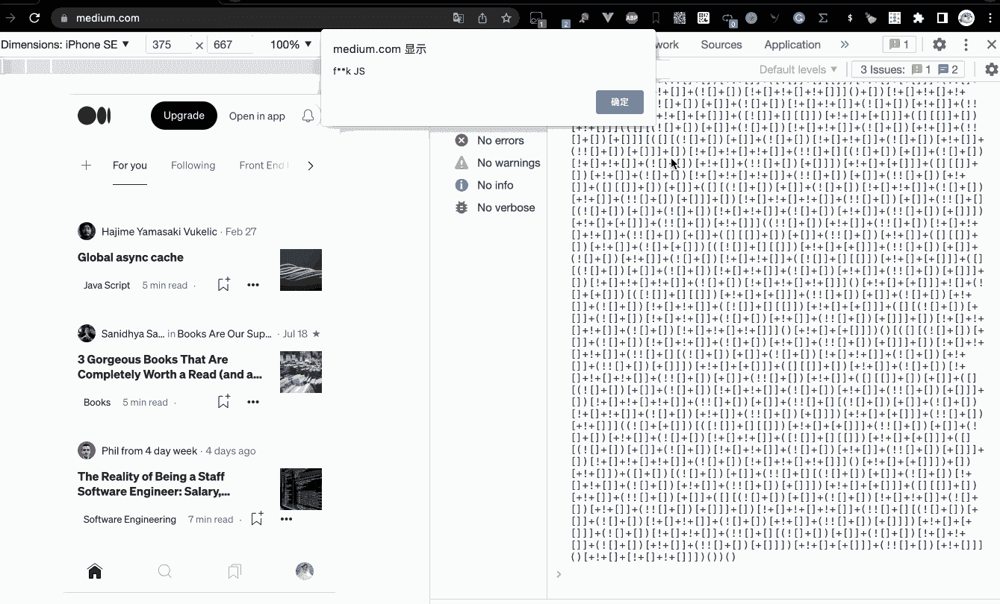

# 我差点被解雇，仅仅因为“警告(‘废话！’)"

> 原文：<https://javascript.plainenglish.io/i-almost-got-fired-just-because-of-alert-crap-35c487bba860?source=collection_archive---------1----------------------->

## JavaScript 是魔鬼，小心它。

Photo by [Elisa Ventur](https://unsplash.com/@elisa_ventur?utm_source=medium&utm_medium=referral) on [Unsplash](https://unsplash.com?utm_source=medium&utm_medium=referral)

**朋友们，我为一个重点项目写了以下代码，以展示我高超的编程技巧。**

没有人知道这是什么，直到我的老板看到它，然后他想直接解雇我，我吓坏了。

真的很难想象下面的代码能被执行。

你不想弄清楚它是如何工作的吗？这篇文章将告诉你关于它的所有秘密。

# 1.它的秘密是什么？

其实很简单，只需要几个字符——`!+`。

1.  JavaScript 的隐式转换规则
2.  新的函数语法

# 2.隐式转换规则

朋友们，我们都知道 JavaScript 是个魔鬼，也就是说它有非常负责任的隐式转换规则，但是今天我们只需要掌握这三个规则。

1.  `!`可以将字符转换成布尔值
2.  `+`能把字符转换成数字
3.  `+[]`前的字符将被转换成字符串

**1。布尔值**

我们可以使用`!`符号将任何字符转换成布尔值。

**2。数字**

如何只用`!+`来表示数字`0 ~ 9`？

让我们先打印出数字 0，因为这是最简单的。

接下来是数字 1，朋友们，开始有点复杂了，想想怎么输出数字 1。

我们只需要 3 个步骤。

**二号**

我们可以把数字 2 转换成`1 + 1`，所以我想你已经知道答案了。

**数字 3~9**

这样，我们就可以方便地表示 3~9。

如何表示非常大的数字？

但是如何表示一个巨大的数字呢？很难想象我们要写很长的`+!+[]`。

那不是一个好主意，我们必须找到一个更有效的方法来解决这个问题。

把字符串转换成数字怎么样？

是的，我们还需要想办法用`!+`来表示“10”和“11”。

你真的很棒！！！我们可以用几个字符`!+`来表示任何数字，即使它非常大。

**3。英文字母**

这似乎是一件不可能的事情。如何用`!+`表示英文字母？

朋友们，跟我来，没有什么是不可能的。

首先，让我们得到一个字符串`undefined`:

太好了，你已经可以打印`undefined`了，但是我们怎么把它变成一个字符串呢？

是的，请使用这条规则。

**“3。** `**+[]**` **前的字符将被转换成字符串**

如果你能得到“未定义”，请你打印出“u”、“n”、“d”、“e”、“f”、“I”、“n”、“e”、“d”好吗？

例如，如果我们试图打印“u”，它将经历以下步骤:

我们再试一次，如何仅通过`!+`打印出字母“a”？

天啊，我觉得`!+`这个角色太强大了。

**4。方法**

怎样才能得到数组的“find”方法？还记得字符串“未定义”吗？

是的，那么我们可以直接调用“find”方法。

但是在空数组上调用`find`方法有什么用呢？

哦，那没有任何意义…让我们试着把这个方法转换回一个字符串:

太好了，我们可以通过打印出“function find…”来获得更多的英文字母，这意味着我们可以先将一些关键字或表达式转换为字符串，然后获得其中的字母，所有字母都可以表示…

**5。如何执行任意代码？**

通过前面的方法，我们基本上可以表示任何字符串，那么如何将任何字符串表示为任何可执行代码呢？

答案是`Function`构造器。我们可以使用`Function`构造函数创建一个新的函数对象，这是一个新的函数:

请尝试在浏览器的控制台执行它，你会发现惊喜。

那么如何获取函数构造函数呢？

上一章我们提到了数组的 find 方法可以通过[]["find"]获得，那么 find 方法的构造函数其实就是一个函数，所以:

我们可以像这样执行一串代码:

让我们试着通过`!+`把上面的代码全部表达出来:

**关于 f:**

**关于查找:**

**关于建造师:**

**关于警报:**

**关于[]["找"]** [**【构造函数】**](/"alert(1)") **():**

不可思议，我们写了可能被老板解雇的代码。可怕的

# 最后

**感谢阅读。**我期待着您的关注和阅读更多高质量的文章。

 [## “我失去了一个工作机会，只是因为承诺。所有”

### 一次让我好难过的面试经历。

javascript.plainenglish.io](/i-lost-a-job-opportunity-just-because-of-promise-all-be396f6efe87)  [## 采访者:“npm 跑 xxx”怎么了？

### 一个大多数人都不知道的秘密。

javascript.plainenglish.io](/interviewer-what-happened-to-npm-run-xxx-cdcb37dbaf44)  [## 面试官:可以“x！== x "在 JavaScript 中返回 True？

### 你可能不知道的五个神奇的 JavaScript 知识点！

javascript.plainenglish.io](/interviewer-can-x-x-return-true-in-javascript-7e1d1fa7b5cd)  [## 现在是 2022 年，不要再滥用箭头功能了

### 不应该使用箭头函数的 4 种情况。

javascript.plainenglish.io](/its-2022-don-t-abuse-the-arrow-function-anymore-905862a9c668) 

*更多内容请看*[***plain English . io***](https://plainenglish.io/)*。报名参加我们的* [***免费周报***](http://newsletter.plainenglish.io/) *。关注我们关于* [***推特***](https://twitter.com/inPlainEngHQ)[***领英***](https://www.linkedin.com/company/inplainenglish/)**和* [***不和***](https://discord.gg/GtDtUAvyhW) ***。****