# 因为 JSON.stringify 我差点丢了年终奖金

> 原文：<https://javascript.plainenglish.io/i-almost-lost-my-year-end-bonus-because-of-json-stringify-a715c54559bb?source=collection_archive---------3----------------------->

## 多么悲伤的故事

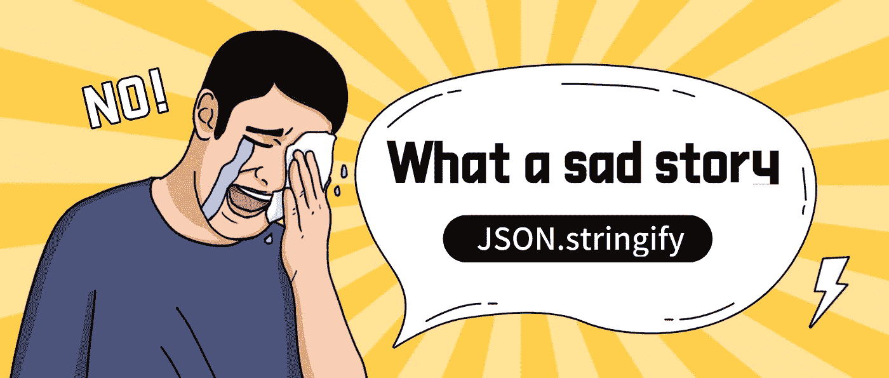

这是一个发生在我身上的真实故事。线上项目出现了一个严重的 bug，因为错误使用 JSON.stringify 导致一个核心页面无法使用，严重影响了用户体验，**我差点丢了年终奖。**

在这篇文章中，我将与你分享这个故事，然后我们还将谈论 JSON.stringify 的特性。

# 故事

一个同事走了，我负责他的一些工作。没想到，我接手不久项目就出现了在线 bug。

这时，公司的工作组展开了热烈的讨论，许多人都在讨论这个问题:

1.  **产品经理投诉:**用户无法再提交表单，带来了很多客户投诉，希望尽快解决。
2.  **测试工程师疑惑:**这个场景的测试环境和预发布环境都已经测试过了，怎么还不能上线。
3.  **后端工程师在说原因:**因为接口缺少 value 字段而出错。

没有人知道如何解决这个问题！

**没人知道怎么解决问题！**

**没人知道怎么解决问题！**

当我发现我的同事们抱怨我负责的模块时，我很头疼😭。

经过短暂的调查，我找到了错误的原因。

是这样的，有一个表单允许用户填写数据，然后前端要解析数据并发送到后端。

表单如下所示(这些选项是可选的):

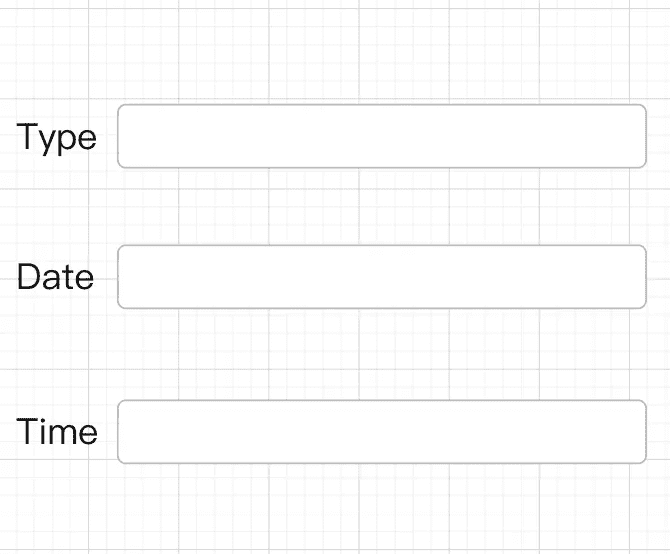

通常，数据应该是这样的:

然后它会变成这样:

但是，所有选项都是可选的。如果用户没有填写，数据如下所示:

然后它会变成这样:

JSON.stringify 忽略在转换过程中值未定义的字段。

当这些数据被发送到后端时，后端无法对其进行处理，从而导致错误。

**问题原因已经找到了，解决方法也很简单，把值未定义的项转换成空字符串提交。**

本来这是一个已经上线一段时间的页面。为什么这个问题突然出现，而之前并不存在？仔细一打听，原来是产品经理提到了中间的一个小优化点。感觉点比较小，就改代码上线了，最终导致项目出现 bug

好在因为从发现问题到解决问题的速度更快，受影响的用户少，问责的级别还没到问责的级别，**我的年终奖算是保住了。**

# 了解 **JSON.stringify**

造成这个 bug 是因为我对 JSON.stringify 不熟悉，所以接下来我们就来分析一下这个内置函数的一些特性。

基本上，JSON.stringify 将一个对象转换成一个 JSON 字符串。

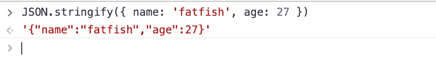

同时，JSON.stringify 有以下规则。

**1。** `[**undefined**](https://developer.mozilla.org/en-US/docs/Web/JavaScript/Reference/Global_Objects/undefined)` **、** `[**Function**](https://developer.mozilla.org/en-US/docs/Web/JavaScript/Reference/Global_Objects/Function)` **、** `[**Symbol**](https://developer.mozilla.org/en-US/docs/Web/JavaScript/Reference/Global_Objects/Symbol)` **都不是有效的 JSON 值。如果在转换过程中遇到任何这样的值，它们要么被省略(在对象中找到时)，要么被更改为** `[**null**](https://developer.mozilla.org/en-US/docs/Web/JavaScript/Reference/Global_Objects/null)` **(在数组中找到时)。** `**JSON.stringify()**` **传入** `**JSON.stringify(function() {})**` **或** `**JSON.stringify(undefined)**` **等“纯”值时可以返回** `**undefined**` **。**

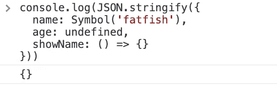

in an object

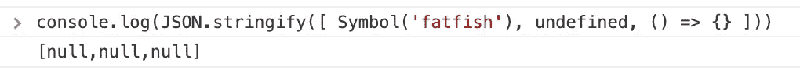

null in array

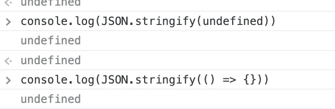

format alone

**2。** `[**Boolean**](https://developer.mozilla.org/en-US/docs/Web/JavaScript/Reference/Global_Objects/Boolean)` **、** `[**Number**](https://developer.mozilla.org/en-US/docs/Web/JavaScript/Reference/Global_Objects/Number)` **、** `[**String**](https://developer.mozilla.org/en-US/docs/Web/JavaScript/Reference/Global_Objects/String)` **对象在字符串化过程中被转换为相应的原语值，符合传统的转换语义。**

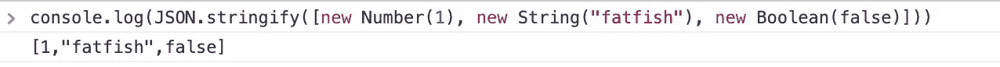

**3。所有**`[**Symbol**](https://developer.mozilla.org/en-US/docs/Web/JavaScript/Reference/Global_Objects/Symbol)`**-键控属性将被完全忽略，即使使用** `**replacer**` **功能时也是如此。**

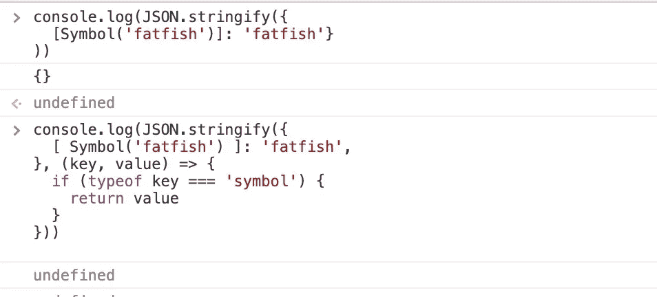

**4。数字**`[**Infinity**](https://developer.mozilla.org/en-US/docs/Web/JavaScript/Reference/Global_Objects/Infinity)`**`[**NaN**](https://developer.mozilla.org/en-US/docs/Web/JavaScript/Reference/Global_Objects/NaN)`**，以及数值** `[**null**](https://developer.mozilla.org/en-US/docs/Web/JavaScript/Reference/Global_Objects/null)` **，都被认为是** `**null**` **。****

**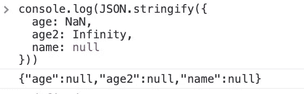**

****5。如果值有一个** `[**toJSON()**](https://developer.mozilla.org/en-US/docs/Web/JavaScript/Reference/Global_Objects/JSON/stringify#tojson_behavior)` **方法，它负责定义哪些数据将被序列化。****

**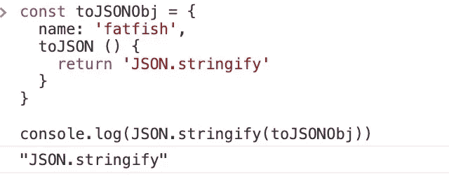**

****6。** `[**Date**](https://developer.mozilla.org/en-US/docs/Web/JavaScript/Reference/Global_Objects/Date)` **的实例通过返回一个字符串来实现** `**toJSON()**` **的功能(同** `**date.toISOString()**` **)。因此，它们被视为字符串。****

**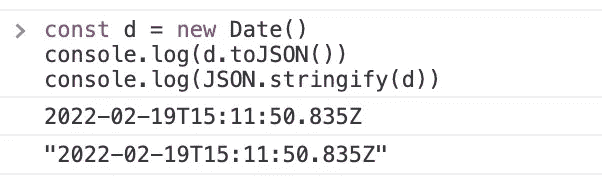**

****7。对包含循环引用的对象执行此方法将引发错误。****

**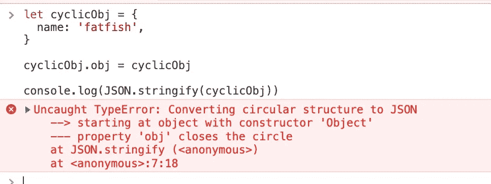**

****8。所有其他的** `[**Object**](https://developer.mozilla.org/en-US/docs/Web/JavaScript/Reference/Global_Objects/Object)` **实例(包括** `[**Map**](https://developer.mozilla.org/en-US/docs/Web/JavaScript/Reference/Global_Objects/Map)` **、** `[**Set**](https://developer.mozilla.org/en-US/docs/Web/JavaScript/Reference/Global_Objects/Set)` **、** `[**WeakMap**](https://developer.mozilla.org/en-US/docs/Web/JavaScript/Reference/Global_Objects/WeakMap)` **和** `[**WeakSet**](https://developer.mozilla.org/en-US/docs/Web/JavaScript/Reference/Global_Objects/WeakSet)` **)将只有它们的可枚举属性被序列化。****

**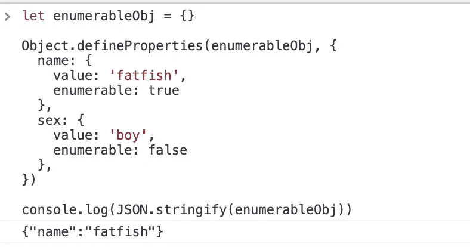**

****9。尝试转换 BigInt 类型的值时抛出错误****

**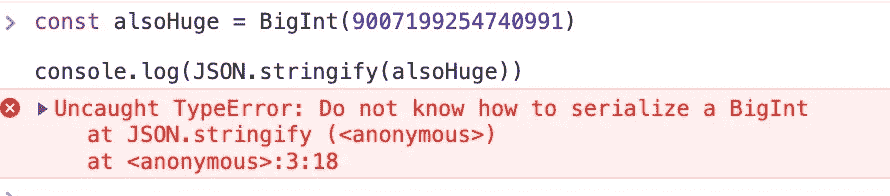**

# **我们自己实现 JSON.stringify**

**理解一个函数的最好方法是自己实现它。下面我写了一个模拟 JSON.stringify 的简单函数。**

****Source code****

****有测试****

**Test code**

****决赛****

**因为一个 bug，我重新学习了 JSON.stringify，了解到它还有那么多平时没注意到的特性。**

**希望你以后不要犯同样的错误。**

**感谢阅读。**

***更多内容请看*[***plain English . io***](http://plainenglish.io/)*。报名参加我们的* [***免费周报***](http://newsletter.plainenglish.io/) *。在我们的* [***社区***](https://discord.gg/GtDtUAvyhW) *获得独家获得写作机会和建议。***