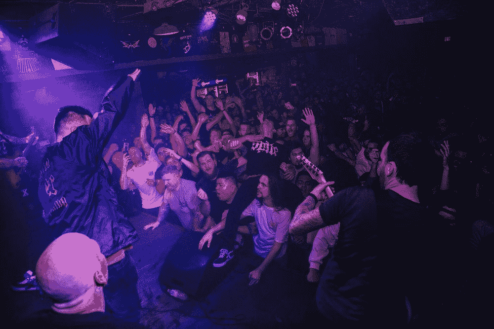

# 我一直想通过编程工作一夜暴富

> 原文：<https://javascript.plainenglish.io/i-always-wanted-to-get-instantly-rich-from-my-programming-job-9044ada48156?source=collection_archive---------1----------------------->

## 后来，我明白了为什么致富不是我最终目标的一些方面。

Photo by [Joel Muniz](https://unsplash.com/@jmuniz?utm_source=unsplash&utm_medium=referral&utm_content=creditCopyText) on [Unsplash](https://unsplash.com/s/photos/club?utm_source=unsplash&utm_medium=referral&utm_content=creditCopyText)

当我成为一名程序员时，我心中只有一个梦想——“变得富有，给自己买一辆新的法拉利”。但我意识到钱的一些重要之处只是时间问题。

当我专注于赚更多的钱，而不是专注于我的工作质量时，我就成了一个需要结果才能执行进一步任务的机器人。我陷入了金钱对我来说意味着一切的思维定势。

我开始讨厌学习新事物，因为没有立竿见影的效果。

这种态度导致了不必要的压力和遗憾。我的理财技巧变得很奇怪。我跟家里人说，不变得富有，我不会停止过度思考。

几乎不到 3 到 4 个月，我就开始感到疲惫不堪。我以前每个周末都会哭，因为我没能变得富有。

我认为我完全没用，我在这个宇宙中一无是处。

我考虑过低消费的生活来存更多的钱。我认为我别无选择，只能存更多的钱，吃低成本的食物。我打电话给父母，告诉他们我的决定。

“嘿，爸爸，我打电话给你只是想告诉你，我没能变得富有，但是别担心，我有一个新的策略。我会尽可能多的存钱，过低消费的生活来增加我的银行存款。这难道不是一个伟大的战略吗？”

来自 Pops 的回复——“孩子，不要被社交媒体上的垃圾所愚弄。你已经有一份收入不错的工作，你不需要马上变得富有。你的努力将决定你的未来。放松，吃健康的食物。你还不需要过低消费的生活……”

## 致富是一种幻觉

相信我，直到你有一份体面的薪水，可以管理你的所有开支，你可以用你的薪水投资很大一部分，那么你就是你自己眼中最富有的人。

没有一个确切的数字可以决定你是否觉得自己很富有。

直到你有能力支付你所有的需求，你才需要考虑你是否富有。

如果有一个时候，你需要牺牲一些你的需求，那么你需要担心。

你的需求完全取决于你的个人喜好，并且因人而异。

## 你的生活并不悲惨

不停地思考你的生活有多悲惨最终会毁掉你所有的生产力。

首先，要意识到你的生活并不悲惨。想想你生活中所有积极的方面。当你发现积极的事情时，把它们记下来。定期阅读它们，你会开始热爱你的生活。

热爱你所做的，热爱你所拥有的。

你必须首先尊重你自己。当你开始尊重你所有的努力时，你就会重新获得内心的自信，这将帮助你过上幸福的生活。

开始阅读关于个人成长的*和 [*找出除了薪水之外重要的事情。*](/3-important-things-that-matter-apart-from-your-salary-68be985a6c5)*

## *如果你仍然认为你很穷，那就照着这个做…*

*好吧，所以你有能力支付所有你想要的，但你仍然认为你很穷，你需要钱。完全没问题，不同的人有不同的思维方式。*

*为了挣更多的钱，你需要学习更多的东西。选择一项技能并掌握它。*

*找到一种激情并掌握它。*

*卖给还没想通的人。*

*如果你没有粉丝群，那就使用预定义的平台受众。在推特上说说你有什么，为什么人们应该从你这里购买。在 LinkedIn 上写一下。试试口香糖路。*

*如果你关于如何掌握某事的产品真的很好，那么相信你自己，找到真正需要它的人。告诉他们为什么你的产品能给社会带来改变。*

*文章到此为止，希望你会发现它的价值和信息。*

*关于我——我是*技术*和*自我提升的顶级作家；* [*点击这里*](https://aniketz.medium.com/) *阅读更多我的文章。**

*如果你想购买 5 美元的中等会员资格， [*点击这里*](https://aniketz.medium.com/membership) (当你使用 [*这个链接*](https://aniketz.medium.com/membership) 购买中等会员资格时，我会从你的会员费中抽取一小部分作为佣金，不需要你额外付费)。如果你想订阅我的电子邮件列表，那么请点击 *。**

* [## 通过我的推荐链接加入 Medium-Aniket

### 作为一个媒体会员，你的会员费的一部分会给你阅读的作家，你可以完全接触到每一个故事…

aniketz.medium.com](https://aniketz.medium.com/membership)* 

*[**通过电子邮件获取我的文章点击这里**](https://aniketz.medium.com/subscribe) **|** [**购买 5 美元中等会员资格**](https://aniketz.medium.com/membership)*

**更多内容请看*[***plain English . io***](https://plainenglish.io/)*。报名参加我们的* [***免费周报***](http://newsletter.plainenglish.io/) *。关注我们关于*[***Twitter***](https://twitter.com/inPlainEngHQ)*和*[***LinkedIn***](https://www.linkedin.com/company/inplainenglish/)*。加入我们的* [***社区不和谐***](https://discord.gg/GtDtUAvyhW) *。**