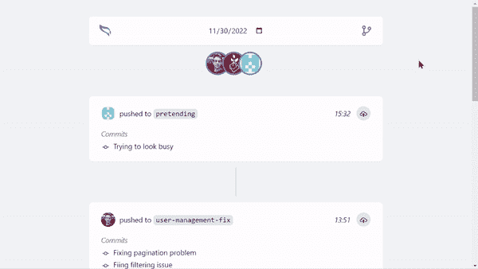

# 我为开发人员自动化每日站立

> 原文：<https://javascript.plainenglish.io/i-automated-daily-standups-for-developers-afb97b09533d?source=collection_archive---------0----------------------->

## 如何一言不发地说出一切

Author: [Pavel Danilyuk](https://www.pexels.com/sk-sk/photo/starsi-ludia-strategicky-hry-hranie-8438918/)

该单口相声了！

这些词总是让我陷入极度恐慌。

我甚至不用听他们说话。一个简单的日历通知会让我热血沸腾。

我不知道我昨天做了什么。我一点也不知道我今天要做什么。我只想平静地编码。

简单地说，我不太喜欢每天站着开会。

有一天，我对他们做了一些决定。这一天是 gitinery 诞生的日子。

[Gitinerary](http://gitinerary.com/) timeline

# Gitinerary 是如何工作的

工具本身其实很简单。

它监听您选择的回购上的提交活动，并显示实时报告(您在上例中看到的报告)。

稍后，您可以按时间顺序浏览报告，并由您的团队成员进行筛选，以查看是否有人偷懒。

要开始使用 Gitinerary，你所要做的就是[将应用](https://github.com/apps/gitinerary)添加到你的 Github 账户或组织中。

# Gitinerary 能帮上什么忙

这个应用程序相当简单。我们已经看到了它能做什么。

但是它实际上能有什么帮助呢？

## 它有助于跟踪进度

通过查看时间线，您可以了解开发人员的工作进展情况。通过阅读提交消息，您可以对它们的目的有一点了解。

没有必要在休息或团队时打扰他们。

## 它有助于组织日常站立

你可以把某一天的时间表作为每天站立的基础。

你会清楚地看到每个开发者都做了什么。如果有些事情需要讨论，你可以这样做。如果没有，你可以完全跳过每天。

## 它有助于建立一个社区

这个可能就在外面。但是我见过很多独立黑客在公共场合搭建。

有了[gitinary](http://gitinerary.com/)，你可以更进一步，分享你的时间表。你的客户会看到你的进步，也许他们会觉得更投入。

# 我是如何建造的

我只花了一天时间就做了一个原型。

其中一半的时间是试图找出如何插入 GitHub 生态系统。

但是当我弄明白这一点时，过程非常简单。

## 创建 GitHub 应用程序

第一步是创建 GitHub 应用程序。

该应用程序将监听 GitHub 存储库中的活动。

每当有事情发生，它就把它存储在数据库中。就这么简单。

我使用 [Probot](https://github.com/probot/probot) 来构建应用程序。只是按照文档来实现我需要的东西。

## 显示时间线

最后一步是获取数据并将其显示在时间轴上。

对于这一部分，我使用了 [NextJS](https://nextjs.org/) 来构建一个全栈 web 应用程序。

在这一点上，我在构建界面方面非常有效率。我只花了几个小时就建立了一个简单的登录页面和时间线页面。

Gitinerary timeline screenshot

# 下一步是什么

应用程序已启动并运行。但我打赌你想知道下一步的计划。

首先，我想看看人们是否有兴趣使用该应用程序。

如果他们这样做了，我将开始收集如何改进应用程序的反馈。增加更多功能，修复 bug，让产品更好。

我还将应用提交到了 [GitHub marketplace](https://github.com/marketplace) 并等待回复。

# 遗言

如您所见，构建一个副业项目并不是火箭科学。

你不必花几个月的时间在你的地下室编码，只是为了意识到没有人想使用你的产品。

我花了几天时间才让这个应用程序达到现在的状态。这主要是因为我专注于一个单一的功能。确保它正常工作。

我们将看看我们将如何从那里开始。暂时就这样了。

[***订阅***](https://bernardbad.medium.com/subscribe) ***所以你不要错过我接下来的故事。*** [***免费试用 gitinary***](https://github.com/apps/gitinerary)***。***

## 你是否希望为你的软件创业增加知名度？检查[电路](https://circuit.ooo/?utm=publication-post-cta)。

我们提供免费的专家建议和定制解决方案，帮助您建立对您的技术产品或服务的认知和采用。

## 更多内容请访问 [PlainEnglish.io](https://plainenglish.io/) 。

报名参加我们的 [**免费周报**](http://newsletter.plainenglish.io/) 。关注我们关于 [**推特**](https://twitter.com/inPlainEngHQ)[**LinkedIn**](https://www.linkedin.com/company/inplainenglish/)**[**YouTube**](https://www.youtube.com/channel/UCtipWUghju290NWcn8jhyAw)**[**不和**](https://discord.gg/GtDtUAvyhW) **。******