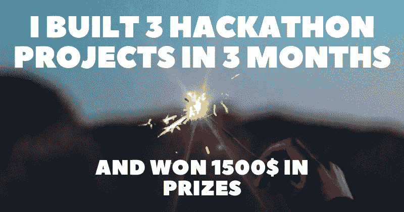
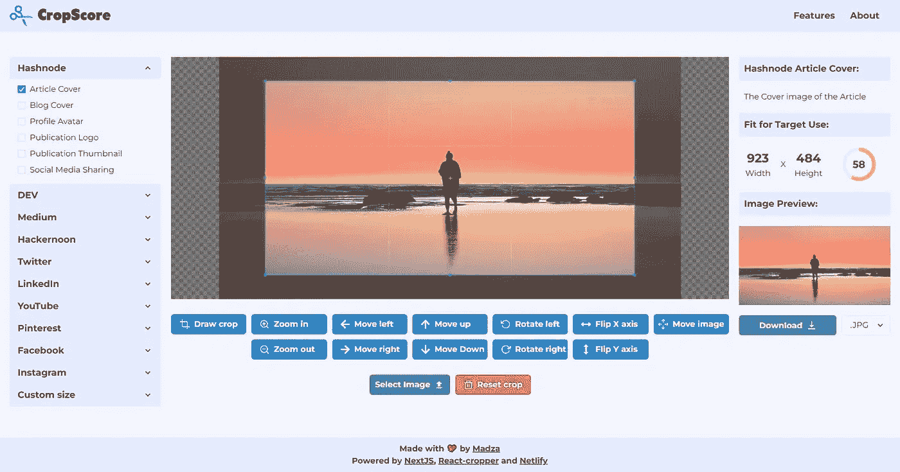
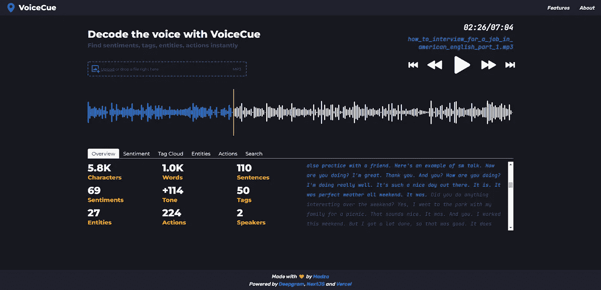
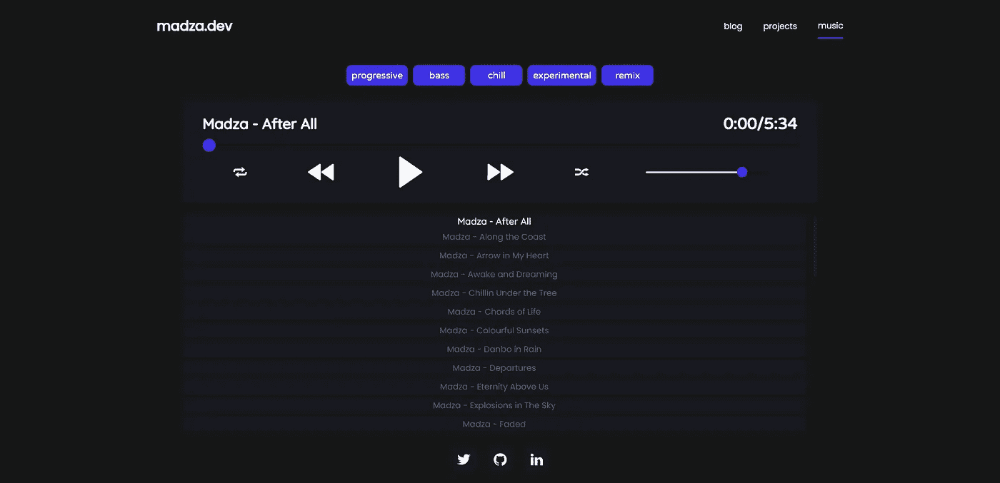

# 我在 3 个月内建立了 3 个黑客马拉松项目，赢得了 1500 美元的🥳奖金🎉

> 原文：<https://javascript.plainenglish.io/i-built-3-hackathon-projects-in-3-months-and-won-1-500-in-prizes-1ec6c5b3d704?source=collection_archive---------13----------------------->

2022 年上半年，从 2 月中旬到 5 月中旬，我有一些空闲时间，所以我决定尝试一项新的冒险——黑客马拉松。令我惊讶的是，我的作品被提名为亚军，所以我决定写一篇文章来激励你。

请注意，这篇文章并不意味着以任何形式吹牛。我仍在自我学习，我写这篇文章的目的是为了表明，如果你投入一些工作，相信自己和自己的想法，每个人都可以做到。

下面我将列出我构建的每个项目，包括特性列表，并描述我使用的技术栈。我还将提供我的完整 hackathon 文章的链接、实时部署项目的链接以及开源代码的链接。

## 1.CropScore

从二月中旬到三月中旬，我想出了一个解决方案，可以让你忘记分辨率和长宽比的技术问题。 [CropScore](https://cropper.madza.dev/) 计算实时裁剪适合目标用途的程度的分数(从名称开始)。

这个项目是专门为 [Hashnode](https://hashnode.com/) 和 [Netlify](https://netlify.com/) 黑客马拉松设计的。

## 功能列表📋

*   图像上传—支持的格式。JPG 和。PNG
*   预设—目前有来自 10 个常用平台的 33 个预设
*   自定义模式—允许用户切换到自定义分辨率
*   比率锁定—用户可以锁定任何自定义纵横比
*   输入验证—无效输入的信息性警告消息
*   移动工具—用户可以四处移动图像
*   缩放工具—放大或缩小图像以获得精确的裁剪
*   旋转工具—以 45 度为增量顺时针或逆时针旋转图像
*   变换图像—在 X 或 Y 轴上交换图像
*   辅助网格-为居中提供帮助
*   分辨率数据—在您调整裁剪窗口大小时实时更新
*   裁剪分数—适合目标用途的实时裁剪分数
*   图像预览—允许用户预览裁剪
*   重置—将图像和裁剪窗口重置为上传图像时的状态
*   下载—在中下载图像。巴新和。使用 jpeg 文件交换格式存储的编码图像文件扩展名
*   响应式—在任何设备上使用

## 我用🛠️的技术堆栈

[NextJS](https://nextjs.org/) — React 应用框架

[反应裁剪器](https://www.npmjs.com/package/react-cropper) —用于核心裁剪器功能

[平面图标](https://www.flaticon.com/)，[反应图标](https://react-icons.github.io/react-icons/) —图标

[脉轮 UI](https://chakra-ui.com/) —用于组件

[GitHub](https://https/github.com)——托管代码

[Netlify](https://netlify.com/)——部署项目

[ESLint](https://eslint.org/) ，[更漂亮](https://prettier.io/) —用于林挺和代码格式化

[Namecheap](https://www.namecheap.com/) —用于自定义子域(在 Netlify 上配置)

## 项目链接📚

✅黑客马拉松全文:[阅读 Hashnode](https://madza.hashnode.dev/introducing-cropscore-an-image-cropper-for-content-creators)

✅ Live 项目:[部署在 Netlify 上](https://cropscore.netlify.app/)

✅源代码:[可在 GitHub 上获得](https://github.com/madzadev/cropper)

## 2.语音提示

从 3 月中旬到 4 月中旬，我开发了一款名为 [VoiceCue](https://cue.madza.dev/) 的应用，这款应用可以生成提示时间码，让你只需点击一下，就能找到语音记录中所有重要的部分，比如情感、实体和标签。

这个项目是专门为 [DEV](https://dev.com/) 和 [Deepgram](https://deepgram.com/) hackathon 设计的。

## 功能列表📋

1.  语音识别——基于 [Deepgram API](https://developers.deepgram.com/)
2.  常规统计—语音记录概述
3.  情感分析—正面和负面单词检测
4.  词云生成—最常用的词分类
5.  实体名称识别——如人、地点等类别
6.  活动跟踪—查找过去、现在或未来的行动
7.  互动抄本—查看进度或点击控制进度
8.  扬声器检测—录音中的扬声器总数
9.  提示词用法—短文本示例有助于更好地理解上下文
10.  自定义搜索—扩展的线索查询能力
11.  波形预览—查看声音的动态，识别无声
12.  音频控制—播放、暂停、快进和后退
13.  拖放支持—将音频拖放到选择文件区域
14.  上传 MP3 文件——最常用的音频格式
15.  进度加载器——改进了加载抄本的 UX
16.  全面响应—在移动设备和平板电脑上运行良好
17.  丰富多彩的用户界面—便于交互和突出显示文字

## 我用🛠️的技术堆栈

[NextJS](https://nextjs.org/) — React 应用框架

[Deepgram](https://deepgram.com/) —用于基于人工智能的语音识别

[妥协](https://www.npmjs.com/package/compromise)，[感情](https://www.npmjs.com/package/sentiment) —用于文字处理

[react-tagcloud](https://www.npmjs.com/package/react-tagcloud) —生成单词云

[反应标签](https://www.npmjs.com/package/react-tabs) —用于导航面板

[反应-拖放-文件](https://www.npmjs.com/package/react-drag-drop-files)-用于拖放支持

[wavesurfer.js](https://www.npmjs.com/package/wavesurfer.js) —生成音频波形

[GitHub](https://github.com/) —托管代码

[Vercel](https://vercel.com/) —部署项目

[ESLint](https://eslint.org/) ，[更漂亮](https://prettier.io/) —用于林挺和代码格式化

[Namecheap](https://namecheap.com/) —用于自定义子域

## 项目链接📚

✅完整的黑客马拉松文章:[在 DEV 上阅读](https://dev.to/madza/introducing-voicecue-find-sentiments-tags-entities-actions-like-a-dj-4kjk)

✅现场项目:[部署在 Vercel 上](https://cue.madza.dev/)

✅源代码:[可在 GitHub](https://github.com/madzadev/cropper) 上获得

## 3.音频播放器

四月中旬到五月中旬，我参加了 [Hashnode](https://hashnode.com/) 举办的[写作大会](https://townhall.hashnode.com/the-epic-hashnode-writeathon?source=hashnode_feed)。

我描述了我如何创建了一个定制的音频播放器来展示我的音乐组合中的曲目，因为很多人对它的技术实现感兴趣。

我真的很高兴我参加了这个项目，因为我涵盖了整个应用程序创建周期，从功能规划、线框和设计，到创建组件、实现逻辑、增加响应能力和部署应用程序。

## 功能列表📋

1.  播放和暂停音频
2.  下一首和上一首曲目
3.  重复曲目
4.  无序播放轨道顺序
5.  进度滑块
6.  剩余时间/总时间
7.  音量滑块
8.  搜索音轨
9.  按流派过滤曲目
10.  播放列表项目

## 我用🛠️的技术堆栈

[React](https://reactjs.org/) —前端接口库

[GitHub](https://github.com/)——托管代码

[Vercel](https://vercel.com/)——部署项目

[Namecheap](https://namecheap.com/) —用于自定义子域

[Flaticon](https://www.flaticon.com/) —用于播放器中使用的图标

## 项目链接📚

✅黑客马拉松全文:[阅读 Hashnode](https://madza.hashnode.dev/how-i-built-a-music-player-to-showcase-my-own-tracks)

✅现场项目:[部署在 Vercel 上](https://www.madza.dev/music)

✅源代码:[可在 GitHub 上获得](https://github.com/madzadev/audio-player)

## 结论

那么，我的主要收获是什么呢？我想鼓励新的和有抱负的开发人员挑战自己，尝试新的冒险。黑客马拉松是探索新技术、学习新技能和发现新联系人的一种有趣方式。

然而最终的结果是，你仍将是一个赢家，因为你将获得的实用技能将比其他任何东西都更有价值。此外，其他人也将从中受益，甚至可以在将来为改进项目做出贡献。

最重要的是，参与黑客马拉松会给你完成项目的动力，因为你致力于一个目标和一个具体的期限。在没有这些的情况下做副业通常会导致放弃，或者在上面开始新的想法。

而且，这样你就能想出一些你可以放进简历和文件夹的东西，这将帮助你找到你的下一个角色。坚持不懈，你会成功的！

写作一直是我的激情所在，帮助和激励他人给我带来了快乐。如果您有任何问题，请随时联系我们！

在 [Twitter](https://twitter.com/madzadev) 、 [LinkedIn](https://www.linkedin.com/in/madzadev/) 和 [GitHub](https://github.com/madzadev) 上给我接通！

访问我的[作品集](https://madza.dev/code)获取更多类似的项目。

*更多内容看* [***说白了。报名参加我们的***](https://plainenglish.io/) **[***免费周报***](http://newsletter.plainenglish.io/) *。关注我们关于*[***Twitter***](https://twitter.com/inPlainEngHQ)*和*[***LinkedIn***](https://www.linkedin.com/company/inplainenglish/)*。查看我们的* [***社区不和谐***](https://discord.gg/GtDtUAvyhW) *，加入我们的* [***人才集体***](https://inplainenglish.pallet.com/talent/welcome) *。***