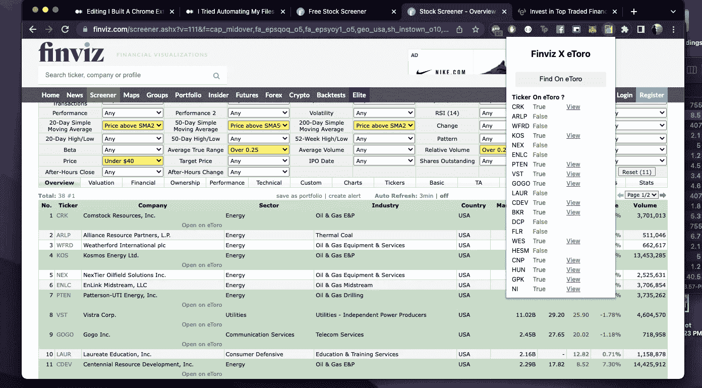
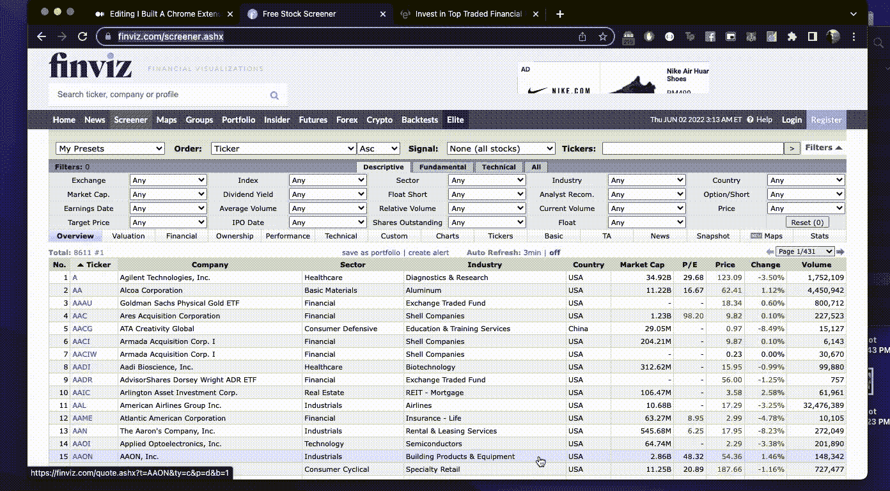
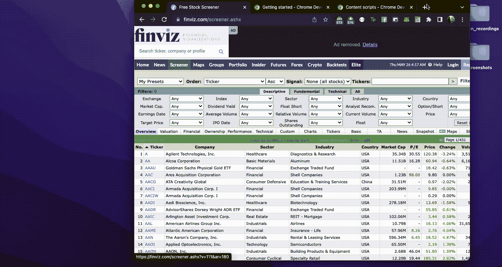
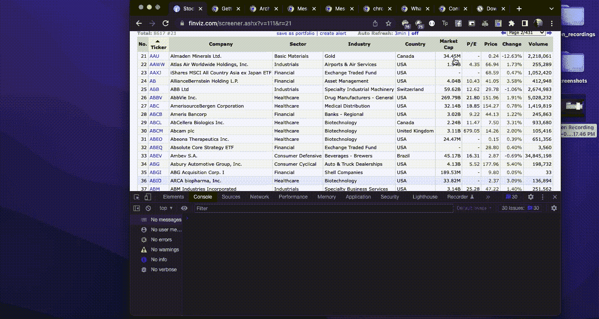
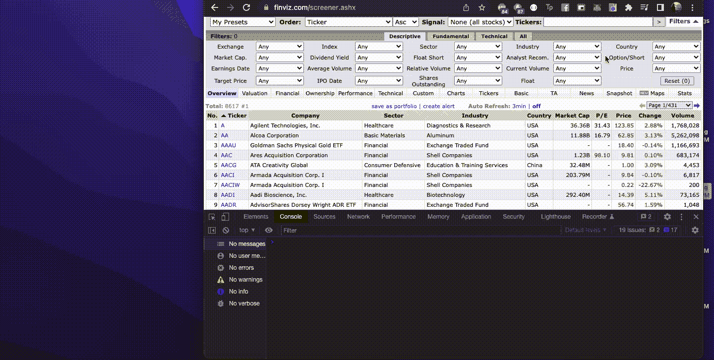
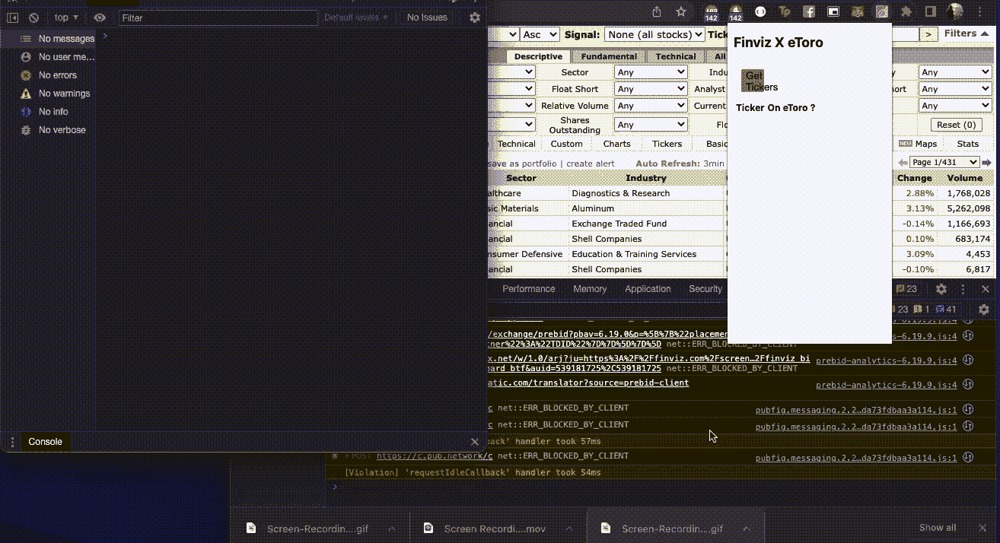
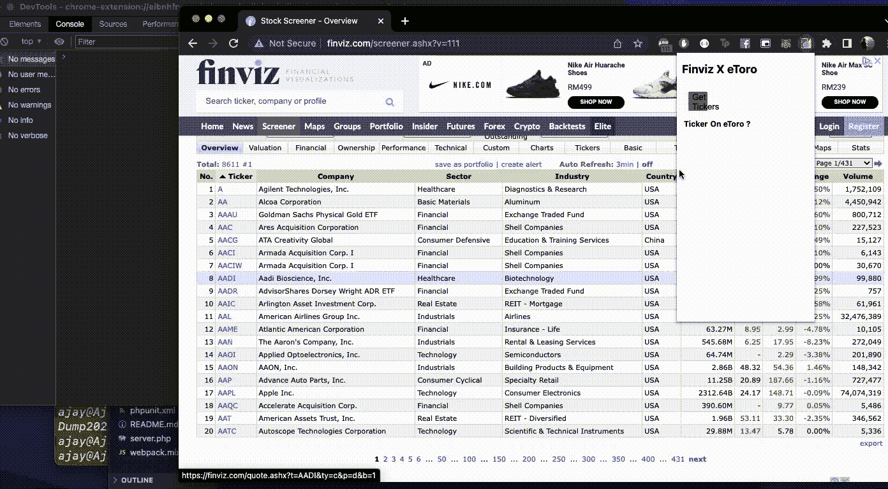
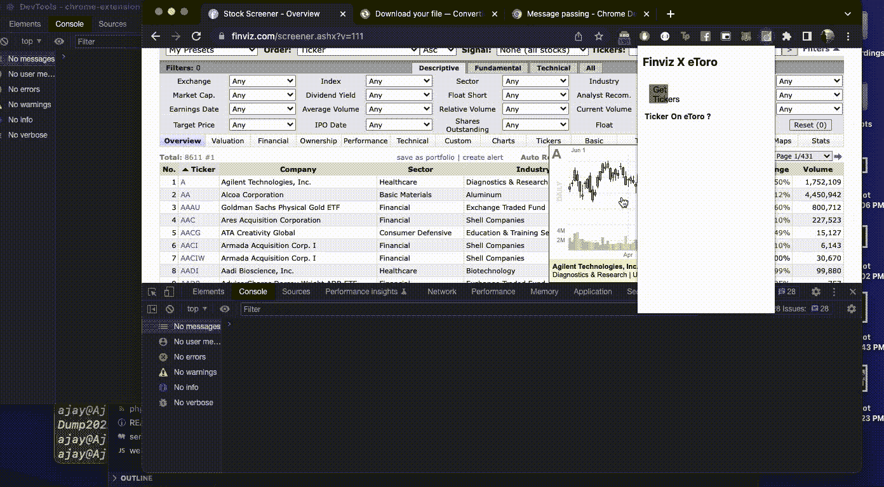
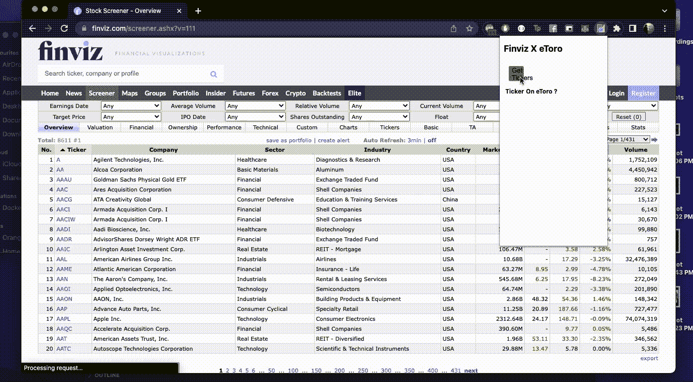
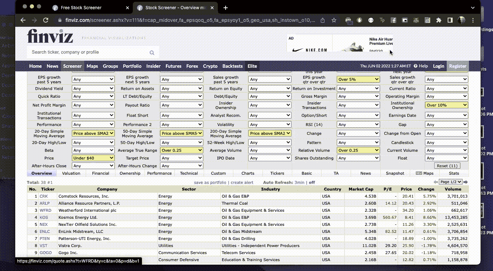

# 我构建了一个 Chrome 扩展，可以在 FINVIZ 的股票筛选工具上即时找到 eToro 的股票

> 原文：<https://javascript.plainenglish.io/i-built-a-chrome-extension-to-instantly-find-etoros-stocks-on-finviz-s-stock-screener-89243d4493d9?source=collection_archive---------8----------------------->



## 你不再需要不断切换标签来查看 eToro 中是否存在某种股票

在疫情被困在室内的时候(就像其他人一样)，我创建了一个 eToro 账户，开始了我拥有劳力士、劳斯莱斯和罗孚的旅程。

显然，这并没有发生。这就是为什么你在看我在 Medium.com 的文章，而不是看我在 IG 上的文章。

我不仅没有被冰冷的现金淹没，而且我还是一个糟糕的交易者。这也是我在 YouTube 上观看大师们([雷纳·特奥](https://www.youtube.com/user/tradingwithrayner) & [肖恩·德克马尔](https://www.youtube.com/watch?v=zBIeAeukTfQ&ab_channel=SeanDekmar)是我的首选)时一直试图解决的问题(糟糕的交易者部分)。

在疯狂观看他们的视频时，我遇到了 FINVIZ 的股票筛选程序。这是一个非常酷的平台，你可以根据不同的技术因素筛选出 8，000 多只股票，然后帮助你更好地规划你的交易。



但问题是，其中一些不在 eToro 上，乍一看你不会知道。

因此，我通常的工作流程总是复制股票行情，进入 eToro 的搜索，然后粘贴股票行情，看看它是否可用。如果 Finviz 给我 100 只股票的列表，那么我需要做 100 次这个动作。

好玩。好玩。

当然，应该有更好的方法。

而不是找到一个已经能做我想做的事情的工具或者抱怨没有工具。

我决定从头开始构建自己的工具。

# 范围

1.  构建一个 Chrome 扩展，从 FINVIZ 读取股票行情，并将其传递到后端。
2.  在后端使用 Laravel 检查数据库中的值，并为每个 ticker 返回一个布尔值
3.  我可能需要想办法从 eToro 获取数据。似乎他们没有官方的 API。所以找到一个解决方法。

# 策略

1.  写乱七八糟的代码。越乱越好。我在很短的时间内构建了这个，它是为我自己做的，所以代码不需要进行适当的结构化。它只需要工作。还有，远离模块构建者，我没有一整天的时间去琢磨如何配置 Webpack。
2.  将 tickers 的废弃限制在 FINVIZ 的概述选项卡上，以进行概念验证
3.  如果我有时间，想办法在扩展中加入支付/记帐功能。破产者需要得到报酬。
4.  也许以后，我也可以将该功能扩展到 CoinGecko。改天再说。不要忘乎所以，现在就开始努力。
5.  想出一个扩展名，并找到一个图标，等等。把这个留到最后。不要在早期浪费时间。

# 让编码开始吧

1.  **安装/项目设置**

谷歌有一个非常详细的入门指南，你可以参考开始做事情。

导读-[https://developer . chrome . com/docs/extensions/mv3/get started/](https://developer.chrome.com/docs/extensions/mv3/getstarted/)

该指南还提供了一个完整示例(代码库)的链接。我将简单地下载它，并开始修改代码，以加快速度。

哦，还有一件事。一旦你下载了代码库，你就可以通过 Chrome 把它作为一个未打包的扩展来加载。相同的指南中概述了这些步骤，所以如果您也想尝试一下，可以参考一下。

**2。弄清楚代码库**

根据文档，主要文件有:

*   manifest.json —所有元数据、权限等。被扔在这里。
*   js——处理对扩展本身真正重要的事件。想想生命周期事件。处理不同生命周期事件的逻辑在这里被抛出。
*   popup.html——基本上是 UI 层。所有的 HTML 逻辑和 UI 元素的 CSS 都在这里。popup.html 也有一个相应的 JS 文件，它处理操作 UI 层的逻辑。
*   和 popup.js — JS 文件来处理来自 popup.html 的事件，还可以注入内容脚本等。

第一项任务——转到 manifest.json，更改名称和描述。

**manifest.json**

```
{
	"name": "Finviz X eToro extension", 
	"description": "Show if the ticker exists on eToro", 
	// 
}
```

请注意，无论何时对 manifest.json 进行更改，都需要转到 chrome://extensions，并重新加载扩展。

我做的下一件事是前往 popup.html，我给车身添加了一些造型，还添加了 h2 元素。我只是想看看这些变化是否会立即反映出来——事实的确如此。

此外，popup.html 有一个绿色按钮，它在 popup.js 文件中有一个相应的 click 事件，该事件委托给一个 setPageBackgroundColor 方法。

我不会做太多改变，但我会在每个方法中添加一个 console.log，看看它在 Chrome DevTools 中是什么样子。

**popup.js**

```
let changeColor = document.getElementById("changeColor");// When the button is clicked, inject setPageBackgroundColor into current page
changeColor.addEventListener("click", async () => {
  let [tab] = await chrome.tabs.query({ active: true, currentWindow: true });// line that I added in
  console.log('button clicked');   chrome.scripting.executeScript({
    target: { tabId: tab.id },
    function: setPageBackgroundColor,
  });
});// The body of this function will be execuetd as a content script inside the
// current page
function setPageBackgroundColor() {// line that I added in
  console.log('setPageBackgroundColor method called.');   chrome.storage.sync.get("color", ({ color }) => {
    document.body.style.backgroundColor = color;
  });
}
```

**结果:**



似乎我在按钮的事件侦听器中编写的任何代码都会出现在扩展的开发工具中，setPageBackgroundColor 方法中的代码会在浏览器的开发工具(FINVIZ 页面)中执行。

这两种环境都应该是隔离的。

下面是我要做的——每次点击绿色按钮时，我都要从 FINVIZ 页面获取 tickers，并在 setPageBackgroundColor 中登录它们。现在，我将把尽可能多的逻辑放入这个方法本身。

在这一点上，我甚至不打算重命名这个方法，我将在最后清理它。

**3。从 FINVIZ 中删除 ticker**

可能是最简单的部分。

我所要做的就是检查 HTML 中的 table 元素，并获取这个类。在那里，执行 querySelectorAll，并映射内部 HTML。

嘣！搞定了。

```
let tickers = Array.from(document.querySelectorAll('.screener-link-primary'))
  .map(function (tickerHtml) {
    return tickerHtml.innerHTML; 
})console.log(tickers);
```

继续前进。


**4。在 popup.html 分机**中显示报价机列表

这并不完全简单。

为了做到这一点，我必须理解 Chrome 扩展的结构。

我浏览了以下链接:

架构概述—[https://developer . chrome . com/docs/extensions/mv3/architecture-Overview/](https://developer.chrome.com/docs/extensions/mv3/architecture-overview/)

信息传递——https://developer.chrome.com/docs/extensions/mv3/messaging/[T5](https://developer.chrome.com/docs/extensions/mv3/messaging/)

chrome . storage—[https://developer . chrome . com/docs/extensions/reference/storage/](https://developer.chrome.com/docs/extensions/reference/storage/)

其要点是，您直接为扩展本身编写的代码和您“注入”到当前页面中的代码是完全隔离的。因此，您需要使用他们的消息传递 API 在两者之间共享数据。

你可以阅读上面的链接来更好地理解事情是如何运作的。

我是这样做的:

我从上面的消息传递指南中复制了 chrome.runtime.sendMessage 部分，并将其添加到内容脚本部分(setPageBackgroundColor 方法)。

我在 popup.js 的底部添加了一个相应的 chrome . runtime . on Message . addlistener 部分，也是从上面的消息传递指南复制过来的。

这一切都非常有效。

**setPageBackgroundColor 方法又名内容脚本部分**

```
function setPageBackgroundColor() {

	let tickers = Array.from(document.querySelectorAll('.screener-link-primary'))
  .map(function (tickerHtml) {
    return tickerHtml.innerHTML; 
  }) console.log(tickers); chrome.runtime.sendMessage({ 
    identifier: "finvizOverviewTab", 
    tickers: tickers
  }, function (response) {
    console.log(response.farewell);
  });}
```

**popup.js(文件底部)**

```
chrome.runtime.onMessage.addListener(
  function (request, sender, sendResponse) {
    console.log(sender.tab ?
      "from a content script:" + sender.tab.url :
      "from the extension");
    if (request.identifier === "finvizOverviewTab")  {
      console.log('tickers', request.tickers); 			// manipulate the DOM     } sendResponse({ farewell: "goodbye" });
  }
);
```

**结果**



**5。在分机上显示滚动条(错误)**

我觉得一切都在工作，我休息了一下，我想在扩展本身和开发工具上显示滚动条，然后砰的一声弹出了这个错误。

乍一看，这很令人困惑，因为 manifest.json 文件具有 activeTab 权限，所以我认为这一切都很好，但编程并不是这样工作的。

**错误**

```
Uncaught (in promise) Error: Cannot access contents of the page. Extension manifest must request permission to access the respective host.
```



**解决方案**

原来您需要一个针对 manifest.json 文件的 host_permissions 键来使事情正常运行。

```
"host_permissions": [
    "*://finviz.com/"
 ],
```

这似乎能完成任务。

结果



跨栏的前半部分完成了。现在，我需要整理后端。在本文中，我不会过多讨论后端是如何工作的。我将在另一篇文章中介绍这一点。

6。从后端获取数据

此时，我所要做的就是通过 HTTP 调用将 tickers 列表从页面传递到后端，获得 JSON 响应，并相应地处理它。

为了简单起见，我将 tickers 数组转换成一个字符串，如下所示:

```
let tickerString = tickers.join('|');
```

然后将其附加到 URL 上。我使用 fetch API 对后端进行 HTTP 调用:

```
let results = await fetch('<http://example-backend.test/check-tickers-status?tickers=>' + tickerString)
  .then(response => response.json())
  .then(response => response.data);   console.log(results);
```

后端将返回一个对象，包含所有的 tickers 和一个相应的布尔值。我只是在弹出窗口中显示了这些值。

**结果**



**7。高亮显示屏幕上的文本**

现在很好，我可以清楚地看到 eToro 上扩展的弹出窗口本身的滚动条，但我也想突出显示 FINVIZ 页面上的项目。

我是这样做的——我从上面的消息传递指南中复制了这段代码。

我是这样编辑的:

```
chrome.tabs.query({ active: true, currentWindow: true }, function (tabs) {
    chrome.tabs.sendMessage(tabs[0].id, { 
      'identifier': 'tickerResults', 
      'results': results
    }, function (response) {
      console.log(response.farewell);
    });
  });
```

在 setPageBackgroundColor 方法(内容脚本)中，我添加了一个侦听器来处理消息:

```
chrome.runtime.onMessage.addListener(
    function (request, sender, sendResponse) {
      console.log(sender.tab ?
        "from a content script:" + sender.tab.url :
        "from the extension");
      if (request.identifier === "tickerResults") {

        console.log('received the ticker results from the extension', request.results); // update the dom 
      }

      sendResponse({ 'farewell': "goodbye" });
    }
  );
```

**结果**



最后要做的事情是获取从扩展传递到内容脚本的结果，然后更新 DOM。

我是这样做的:

```
let tickerResultsFromEtoro = request.results;let tickersHtmlElements = Array.from(document.querySelectorAll('.screener-link-primary'));let tickers = tickersHtmlElements.map(function (tickerHtml) {
    return tickerHtml.innerHTML; 
  })for (let key in tickerResultsFromEtoro) {
          if (tickerResultsFromEtoro[key]) {
            let element = tickersHtmlElements[tickers.indexOf(key)]; 
            element.parentElement.parentElement.style.background = '#c6ddc6'; let thirdCol = element.parentElement.parentElement.children[2]; thirdCol.innerHTML = thirdCol.innerHTML + `<a href="<https://www.etoro.com/markets/${key}>" target="__blank" class="screener-link-primary" style="float:right;">Open on eToro</a>`
          }
        }
```

**结果**



让我加入一些基本的 CSS，让 popup.js 看起来稍微好一点。



太好了！它工作了。

现在我可以很快看到哪些 tickers 在 eToro 上可用，哪些不可用。我为自己节省了很多时间和精力。

印象深刻。


# 开发者体验

如果你懂香草 JS，应该是轻而易举的事。

否则你可能会有一些麻烦。但是这里好的一面是文档很切题。只需遵循入门指南，您将能够顺利地开始行动。

我喜欢的另一件事是，我不需要安装一堆不同的工具或软件包。我只需下载代码库，就可以让 chrome 扩展在浏览器中运行。

我肯定会构建更多我自己能用的 chrome 扩展。你也应该试一试！

# 下一步是什么？

当前版本的 Finviz X eToro 扩展相当基础。我可以让它变得更好，下面是我本周要做的事情:

*   在 background.js 上添加一个权限检查，使这个扩展只有在用户使用[Finviz.com](http://Finviz.com)时才可以点击
*   使用存储 API 来存储之前的结果，这样每次点击时扩展就不会为空。
*   做一些 CSS 工作，使扩展可发布
*   可能会考虑将商业模式整合到扩展中。想想免费扫描的次数，然后他们应该付费使用它进行额外的扫描。让我们看看。

# 后端怎么样？

这个 chrome 扩展的大部分逻辑都是在后端处理的。eToro 没有官方的 API，所以我必须找到一个变通办法从 eToro 获取数据。得到这些数据后，我简单地使用 Laravel 来处理来自 chrome 扩展的 HTTP 请求。

你想知道更多关于我如何构建后端的信息吗？

在[Medium.com](https://medium.com/@ajay_613)上关注我，一旦我们达到 100 个关注，我会提供一个关于我如何让后端运行起来的深入指导。

[**也读:我第一次尝试用 PHP 自动化我的文件&文件夹**](https://medium.com/@ajay_613/i-tried-automating-my-files-folders-with-php-for-the-first-time-4172a0af22b5)

*更多内容看* [***说白了就是 io***](https://plainenglish.io/) *。报名参加我们的* [***免费周报***](http://newsletter.plainenglish.io/) *。关注我们关于*[***Twitter***](https://twitter.com/inPlainEngHQ)*和*[***LinkedIn***](https://www.linkedin.com/company/inplainenglish/)*。查看我们的* [***社区不和谐***](https://discord.gg/GtDtUAvyhW) *加入我们的* [***人才集体***](https://inplainenglish.pallet.com/talent/welcome) *。*