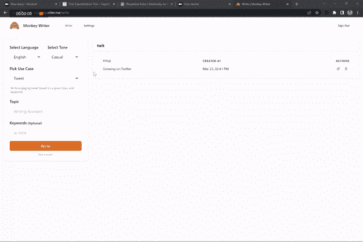

# 我在 30 天内建造了我自己的 SaaS

> 原文：<https://javascript.plainenglish.io/i-built-my-own-saas-in-30-days-46c4c3decdc2?source=collection_archive---------3----------------------->

## 现在它已经为用户准备好了

Credits [Andrea Piacquadio](https://www.pexels.com/sk-sk/@olly?utm_content=attributionCopyText&utm_medium=referral&utm_source=pexels) on [Pexels](https://www.pexels.com/sk-sk/fotka/frustrovany-stres-stresovany-sklamanie-3760139/?utm_content=attributionCopyText&utm_medium=referral&utm_source=pexels)

几周前，我派自己去执行一项令人兴奋的任务。我给自己安排了一个任务，在 30 天(T1)或更短的时间内建造一个 SaaS。今天，我很自豪地向大家展示我努力的最终成果。这正是我在这个故事中要做的。

**我来告诉你:**

*   *该产品有什么作用…*
*   *引擎盖下的工作原理…*
*   *商业模式如何运作……*
*   *未来会怎样…*

所以不要再浪费你的时间了，让我们开始吧。

# 介绍猴子作家

[猴子作家](https://monkeywriter.me/)是你的人工智能写作助手，帮助你**更好、更快、更便宜地创作引人入胜的内容。**

> 重要的是单词*“assistant”，*的意思是它只协助你创建内容。它不会为你创造。

这个工具只需要你简单的输入，它就会生成符合你需求的内容。我可以试着解释一下，但我认为下面的演示更好地展示了这一点。

How Monkey Writer works

这是该应用程序的关键特性。您可以使用不同的音调、语言和指定的关键字来创建各种类型的内容。

Monkey writer options

内容直接生成到文档中。使用富文本编辑器打开并显示文档。

> 使用这种技术，您可以立即更改和微调创建的内容。

您可以创建任意多的文档。最重要的是，你可以使用搜索工具找到想要的文件。搜索基于文档的标题，也基于文档的内容。

Document management in Monkey Writer

这几乎是它所有的功能。简单而有效。当然，还有额外的逻辑来处理支付、用户设置和认证。但是我们可以认为这些是必需品。

现在，让我们来了解一点技术问题，看看这个产品在引擎盖下是如何工作的。

# 让我们来谈谈技术

如果您想知道 monkey writer 是如何工作的，这一部分正是为您准备的。在这一部分，我将解释猴子作家是如何工作的，以及是什么让它运行的。

**这个应用程序有 3 个主要部分:**

*   下一个 JS React 网站
*   数据库ˌ资料库
*   第三方服务

## Next.js Web 应用程序

web 应用程序是使用 [Next.js](https://nextjs.org/) 框架构建的。我使用 React 和 TypeScript 作为代码库的主要支柱。我也**想要快速构建一个原型，所以我使用**[**Chakra UI**](https://chakra-ui.com/)来构建一个用户界面。

> 我没有因为这个设计而欣喜若狂，这在现阶段是可以的。我们的目标是开发一个看起来不错的 UI，能够响应移动设备。

我说的一切都是**托管在** [**Vercel**](https://vercel.com/) **平台上。**

## 数据库ˌ资料库

对于数据库的选择，我没有想太多，只是选择了 PostgreSQL 数据库。客户端可以通过 [Vercel Edge 函数访问它。](https://vercel.com/features/edge-functions)

## 支付管理

这是一个 SaaS 产品，作为其中的一部分，我们想收取订阅费。幸运的是， [**Stripe**](https://stripe.com/) **提供了一种集成订阅管理的方式。**而且都不需要大量的编码开销。

## 内容创作

现在，对于最关键的部分，人工智能内容生成。这听起来可能很复杂，但实际上比看起来简单。猴子作家在由 [OpenAI](https://openai.com/) 提供的 GPT-3 模型上工作。

这太棒了，因为我们可以使用 OpenAI APIs 直接生成内容。模型已经被训练成这样。剩下的就是解释我们需要生成什么样的内容。

所有这些都总结在下面的图表中。

Monkey Writer architecture

现在我们已经了解了这个应用程序的技术方面。我们来看看数字。

# 让我们谈生意吧

开发一个有效的应用是一回事。但是开发用户想要使用的应用程序也很重要。

从上面展示的视频中，我们可以看到该应用程序已经在工作了。现在的问题是，**会有人用吗？**

这个问题的答案是**是的，原因很简单。我很确定人们会使用猴子作家。事实上，已经有人在使用类似的网站了。**

事实是，猴子作家并不是市场上唯一的同类工具。已经有**工具在做同样的事情，使用相同的 OpenAI APIs。**

**列举几个:**

*   [Rytr](https://rytr.me/)
*   [碧玉](https://www.jasper.ai/)
*   [作家索尼克](https://writesonic.com/)

然而，**猴子作家有一个方面使它非常不同。**它与竞争对手的区别在于定价模式。

当其他工具每月向你收取高额费用时，猴子作家**只对你写的文字收费。**这种定价模式使其成为所有人工智能写作工具中最具成本效益的解决方案。

这就是我喜欢它的地方，也希望其他人也会喜欢它。也就是说，让我们在下一部分讨论这个软件的下一步计划。

# 我们将何去何从

我在构建这个项目的过程中得到了很多乐趣。但最后我意识到了一些事情。为了使这项事业成功，T4 需要更多的汗水和泪水。

这款产品已经运行良好，但是为了让它与众不同，还有很多工作要做。毕竟，用户会付费使用它。企业主有责任让他们的经历尽可能顺利。

最大的问题是，**我会继续写《猴子作家》吗？**我不太给它机会。一开始我觉得很有趣，但是随着项目的进展，我慢慢地对它失去了热情。

另一方面，删除所有的进度并关闭这个项目是很遗憾的。这就是为什么我在考虑将它开源或者送给对这个项目有热情的人。

我还不确定，但我想听听你的看法。 ***你觉得我该怎么办？***

> 如果你想亲自试用 Monkey Writer，你可以点击这个链接。注册是免费的，你也可以获得免费积分来测试这个工具。

我希望你喜欢这个故事。如果你想从我这里听到更多或者阅读更多，可以考虑使用 [***这个链接***](https://bernardbad.medium.com/membership) ***成为一名中等会员。***

 [## 我将在 30 天内建造我自己的 SaaS

### 我告诉你如何做同样的事情

javascript.plainenglish.io](/im-going-to-build-my-own-saas-in-30-days-f2c9d2cf8e1c) 

*更多内容请看*[***plain English . io***](https://plainenglish.io/)*。报名参加我们的* [***免费周报***](http://newsletter.plainenglish.io/) *。关注我们关于*[***Twitter***](https://twitter.com/inPlainEngHQ)*和*[***LinkedIn***](https://www.linkedin.com/company/inplainenglish/)*。加入我们的* [***社区不和谐***](https://discord.gg/GtDtUAvyhW) *。*