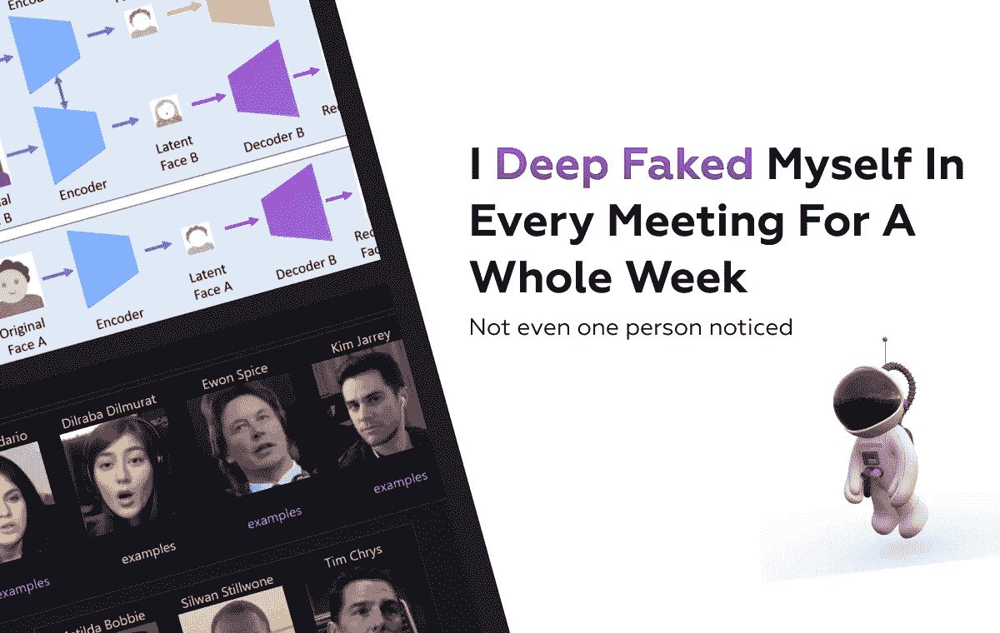
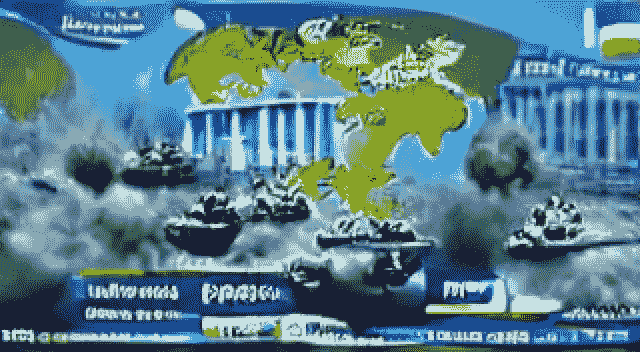
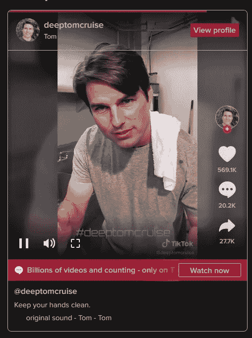
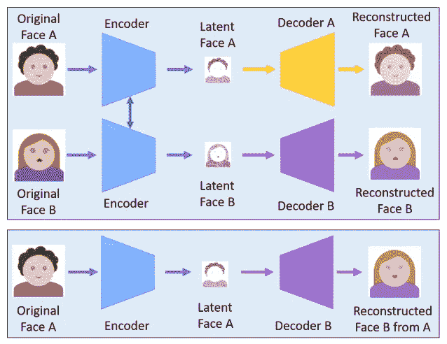
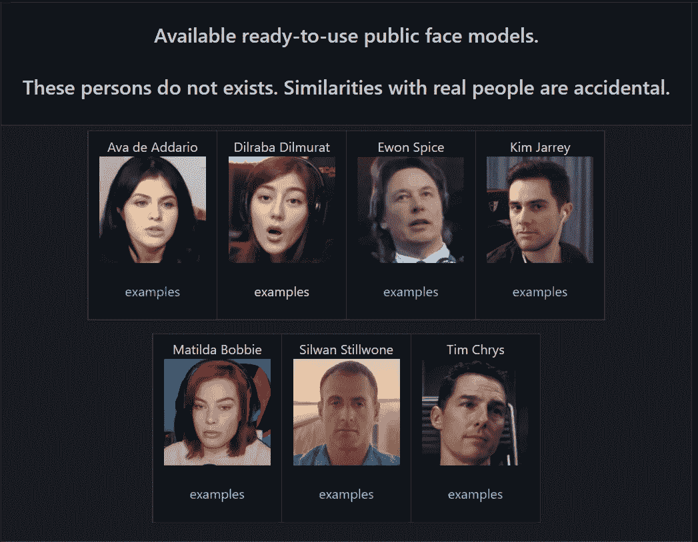
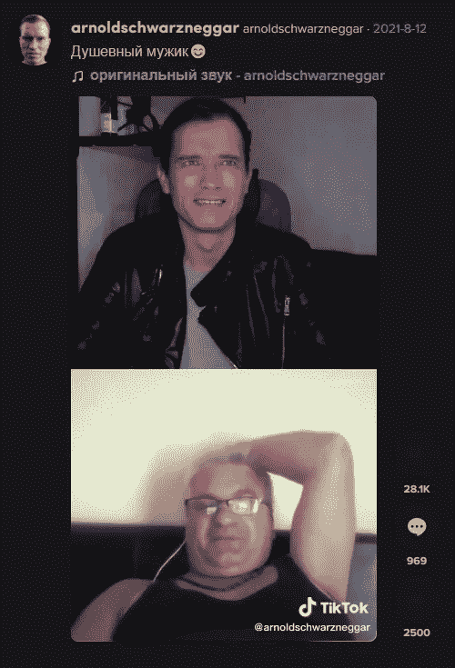
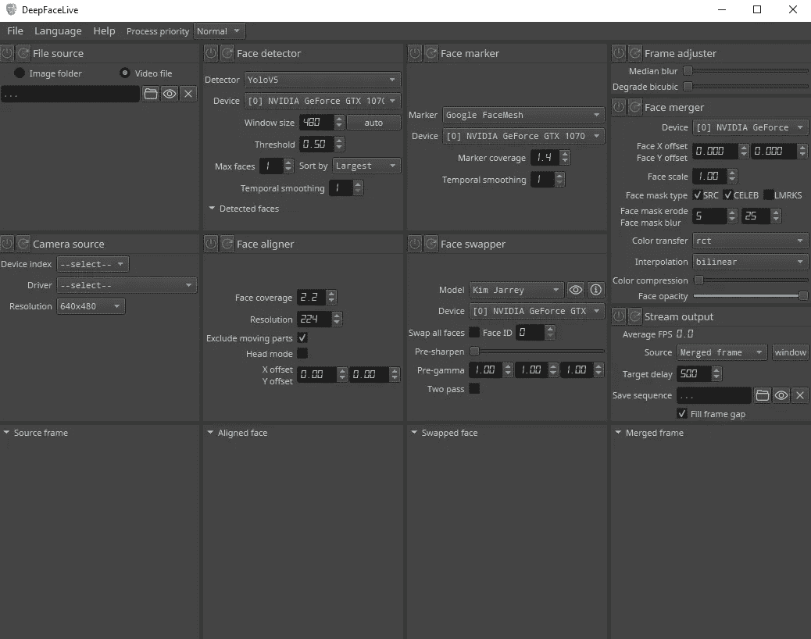

# 整整一个星期，我在每次会议上都假装自己

> 原文：<https://javascript.plainenglish.io/i-deep-faked-myself-in-every-meeting-for-a-whole-week-23901deed017?source=collection_archive---------2----------------------->

## 甚至没有一个人注意到。

我们都知道那些不计其数的、强制性的、大流行后的变焦电话，在那里时间似乎停止了，所有关于开发者日常生活的**精彩**都变成了**尘埃**。幸运的是，我们中的一些人有更愉快的经历。虽然我通常在会议期间过得很愉快，但我决定用**艾**来增加点趣味。

我想知道怎样才能让会议更有趣？如此平淡无奇的东西怎么会变成一道欢笑和快乐的彩虹。我在一个像我这样的开发者不常漫游的地方找到了灵感。

World War III Depiction by AI

这是 VFX 和 CGI 关注的 YouTube 频道的惊人利基(更像是一个完整的行业)，更准确地说是 [Corridor Crew 的 VFX 视频](https://www.youtube.com/watch?v=qXLugdeogQU)之一，其中展示了一个名为[**DeepFaceLive**](https://github.com/iperov/DeepFaceLive)**的开源项目。**

有趣的是，就在我完成这篇文章的时候，他们已经发布了另一个很棒的视频，涵盖了[声音深度伪装](https://www.youtube.com/watch?v=0fO7CBDMGNA)和一个非常搞笑的背景故事，我不会让你扫兴的。

# 什么是深度假货

> 看起来真实的假面

它们可以是任何东西，从巴拉克·奥巴马(Barack Obama)称唐纳德·特朗普(Donald Trump)为“彻头彻尾的笨蛋”，到马克·扎克伯格(Mark Zuckerberg)吹嘘拥有对数十亿人被盗数据的绝对控制权，两者都是假视频。

Deep Fake Of Tom Cruise

深度假像是计算机生成的视频，其中人工智能用另一个人的脸代替一个人的脸，同时匹配从说话到皱眉的微小面部手势。

它们经常被用来传播错误信息，甚至是在正在进行的乌克兰战争中，甚至是用流行名人的面孔制作成人内容，尽管这并不总是背后的恶作剧，在我的用例中，这都是为了搞笑。

大型电影公司也用它来重现或扩展老电影场景，让**的**演员变老(尽管这也是通过其他方式完成的)。

> 在二十一世纪，机器人将取代古代文明中奴隶劳动的地位。(尼古拉·特斯拉)

想象一下，大公司开发和销售深度假货服务，以实现自动新闻播报，甚至减少演员的参与，用经过面部改造的特技演员取代他们，但要实现这一点还有很长的路要走。

大学和特效公司的研究人员长期以来一直在推动视频和图片处理的极限。

面部交换视频可以通过几个步骤来制作。首先，你必须通过一个编码器来运行这两个人的数百万张照片，这是一个人工智能系统。编码器寻找并学习两张脸之间的相似之处，然后将它们减少到它们共有的特征，压缩图像。

然后，使用被称为解码器的第二个人工智能系统从压缩的照片中恢复人脸。你训练一个解码器来恢复第一个人的脸，训练另一个解码器来恢复第二个人的脸，因为这两个人的脸是不同的。

你只需将经过编码的照片发送到“错误的”解码器中，就可以实现面部交换。例如，人 A 面部的压缩图像被提供给已经对人 B 进行了训练的解码器。之后，解码器使用人 A 面部的表情和方向来重建人 B 的面部。对于可信的视频，这必须在每一帧上进行。

Deep Fakes in a nutshell

算上人脸 A & B 的模型训练和视频中人脸的合并，整个过程可能需要几个小时，但现在几乎可以实时完成。

值得注意的一点是，音频流和图像也存在深度伪造技术，一些州甚至**禁止**未经同意用于邪恶目的的深度伪造。

# 如何深入伪装生活

> 按下运行和被击昏

人工智能**的发展速度比元宇宙骗局达到售罄状态的速度还要快，这有时会很可怕。我们从人工智能能够准确区分狗和猫的图片，到它很快能够阅读我们的灵魂并领导社会。**

AI can be friendly

让我们暂时忘记人工智能征服世界，看看如何以一种有趣、轻松的方式使用它，当你的同事发现你实际上不是电影明星或想象中的政治人物的折扣版本时，他们会笑或喘气。

我说所有这些虚构的听起来的词是因为即使在可笑的情况下，未经同意使用真人的深度假货也可能被视为非法，但这很容易解决，因为知识库提供了一组不存在的人，他们可能与真人有一些相似之处，这无疑是偶然的。

Public Face Models

还有一个抖音现场直播的例子，一个阿诺德·施瓦辛格低沉的假俄语，真是太美了。

TikTok Livestream Deep Fake

如果你已经**出售了**并且想自己尝试一下，那就去[官方仓库](https://github.com/iperov/DeepFaceLive)看看吧，免费拥有如此强大的东西真是不可思议。如果您想跳过阅读代码并自己编译它，可以下载。自述文件中列出的外部链接。

解压压缩文件并运行。蝙蝠文件，并准备好被深度伪造。😎

确保到处都选择 GPU，因为它在运行人工智能密集型任务方面通常比 CPU 更有能力。

你可以定制软件在视频和直播流上运行，请记住，如果你的电脑不够强大，使用直播功能可能会导致滞后和延迟。

我的第一次尝试并不令人印象深刻，因为我是在我的笔记本电脑上测试的，它无法跟上每秒不到 5 帧的实时运行，这在通话期间确实无法使用。

由于资源需求，视频输出也变黑了，很快就崩溃了，但我没有放弃，在与几个朋友通话时，我自己用 GTX 1070 设法控制住了金·贾瑞，这导致了一个**难忘的**反应。

希望你喜欢这个简短的“AI/深假”故事，别忘了鼓掌**👏**并关注更多软件相关内容🚀。

*更多内容看* [***说白了就是 io***](https://plainenglish.io/) *。报名参加我们的* [***免费周报***](http://newsletter.plainenglish.io/) *。关注我们关于*[***Twitter***](https://twitter.com/inPlainEngHQ)*和*[***LinkedIn***](https://www.linkedin.com/company/inplainenglish/)*。加入我们的* [***社区***](https://discord.gg/GtDtUAvyhW) *。*