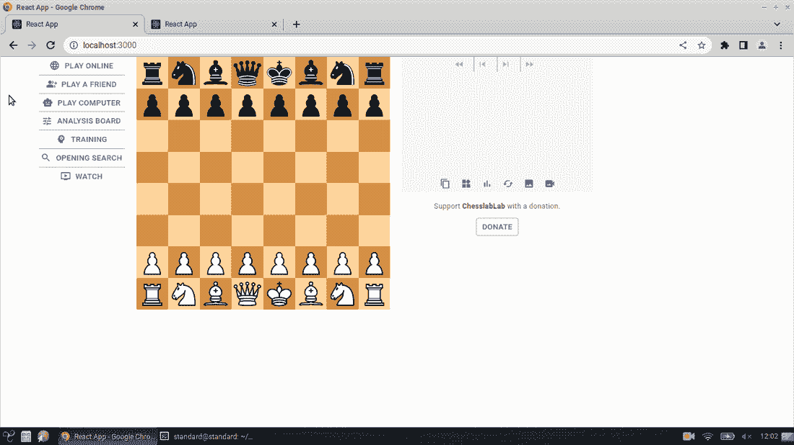

# 我用这个一行程序修复了一个无法捕获的类型错误

> 原文：<https://javascript.plainenglish.io/i-fixed-an-uncaught-typeerror-bug-with-this-one-liner-a35d50dcac1a?source=collection_archive---------2----------------------->

## 该应用程序在接受撤回后崩溃


Photo by [Muha Ajjan](https://unsplash.com/@isword?utm_source=unsplash&utm_medium=referral&utm_content=creditCopyText) on [Unsplash](https://unsplash.com/s/photos/keyboard?utm_source=unsplash&utm_medium=referral&utm_content=creditCopyText)

你好，网络开发者，你今天过得怎么样？这是“让我们开门见山”系列的第三篇文章，在这里我将用几句话解释如何解决 GitHub 上的一堆 ChesslaBlab 问题。

[](https://programarivm.medium.com/solving-issues-on-github-in-few-words-e63a115a3260) [## 用几句话解决 GitHub 上的问题

### 让我们开门见山吧

programarivm.medium.com](https://programarivm.medium.com/solving-issues-on-github-in-few-words-e63a115a3260) 

到目前为止，做到这一点相当具有挑战性。我不可避免地以阐述解决方案告终，因为它们需要一些开发工作。然而，今天我带来了一个帖子，展示了如何用一行代码修复下面的错误。

[](https://github.com/chesslablab/redux-chess/issues/319) [## 该应用程序在接受收回问题# 319 cheslablab/redux-chess 后崩溃

### 下面附上的是在控制台上获得的输出。Board.js:81 未捕获的类型错误:无法读取的属性…

github.com](https://github.com/chesslablab/redux-chess/issues/319) 

正如你点击上面的链接所看到的，在游戏开始后，当提议收回时，抛出了一个未捕获的类型错误。在还没有采取任何行动的时候，这样做确实没有意义。因此，在游戏开始时禁用**提议收回**按钮可能是个好主意，如下图 GIF 所示。



**Figure 1**. **Propose a Takeback** has been disabled at the starting position

只有文件`src/features/playMode/StartedButtonsPlayMode.js`需要更改。

下面的一行程序成功了。

```
disabled={!state.board.movetext}
```

所以，是的，在这种情况下，这是一个很容易解决的问题。

非常感谢您的阅读！

*更多内容尽在* [***说白了. io***](https://plainenglish.io/) *。报名参加我们的* [***免费周报***](http://newsletter.plainenglish.io/) *。关注我们关于* [***推特***](https://twitter.com/inPlainEngHQ) *和*[***LinkedIn***](https://www.linkedin.com/company/inplainenglish/)*。查看我们的* [***社区不和谐***](https://discord.gg/GtDtUAvyhW) *加入我们的* [***人才集体***](https://inplainenglish.pallet.com/talent/welcome) *。*