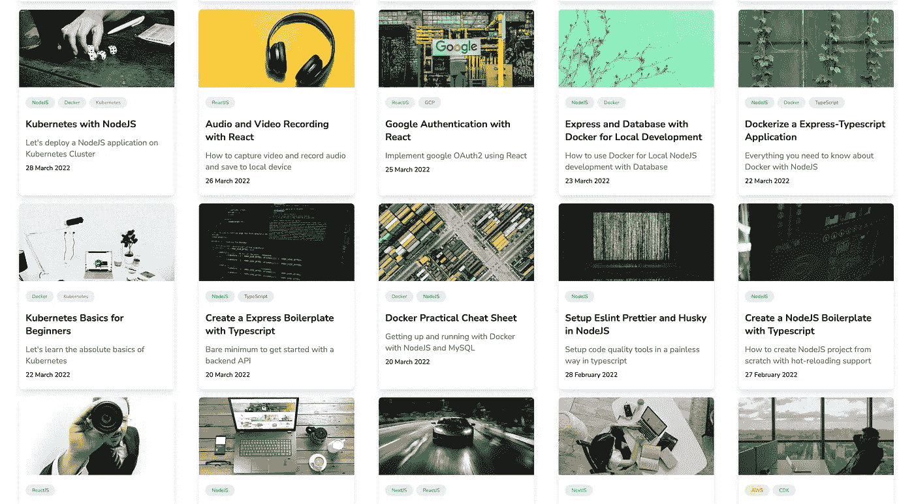
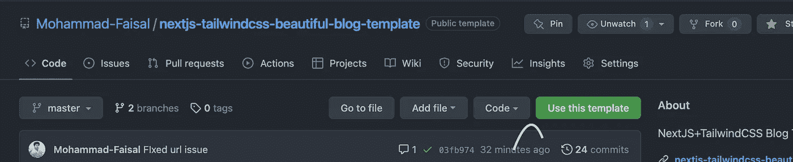
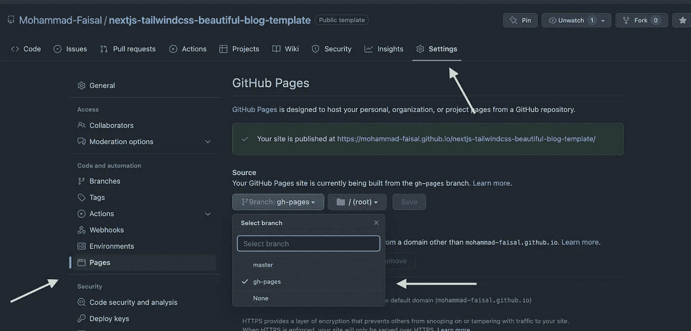
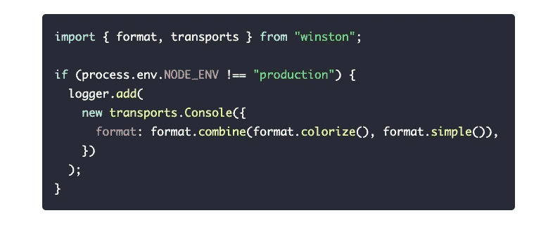

# 我的开源博客，你现在就可以使用

> 原文：<https://javascript.plainenglish.io/i-just-opensourced-my-blog-that-you-can-use-right-now-b411d655e9b6?source=collection_archive---------6----------------------->

## 这里是你如何得到你自己的版本和技术细节。


Photo by [Surface](https://unsplash.com/@surface?utm_source=unsplash&utm_medium=referral&utm_content=creditCopyText) on [Unsplash](https://unsplash.com/s/photos/happy?utm_source=unsplash&utm_medium=referral&utm_content=creditCopyText)

创建我的个人网站是我的一个长期目标。最后，我创建了我的个人网站和一个技术博客，你可以在这里访问。

今天，我开源了我个人网站的博客部分。我将向您展示如何使用它，并讨论一些技术细节。

# 你会得到什么？

这是一个博客主页的例子。截图取自我的个人网站。



Demo

## 现场演示

或者你可以亲自去参观。；)

[](https://www.mohammadfaisal.dev/blog) [## 博客|穆罕默德·费萨尔

### Mohammad Faisal 撰写的技术博客

www.mohammadfaisal.dev](https://www.mohammadfaisal.dev/blog) 

# 特征

博客技术上非常丰富。但是最重要的特征是。

*   **Markdown** 支持博客
*   用 **Prism.js** 突出显示语法
*   Github 页面**自动部署**支持
*   **谷歌分析**整合
*   **SEO** 设置
*   **顺风 CSS+排版**整合
*   **黑暗模式**支持下一主题

# 让我们把它变成你自己的

让我们看看你如何使用它。下面是您将需要的存储库。

[](https://github.com/Mohammad-Faisal/nextjs-tailwindcss-beautiful-blog-template) [## GitHub-Mohammad-fais al/NextJS-TailwindCSS-beautiful-Blog-template:NextJS+TailwindCSS Blog…

### https://nextjs-tailwindcss-beautiful-Blog-template-6 bhlgxk 4v . vercel . app/sample-Blog 这是一个博客模板，使用…

github.com](https://github.com/Mohammad-Faisal/nextjs-tailwindcss-beautiful-blog-template) 

如果你喜欢视频版本，我也为此制作了一个 youtube 视频。

或者你可以按照下面的说明。

你可以去那里点击`Use this template`按钮，让它成为你自己的



Use this template

这将自动启动一个构建网站并添加到名为`gh-pages`的新分支的操作。

## 出版

从你的存储库的`settings`面板中，你将进入`pages`部分并选择源为`gh-pages`。



Publish it

你会在那里看到实时网址。

## 定制内容

如果您想定制它，您可以遵循存储库上的`Readme`文件。基本上，这个想法就是编辑`.env.local`文件，用您自己的信息更新信息。

## 自定义徽标

在`/public`文件夹中，也有一些你可以定制的图片，添加你自己的风格。

# 技术讨论

现在让我们来谈谈博客的不同技术方面。如果你喜欢视频版本，你可以看下面我做的视频。

或者我们也在这里谈一谈

## 降价支持

我使用了一个名为`gray-matter`的库从 markdown 文件中加载元数据。

您可以在降价文件中添加元数据，如下所示

```
---title: "Add Custom Fonts with NextJS"description: "Create beautiful looking websites in minutes"banner: "/images/posts/add-custom-fonts-to-nextjs/banner.jpeg"tags: ["NextJS"]date: 1 January 2022published: **true**---
```

该包将自动读取数据并为您返回一个对象。[以下是我的使用方法](https://github.com/Mohammad-Faisal/nextjs-tailwindcss-beautiful-blog-template/blob/master/lib/blog-api.ts)

## 代码突出显示

为了突出代码，我使用了 [Prism.js](https://prismjs.com/) 。首先，我将样式文件加载到`_app.tsx`文件和[代码块](https://github.com/Mohammad-Faisal/nextjs-tailwindcss-beautiful-blog-template/blob/master/components/code-block/index.tsx)组件中，我正在加载给我们漂亮的语法高亮的样式。



Syntax Highlight

## 深色模式

对于黑暗模式，我使用的是`[next-themes](https://www.npmjs.com/package/next-themes)`，它导出了一个名为`setTheme`的函数，我在`Header`组件中使用这个函数来切换主题。

## 谷歌分析

谷歌分析对任何生产应用都非常有用。你只需在`.env.local`文件中添加你自己的 google analytics 键，一切都会为你服务。你可以查看下面的文章了解详情

[](https://www.mohammadfaisal.dev/blog/add-google-analytics-to-nextjs) [## 使用 NextJS | Mohammad Faisal 添加谷歌分析

### 数据是当今世界上最有价值的商品。因此，了解您的用户如何使用您的平台至关重要…

www.mohammadfaisal.dev](https://www.mohammadfaisal.dev/blog/add-google-analytics-to-nextjs) 

## SEO 设置

我们正在使用`[next-seo](https://www.npmjs.com/package/next-seo)`包为网站添加所有需要的标签。以下是详细情况

[](https://www.mohammadfaisal.dev/blog/improve-seo-in-nextjs) [## 改进 NextJS 中的| Mohammad Faisal

### 我们都喜欢 React 的速度和性能。由于它使用单页应用程序的方法，一切都感觉很快…

www.mohammadfaisal.dev](https://www.mohammadfaisal.dev/blog/improve-seo-in-nextjs) 

此外，我们也在为我们的博客生成`sitemap.xml`文件。你可以看看下面的文章。

[](https://www.mohammadfaisal.dev/blog/create-sitemap-in-nextjs) [## 在 NextJS | Mohammad Faisal 中创建站点地图

### 对于任何面向公众的网站来说，网站地图都是 SEO 的重要组成部分。这基本上是一个列表的网址，你想…

www.mohammadfaisal.dev](https://www.mohammadfaisal.dev/blog/create-sitemap-in-nextjs) 

## 顺风排版

我真的很喜欢顺风排版。这让我的生活变得简单多了，因为我并不擅长 UI 设计。它像魔法一样起作用，让一切都变得非常美丽。[这里有一个视频](https://www.youtube.com/watch?v=IZZ5uwOkrAA)，我描述了我是如何使用它的。

# 结论

给你。如果你喜欢这个项目，请启动它。此外，如果您有任何问题或困惑，请随时通过我的 [LinkedIn](https://www.linkedin.com/in/56faisal/) 或我的[个人网站](https://www.mohammadfaisal.dev/)联系我。

祝您愉快！:D

## 进一步阅读

[](https://bit.cloud/blog/how-to-build-a-composable-blog-l1jkl9f4) [## 如何建立一个可组合的博客

### 从头开始创建一个博客需要很多。有许多移动的部件组合在一起形成一个…

比特云](https://bit.cloud/blog/how-to-build-a-composable-blog-l1jkl9f4) 

*更多内容看* [***说白了就是***](https://plainenglish.io/) *。报名参加我们的* [***免费周报***](http://newsletter.plainenglish.io/) *。关注我们关于*[***Twitter***](https://twitter.com/inPlainEngHQ)*和*[***LinkedIn***](https://www.linkedin.com/company/inplainenglish/)*。查看我们的* [***社区不和谐***](https://discord.gg/GtDtUAvyhW) *加入我们的* [***人才集体***](https://inplainenglish.pallet.com/talent/welcome) *。*