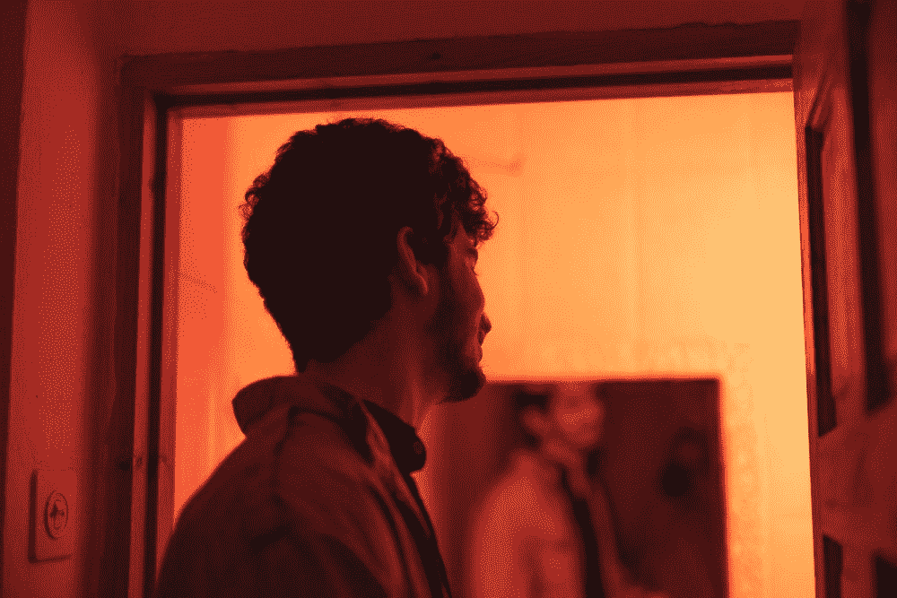

# 我每天看着镜子里的自己，问这三个毁了我一生的问题

> 原文：<https://javascript.plainenglish.io/i-look-myself-in-the-mirror-and-ask-these-3-life-ruining-questions-every-day-cdb7ec40235c?source=collection_archive---------14----------------------->

## 作为一名开发人员，每次我评估自己时都会得到相同的答案

Photo by [Or Hakim](https://unsplash.com/@orhakim?utm_source=unsplash&utm_medium=referral&utm_content=creditCopyText) on [Unsplash](https://unsplash.com/?utm_source=unsplash&utm_medium=referral&utm_content=creditCopyText)

我仍然记得，在我的童年，我是一个喜欢无忧无虑，尽情享受运动的孩子，但是随着时间的流逝，很少有事情会发生巨大的变化。

在我目前的情况下，我经常问自己 3 个奇怪的问题，有时会让我一片空白。这三个问题是—

*   我挣得够吗？
*   我的成长速度够我的未来吗？
*   我未来的自己会以我为荣吗？

自我怀疑是人类可能遇到的最糟糕的事情。我不是在自我怀疑，但同时，我也在寻找这些问题的答案。

## 我挣得够吗？

我真的不知道为什么我一直问自己这个问题。我相信我的工作对我来说是最重要的。

但是有时候，我希望给自己买一套好房子和一辆好车。因为我住在大都市，好公寓的价格总是很高。目前，我唯一关注的是将我的大量储蓄投资于一些有价值的回报。

这项投资可能会让我买一套我未来想要的梦想公寓。与此同时，我要确保我没有更多地投资于不稳定的资产，也没有投资于那些经过适当研究和事先了解的有意义的东西。

如果我问自己“我挣得够吗？”。

答案是非常怪异和不合逻辑的。我心中的确切答案是——“我不知道我挣得够不够”。

与此同时，我想强调一个重要的事实，目前我收入的 35%对于我的需求(包括聚会、房租、每周一次的酒店食物)和支付所有的月账单是绰绰有余的。

因此，我把每月收入的 65%存起来，非常系统地进行投资。

即使知道这个事实，如果有人仍然问我“你赚够了吗？”我现在没有该死的答案。

也许我是，也许我不是。我不知道。我很困惑。

有时候我只是觉得，我被困在一个仓鼠轮子里。

## 我的未来呢？

正如我已经提到的，在未来，也许三年后，我计划在一个大都市买一套好公寓。

但有时我会想，如果我的投资和存款不足以给自己买一套梦想中的公寓该怎么办。

同样，我说的梦幻公寓，并不是指带有游泳池的巨型公寓。对于梦想公寓这个词，我的意思是一个我可以愉快地放松的地方，而不考虑它的地毯面积。

我知道很多人会对我提出一个普遍的观点“用住房贷款选项给自己买一套公寓”。

对于那些收入稳定并能定期付清教育管理保险的人来说，住房贷款是最好的选择。我当然有足够的信心用我的收入定期支付我的 EMIs，但是我有一些不同的计划。

如果我将来需要贷款买房，贷款金额不应该超过总房价的 35%到 45%。

是的，你可以叫我任何你想要的名字，但是我答应自己尽可能地接受最低限度的房屋贷款。

我不能将我的房屋贷款延长到总价的 45%以上的唯一原因是因为我的个人理智(怪异),我会觉得自己像一个支付高额 EMIs 多年的怪物，直到我完全拥有公寓。

此外，我需要为三件重要的事情存钱

*   应急基金
*   我未来的大开销
*   婚后生活

## 我未来的自己会以我为荣吗？

我不知道将来我是否会为自己感到骄傲。我在一本书上看到“对自己的未来想太多会让你焦虑”。

此外，我是功夫熊猫电影《老乌龟》的忠实粉丝，因此我相信—

> “昨天已成历史，明天还是个谜，但今天是一份礼物，这就是为什么它被称为“现在”

就我个人而言，我也看过许多动漫系列，它们只给观众一个简单的寓意“无论发生什么，都要相信自己”。

我相信自己，你也应该如此。相信自己给了我力量，让我可以在自己身上下功夫，专注于自我提升。

是的， [*世界正以最快的速度前进，我也应该如此。*](/being-lazy-is-unacceptable-when-the-world-is-moving-at-its-fastest-speed-383bee04be80)

我不知道我未来的自己是否会为我的决定感到骄傲，但我确信我对自己现在的决定感到满意。

如果你再问我一个问题“你为你过去的版本感到骄傲吗？”

我的回答将是——“是的，那个孩子尽他所能努力给我我所拥有的。不管发生了什么，我都为他感到骄傲。我从失败中学到了大量的生活经验，这将有助于我未来的发展。”

最后，我会尽可能地专注于我当前的版本。我将集中精力在经济和精神上发展自己。不管我在什么情况下，我都会像个国王一样面对它。

关于我——我是*科技*和*自我提升* [*的顶级作家点击这里*](https://aniketz.medium.com/) *阅读更多我的文章。*

就这样，这是文章的结尾。希望它对你有价值。如果你喜欢这篇文章，点击这里订阅我的邮件列表。我会通过电子邮件给您发送技术相关的文章。

 [## 通过我的推荐链接加入 Medium-Aniket

### 作为一个媒体会员，你的会员费的一部分会给你阅读的作家，你可以完全接触到每一个故事…

aniketz.medium.com](https://aniketz.medium.com/membership) 

[**通过电子邮件获取我的文章点击这里**](https://aniketz.medium.com/subscribe) **|** [**购买 5 美元的中等会员资格**](https://aniketz.medium.com/membership)

*更多内容看* [***说白了。报名参加我们的***](http://plainenglish.io/) **[***免费周报***](http://newsletter.plainenglish.io/) *。在我们的* [***社区不和谐***](https://discord.gg/GtDtUAvyhW) *获得独家获取写作机会和建议。***