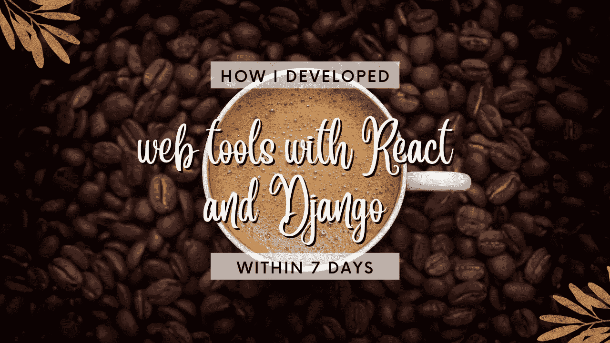

# 我用 React 和 Django 制作了两个新的网络工具&这是我的经验！

> 原文：<https://javascript.plainenglish.io/i-made-2-new-web-tools-with-react-and-django-heres-my-experience-fb30e16cc06c?source=collection_archive---------21----------------------->

## 下面是我用 React 和 Django 制作 web 工具的经验。

Web App Development with React, Next.js, and Django

我是一名独立开发人员，我用我的 Django 技能开发了大量的 web 工具，但我学会了 React 和 Next.js，下面是我的故事。

# 为什么要独立开发？

你应该尝试独立发展的原因有很多，我开始独立发展的一些原因是:
它给你一种重要感和归属感，这对于建立自信和为社区做贡献是必不可少的。此外，它还能培养你内心的主人翁感。

# 我的网络应用/工具的初步开发

嗯，最初我只用 Django 进行开发，并在服务器上部署 web 应用程序。但是我用姜戈是有原因的。原因是我学习 Django 的唯一目的是制作那些 web 应用程序，我不知道其他的 web 框架。
拜托，Django 是迄今为止我测试过的最简单、最快的 web 框架。
我不必担心我的网络应用程序的 CSRF 和其他安全问题，因为我显示的数据是从其他地方刮来的。

我的一些非常常见/新的网络应用程序…

1.  [YouTube 标签生成器](https://apps.webmatrices.com/platforms/youtube-tag-generator)
2.  [相关关键词生成器](https://apps.webmatrices.com/generator/related-keyword-generator)
3.  [Linkedin 标签生成器](https://apps.webmatrices.com/social-media/linkedin-hashtag-generator)

# 切换到 React 和 Next.js

其实我并没有完全切换到 React/Next.js，我只是切换了我的 web 应用的前端部分。后端还是在 Django。

# 挑战

我必须保证我的网络应用程序的安全，这样它就不会泄露后端部分，我不想让后端公开。然后，我尝试使用 Next.js 的 API，并用它请求 Django 服务器。此外，使用 CSRF 也因此变得容易。我为这个任务使用了一个名为 [next-csrf](https://www.npmjs.com/package/next-csrf) 的包。

# 最大的部分

最棒的是，所有这些忙碌和努力工作，将会给我带来丰厚的谷歌广告收入。NFT 名字生成器是我最喜欢的网络应用之一。而且，它给我很好的报酬。

谢谢你陪我，祝你有美好的一天！

*更多内容请看*[***plain English . io***](https://plainenglish.io/)*。报名参加我们的* [***免费周报***](http://newsletter.plainenglish.io/) *。关注我们关于*[***Twitter***](https://twitter.com/inPlainEngHQ)*和**[***LinkedIn***](https://www.linkedin.com/company/inplainenglish/)*。查看我们的* [***社区不和谐***](https://discord.gg/GtDtUAvyhW) *加入我们的* [***人才集体***](https://inplainenglish.pallet.com/talent/welcome) *。**