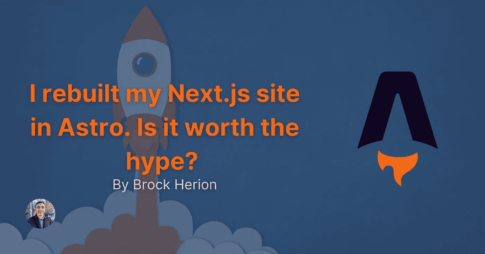

# 我在 Astro 重建了我的 Next.js 网站。它不辜负炒作吗？

> 原文：<https://javascript.plainenglish.io/i-rebuilt-my-next-js-site-in-astro-does-it-live-up-to-the-hype-5268c09f4463?source=collection_archive---------1----------------------->



任何了解我的人都知道我喜欢 Next.js。这是一个构建 React 应用程序的很好的框架，与 Vercel 相结合，提供了一个很棒的开发者体验。然而，这个周末，我通过一段新的 Fireship.io 视频被介绍给了 Astro。我听说过几次阿斯特罗，但从没用过它。出于对炒作内容的好奇，我决定将 [brockherion.dev](https://brockherion.dev) 移植到 Astro。

在进入我的经验之前，我不会比较每个框架的技术细节。我会给出一些与我的经验相关的不同之处，但这不是 Next vs Astro 的文章。我只是简单地分享一下使用 Astro 对我来说是什么样的，以及为什么我计划在这个特定的项目中坚持使用它。您可以在 [Astro Docs](https://docs.astro.build/en/comparing-astro-vs-other-tools/#nextjs-vs-astro) 上阅读更多关于 Next 和 Astro 之间的区别。

现在，继续表演！

# 动机

正如我在[之前的一篇文章中所写的那样，我的网站是使用 Next.js、TailwindCSS 和 TypeScript 构建的。我选择这个堆栈是因为实际上构建一个好看的网站是多么容易。这也是我最习惯使用的堆栈，因为我已经使用这些技术有一段时间了。](https://brockherion.dev/blog/posts/how-i-built-brockherion-dev)

虽然我喜欢 Next.js 构建高度交互的网站，但是我发现仅仅针对静态内容进行设置有点令人沮丧，尤其是从降价文件中。我带来了几个“npm”包来处理诸如解析 frontmatter 之类的事情。虽然这确实让事情变得更容易，但让我的降价页面渲染仍然需要我做大量的工作。不过，这并不是世界末日，尤其是当我所有的组件都安装好之后。

另一个小问题是实际部署站点。我使用 Vercel 进行托管，他们让部署你的网站变得非常容易。然而，构建时间从 30 秒到一分钟多一点不等。再说一遍，这并不是什么失眠的事情，但确实有点烦人。如果我正在修复一些非常小的东西，比如一篇博客文章中的一个打字错误，那就更是如此。

由于 Astro 是一个构建静态网站的工具，我很好奇它在下一步会有什么表现。然而，我对原始表演不太感兴趣。Next 确实支持静态站点生成，并且做得很好。一旦部署，我的灯塔评分一致在 90 和 100 之间的下一个版本的网站。Astro 版本也是如此。

我想知道的是开发者的体验。Astro 能否解决我在下一个设置中的难点？

# 移植 brockherion.dev

我用博客模板和对 Tailwind 和 React 的支持创建了一个新的 Astro 项目。Astro 很好，因为它支持多种 UI 框架，包括 React、Vue 和 Svelte。我最初的计划是把我所有的 React 组件从下一个版本移到这里，做一个精确的 1-1 端口。这本来是测试原始性能的最佳情况，但是我不太关心这个。我借此机会对用户界面做了一些修改，使它更有凝聚力。因此，虽然布局略有不同，但内容本身或多或少是相同的。

让我惊讶的是 Astro 的语法是多么直观。虽然我可以使用 JSX 组件，但我决定尝试一下 Astro 组件，并最终真正喜欢上了它们。它们和 JSX 很相似，在那里我可以相对较快地找到它们。我也意识到我在 Next 中创建的一些组件可能有点多余。我最终稍微简化了我的页面和组件结构，并清理了一些我留下的技术债务。

几个小时之内，我的所有页面(除了项目页面)和博客文章都被转移了。我并没有花太多时间来移动我的内容，甚至花了更少的时间来修复我之前设置中的一些问题。在对我的 SEO 设置进行了一点图像优化和微调之后，我已经准备好部署这个网站了。

# 阿童木值得大肆宣传吗？

我首先要说的是，我对开始学习 Astro 的简单程度印象深刻。正如我之前说过的，它和 JSX 非常相似，让我觉得很熟悉。也就是说，如果我真的想使用 React 组件，我真的很感激。如果网站更大，这将使过渡过程更加平稳。

其次，我很欣赏 Astro 将 markdown 文件视为页面。但在 Next 中却不是这样，你必须使用“getStaticProps”和“getStaticPaths”来设置和渲染你的 markdown 文件。我也很喜欢你如何在 frontmatter 文件中定义你的降价页面的布局。你需要做的就是

```
---
setup: |
  import Layout from ‘../../../layouts/BlogPost.astro’
---
```

并且你的页面被包装在你的布局中。

最后，我真的很喜欢 Astro 处理 frontmatter 的方式。你可以在你的`. astro `文件中编写这样的代码来抓取你所有的帖子。

```
---
let allPosts = await Astro.glob(‘./posts/*.md’);let featuredPosts = allPosts.filter(post => post.frontmatter.isFeatured);
---
```

因为“allPosts”是一个数组，所以可以非常容易地根据你的帖子的内容进行排序和过滤。我甚至不能开始描述这比我在 Next 的设置好多少。

同样让我印象深刻的是 Astro 版本构建和部署的速度。我前面提到过，下一个版本的构建和部署需要 30 秒到 1 分钟。Astro 版本的构建和部署需要 15 到 25 秒。这在构建时间上是一个不错的改进！

在下一个版本中，我可以设置一个简单的脚本，在我构建应用程序来重新创建网站地图时运行。我不完全确定我将如何在这里设置它，但我确信它将是非常相似的东西。

# 最后的想法

鉴于我在这个网站上的用例，Astro 比 Next.js 更适合。虽然在性能方面它们非常相似，但 Astro 只是让我的事情变得更容易。从如何处理降价到改进构建时间，Astro 给我留下了深刻的印象。

Astro 是否取代 Next.js？不，一点也不。对于 brockherion.dev 来说，Astro 更有意义，因为内容是静态的。它让我可以用更少的开销做我需要的事情。Next 可以处理静态内容，但是需要更多的设置才能正常工作。对我来说，下一个亮点是当我构建一个非常交互式的应用程序或动态网站时。如果我有很多动态或用户驱动的内容，Next 可以轻松处理。在这种情况下，最重要的是使用合适的工具。

总的来说，我真的很喜欢 Astro，迫不及待地想知道它的发展方向。对于构建静态站点来说，这是一个非常棒的工具。它能够为我提供我所需要的东西，同时为我提供一个很好的开发体验。

编码快乐！

*更多内容请看*[***plain English . io***](https://plainenglish.io/)*。报名参加我们的* [***免费周报***](http://newsletter.plainenglish.io/) *。关注我们关于*[***Twitter***](https://twitter.com/inPlainEngHQ)*和*[***LinkedIn***](https://www.linkedin.com/company/inplainenglish/)*。查看我们的* [***社区不和谐***](https://discord.gg/GtDtUAvyhW) *加入我们的* [***人才集体***](https://inplainenglish.pallet.com/talent/welcome) *。*