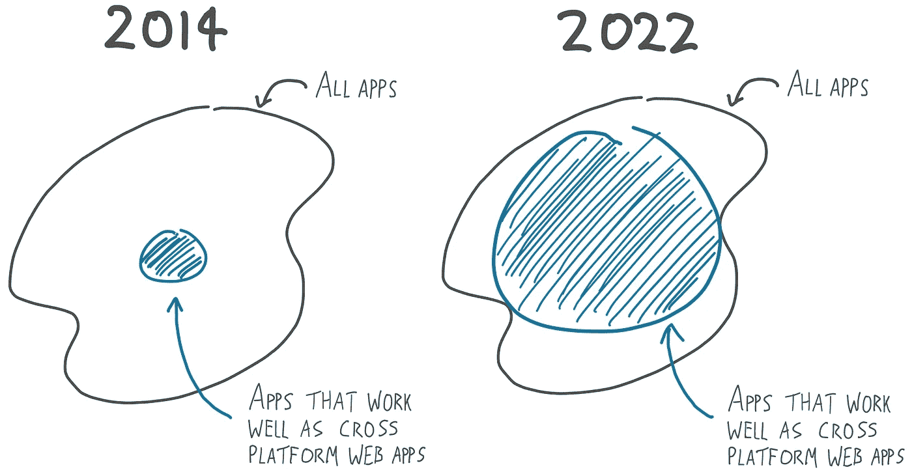
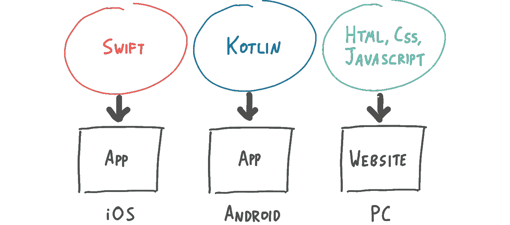
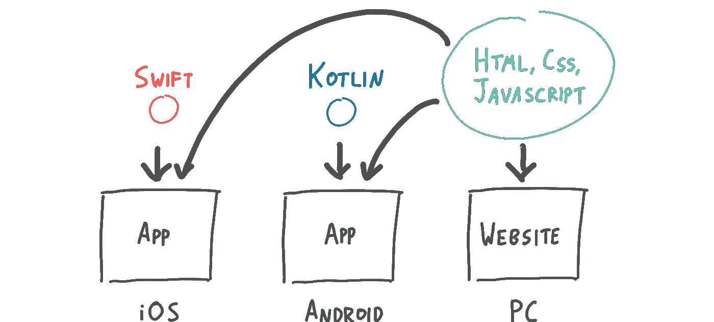
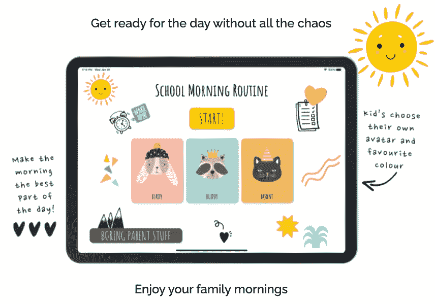
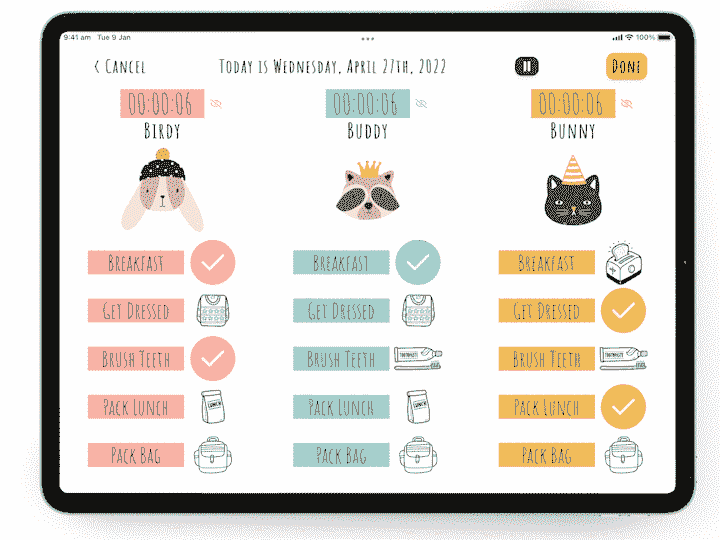
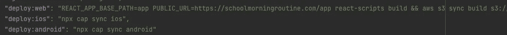
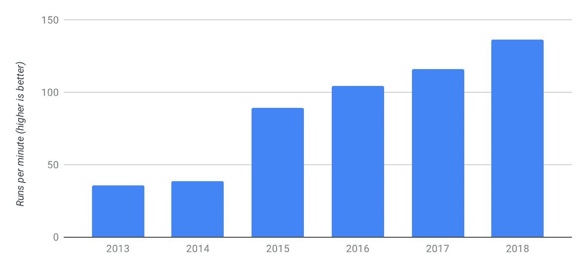
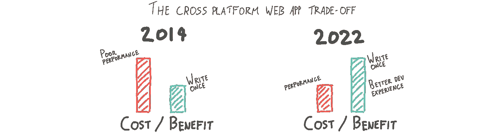

# 我把我的原生 iOS 应用换成了跨平台的 Web 应用，没人注意到

> 原文：<https://javascript.plainenglish.io/i-replaced-my-native-ios-app-with-a-cross-platform-web-app-and-no-one-noticed-1653901ce244?source=collection_archive---------0----------------------->

## 我的跨平台 web 应用程序的性能权衡是如何被用户忽视的。

所以这一切都是从我想出一个帮助父母让他们的孩子为上学做好准备的应用程序的想法开始的。

我是一个有 3 个孩子的父亲，我很恼火，因为在工作中我有几十个强大的工具来组织和管理我的团队。但是在家里让孩子们准备上学，我什么都没有。一片混乱。所以我想…为什么不为孩子们建立一个待办事项列表呢？我可以让 UX 看起来像一个游戏，甚至嵌入游戏化设计元素，以帮助孩子们保持专注和参与。

所以我做了学校早上的例行公事。结果棒极了(你可以在这里查看)。现在，孩子们在大约 30%的时间里为上学做好了准备，少了 95%的唠叨。(是的我测量过；)

但是在我的发展过程中，我犯了一个巨大的错误。我浪费了很多时间来构建一个原生的 iOS 应用程序。

# 选择移动应用技术(又名选择你的毒药)

现在，在 2022 年开始一个移动应用程序的问题是，有很多完全不同的技术方向可以选择:原生、跨平台 web 应用程序、React 原生、Flutter、Progressive Web 应用程序、Xamarin 等。

制作一个 app 的默认方式是编码 3 次，一次针对 iOS，一次针对 Android，一次针对 Web。

但是，对我们软件开发人员来说，多次编写相同的代码是非常令人不安和不自然的。因此，多年来，我们创造了许多方法来尝试“一次编码，随处运行”。但它们都涉及令人讨厌的权衡。

# 跨平台网络应用

对于跨平台的 web 应用程序，您只需使用通用的 web 技术编写一次代码，就可以将其部署到多个平台。在需要使用浏览器无法提供的 iOS 和 Android 功能时，使用少量的原生代码。

但是令人讨厌的交易是性能。

> 2014 年，我实际上试图使用 Ionic 框架来制作一个不同的应用程序，我发现了大多数人的做法:Android 和 iOS 在运行 web 应用程序方面很糟糕。

它们缓慢、不可预测、不稳定、闪烁不定、口吃，而且触摸交互也很古怪。

所以我很早就决定，学校早上的例行程序不能是一个跨平台的网络应用程序。我的应用程序会大量使用游戏风格的动画，因为它是为孩子设计的，它需要有出色的触摸交互。

# 走向本土化

所以…我决定做原生应用。它们通常风险最小，质量最高。当然，不得不多次编写同一个应用程序是很糟糕的，但不管怎样，这是一个小应用程序…我相信努力胜过魔法。

*(说到我对魔法的厌恶，我不会在这里解释为什么我没有选择像 Flutter 或 React Native 这样的当前科技宠儿。这些都是有趣的话题，值得在将来的某个时候发表自己的博文…)*

所以，首先我写了一个华丽的 iOS 应用。我和测试人员反复讨论了很多次。然后我在 App Store 上发布了它，从最初的用户那里得到了一些非常积极的反馈。五星评论，来自改变了生活的用户的滔滔不绝的电子邮件，等等。

兴奋的是，我正在做一些成功的事情，我决定下一步开发 web 应用程序。我使用了 CSS 动画，帧运动和一些令人愉快的洛蒂动画。当我完成的时候，我花了一个下午的时间仔细地调优。只是确保没有不必要的渲染。叹息…#反应 _ 生活

到那时为止，我的孩子已经用了几个星期 iOS 版本的学校晨间例行程序了。所以为了测试新的跨平台网络应用版本，我把它放到了我孩子的 iPad 上。他们可以用它来测试，为上学做准备。

有趣的是，我只是忘了告诉他们我已经把这个应用程序从本地应用程序改成了网络应用程序。但是早晨来了又去，他们没有注意到。

他们没有注意到。

他们甚至没有注意到。

如果你没有孩子，你可能意识不到这一点，但孩子抱怨一切。说真的，一切。但他们不仅没有抱怨使用网络应用，第二天我还问他们是否注意到了什么不同。他们实际上感谢我，因为我不得不在网页版中使用不同的 tick 动画，2/3 的人更喜欢它。

他们是对的，动画像黄油一样光滑，触摸互动也很紧密。

我很震惊。好吧，也许只是因为我有一个比较新的高性能的 iPad？所以我出去买了一个低端的安卓平板。我选了一个动力不足的，甚至打开 Android 设置屏幕都很笨拙和口吃。但这是一个重要的测试，因为对许多人来说，这是他们唯一可以使用的设备。

嗯，我做了学校早上的例行公事，你猜怎么着。那是…很好。不算高明，但嘿，这是一款低端安卓平板，你还能指望什么？

于是……我走到办公桌前，删除了我的原生 iOS app，决定用[离子电容](https://capacitorjs.com/)。

现在，我可以编写一个应用程序，并将其部署在三个平台上。查看我的构建脚本。通过 3 个命令，我可以部署到 iOS 应用程序、Android 应用程序，或者部署到我在 AWS 上的网站！

多酷啊！

从那以后，我在 Android、iOS 和 Web 上发布了学校晨间活动。我的 iOS 用户不仅没有注意到，而且实际上我的错误也更少了。有一个麻烦的 bug 是由渲染一个只在 iOS 14 上发生的表格视图引起的，堆栈跟踪是无用的...感叹，#ios_life。但是我的跨平台网络应用消失了。

That flat line is when the cross platform web app was released

不知何故，我的跨平台 web 应用程序实际上更加稳定！

# **到底是怎么回事？**

如何使用 web 应用程序为孩子们制作一个动画应用程序？

> 原来在 2022 年，对于很多 app 来说，一次编写随处运行的梦想终于到来了。

跨平台 web 应用程序的成本/收益权衡总是以更差的性能换取更少的开发时间。在 2014 年，对于大多数应用程序来说，这是一个糟糕的权衡。但是在过去的 8 年里，很多事情都变了。浏览器性能稳步提升:

Source: [https://v8.dev/blog/10-years](https://v8.dev/blog/10-years)

web 应用程序开发工具的种类和成熟度也增加了。现在我们有了 React 和 TypeScript。ide 和 Chrome 调试器远远领先于本地的同类产品。有创新的设计模式和开源库，可以满足各种可能的需求。JavaScript 的世界比 Swift 或 Kotlin 的世界更加生机勃勃。

2022 年，成本/收益的计算方式发生了变化。

# 我们现在在哪里？

我一直是爱奥尼亚队的球迷。他们几年前创办了一家公司，作为跨平台网络应用的早期倡导者。我喜欢他们做的事情，但我总是为他们感到难过。他们似乎押错了赌注。支撑跨平台网络应用的技术无法支持他们的梦想。

> 我认为今天，技术终于赶上了 Ionic 团队的愿景。

学校晨间例行程序正是几年前你会疯狂地构建成一个跨平台网络应用的那种应用。但是很管用！太漂亮了，说真的，看看吧！我在 Google Play 商店和 App Store 上部署了相同的应用程序，甚至可以在线使用。

也不仅仅是我，去年年底，乔希·沃德尔开发了目前风靡全球的手机游戏 Wordle。正如我在这篇[帖子](https://uxdesign.cc/wordle-is-a-masterclass-in-product-design-simplicity-52de1ba06d85)中所写的，它甚至没有一个移动应用程序。这是一个使用 web 组件编写的渐进式 Web 应用程序。

# 结论

这是我希望在开始写学校晨间例行公事之前读过的帖子。因为过去我忽略了跨平台的网络应用。我以为他们太慢了。但它们是我的应用程序的完美选择。

浏览器和网络技术每年都变得越来越强大。每年都有更多种类的应用程序可以跨平台开发。

所以在你开始你的下一个项目之前，你为什么不看看跨平台网络应用。也许它们不适合你的项目，但是也许，像我一样，你会发现你可以只写一次代码就可以在任何地方运行。我认为这很了不起。

*作者注:在这篇文章的前一个版本中，我推测了跨平台 web 应用程序稳步改进的含义。我袖手旁观那些漫天要价，但它们掩盖了帖子的目的，所以我把它们拿掉了。*

我希望没有人认为这篇文章是对本地开发或本地开发者的批评。我自己写了十几个我喜欢的原生 iOS 和 Android 应用程序，当你读这篇文章的时候，其中许多正在生产中被使用。尽管跨平台的 web 应用程序是学校早上例行工作的最佳选择，但今天，如果我必须开发一个大量使用本机功能或计算要求很高的应用程序，我仍然会编写一个本机应用程序。

## 进一步阅读

 [## 为 React 和 React Native with Bit 创建跨平台设计系统

### 对于 web 和移动开发，许多团队使用 React 和 React Native 来实现 UI/UX 的一致性。当开发人员…

比特云](https://bit.cloud/blog/creating-a-cross-platform-design-system-for-react-and-react-native-with-bit-l7i3qgmw) 

*更多内容看* [***说白了。报名参加我们的***](https://plainenglish.io/) **[***免费周报***](http://newsletter.plainenglish.io/) *。关注我们关于* [***推特***](https://twitter.com/inPlainEngHQ)[***LinkedIn***](https://www.linkedin.com/company/inplainenglish/)*[***YouTube***](https://www.youtube.com/channel/UCtipWUghju290NWcn8jhyAw)*[***不和***](https://discord.gg/GtDtUAvyhW) *。对增长黑客感兴趣？检查* [***电路***](https://circuit.ooo/) *。*****