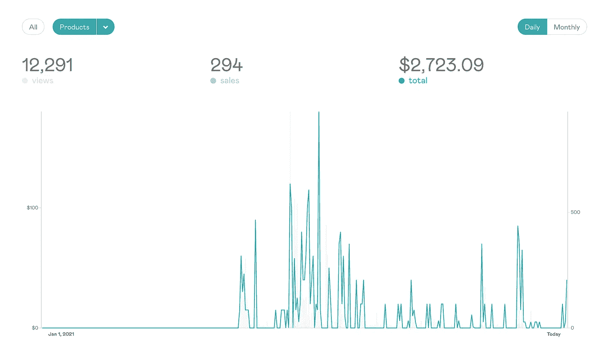

# 我花了 35 个小时写了一本电子书，前 6 个月赚了 2723 美元

> 原文：<https://javascript.plainenglish.io/i-spent-35-hours-writing-an-ebook-and-earned-2-723-in-the-first-6-months-b7b2ead44f5f?source=collection_archive---------10----------------------->

Photo by [Travis Essinger](https://unsplash.com/@travisessinger?utm_source=medium&utm_medium=referral) on [Unsplash](https://unsplash.com/?utm_source=medium&utm_medium=referral)

## 创建我的第一个信息产品改变了我的生活。

你梦想过不用工作就能赚钱吗？

销售信息产品是被动赚钱的好方法。但是一开始需要付出很多努力和付出，但是完全值得。很多人都在做，你也可以。

在推出我的第一本[电子书](https://sunilkumarc.gumroad.com/l/kgtSS) : ***如何创办一家 SaaS 公司:初学者指南*** 后的前 6 个月，我赚了 2723 美元。这可能不是一大笔钱。但是赚到这个让我意识到互联网提供了无尽的机会。这只是开始。

一旦安装好，你的信息产品就可以成为你的小型赚钱机器。

*   但是什么是信息产品呢？
*   我应该卖多少钱？
*   *我如何销售它们？*
*   我把它们卖给谁？

你可能现在脑子里就有这些问题。让我们来回答所有这些问题。

# 什么是信息产品？

信息产品是包装成电子书、视频、录音等形式的任何知识/内容。

如果你认为你知道一些别人不知道的东西，你可以把一个信息产品放在一起，有无数人愿意付钱给你来学习你已经知道的东西！

比如说你擅长文案。你知道如何写销售产品的内容。你可以将你所有的知识打包成一个信息产品并开始销售。

# 一个信息产品应该有多大？

这里没有硬性规定。

它可以小到 20 页的电子书，或者 30 分钟的视频教程。也可以是 300-500 页的电子书或 8-10 小时的完整视频教程。

现在，在你开始创建一个信息产品之前，这些是一些需要考虑的重要问题。

你能为你知道的每个话题创造一个信息产品吗？—是的

你能销售你创造的每一个信息产品吗？—是的

但是你能卖出几千个吗？—可能不会。

有可能其他专家已经创造了许多信息产品。你需要一款独一无二的产品来扩展这项业务。如果你想脱颖而出，你应该带些独特的东西来。

例如，谈谈对你有效的策略。

做一些事情，尝试，让它首先为你自己工作。然后创建一个信息产品，教别人如何做同样的事情，复制你的成功。因为你正在分享你自己的旅程，产品可能会卖得更好。

# 你应该卖多少钱的信息产品？

信息产品的定价很棘手。

最好的方法是:

1.研究同类产品卖多少钱
2。将您的产品定价在同一范围内
3。看看效果如何
4。调整(增加或减少)它，直到你找到最佳销售点

在定价方面没有硬性规定。不断尝试价格，看看什么最适合你。

另一个增加销售额的好方法是时不时地进行促销。请热爱折扣。利用假期。

# 你在哪里卖信息产品？

最好的方法是建立自己的支付集成(Stripe)登录页面，然后开始销售。但是如果你不想全靠自己，有像 Gumroad 这样的平台可以让创作者轻松完成。

还有很多其他平台像 Udemy，AppSumo 等。

但是选择一个能提供你正在寻找的特性的平台，并坚持下去。我目前在 Gumroad 上出售我的 SaaS 电子书。

它提供了我需要的一切:

支付—电子邮件—分析—联盟计划等

现在最大的问题是“谁会购买我的信息产品”？

你应该为你的产品增加流量，从而卖出更多。

# 你怎么获得流量？

有多种方法可以为你的产品登陆页面带来流量。让我们在这里谈论 2 种主要方式。

1.  一种方法是在不同的社交媒体平台上拥有良好的在线形象。在你的追随者中拥有可信度会让他们购买你的付费产品。但是，建立一个网上存在需要大量的辛勤工作，奉献和耐心。

你需要通过多年分享免费内容来建立你在特定领域的权威。我分享我的自由职业之旅和这些年来帮助我成功的事情。因此，通过建立网上形象来销售信息产品是一个漫长的过程，需要时间。

2.另一种流行的方式是投放广告。脸书、Instagram 和谷歌是一些提供广告服务的流行平台。了解如何运行有效的广告来吸引用户，并建立一个杀手级的登录页面。

一旦你有信息产品出售，你可以运行伟大的广告活动，并开始每天毫不费力地赚钱。

# 结论

销售信息产品是最受欢迎的方式之一，通过这种方式，人们可以被动地赚很多钱！

那不是做梦吗？

你还在等什么？开始创建你的第一个信息产品吧！

如果你喜欢这篇文章，请在 Twitter 和 Instagram 上关注我，我是一名软件开发人员，在自由职业网站上创作内容，在互联网上赚钱。

*更内容于* [***浅显易懂的英语中***](http://plainenglish.io/) *。报名参加我们的* [***免费周报***](http://newsletter.plainenglish.io/) *。在我们的* [***社群不和***](https://discord.gg/GtDtUAvyhW) *中获得独家写作机会和建议。*