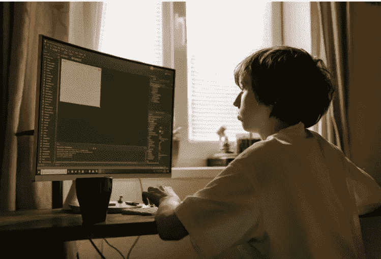
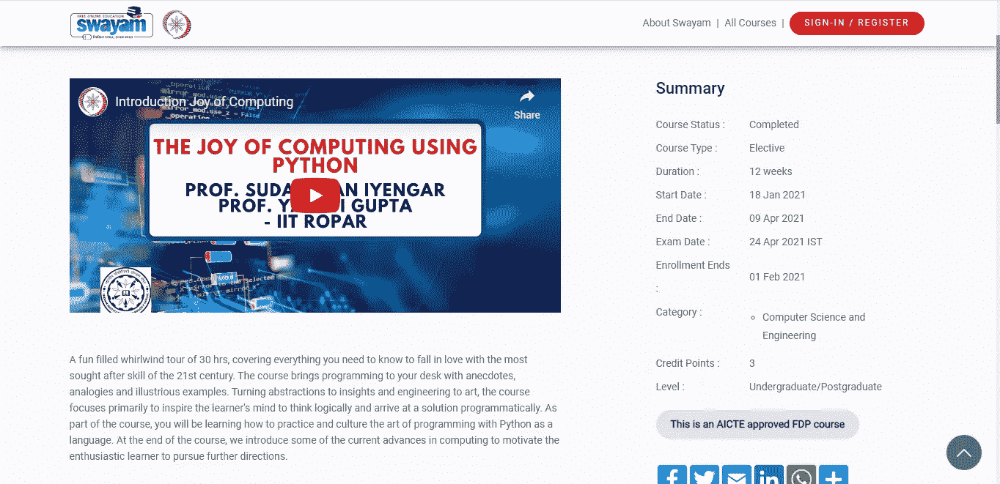
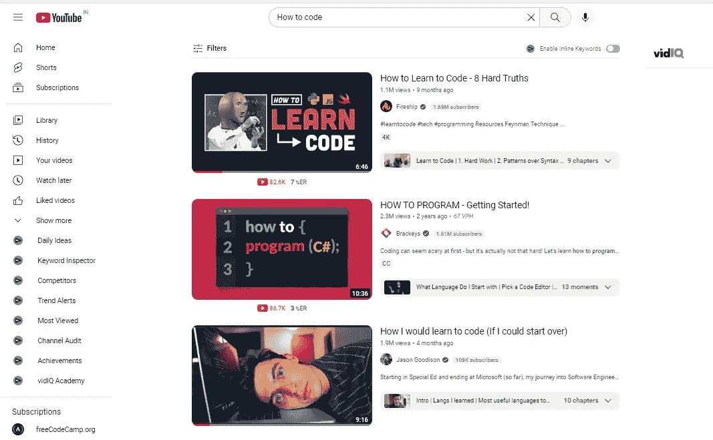
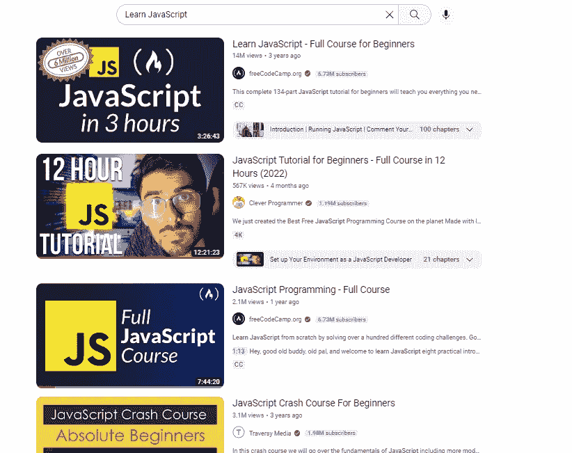
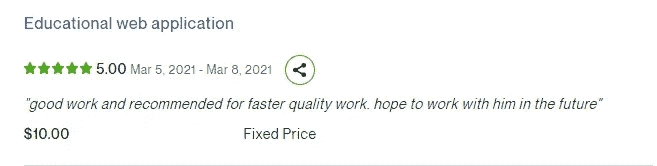
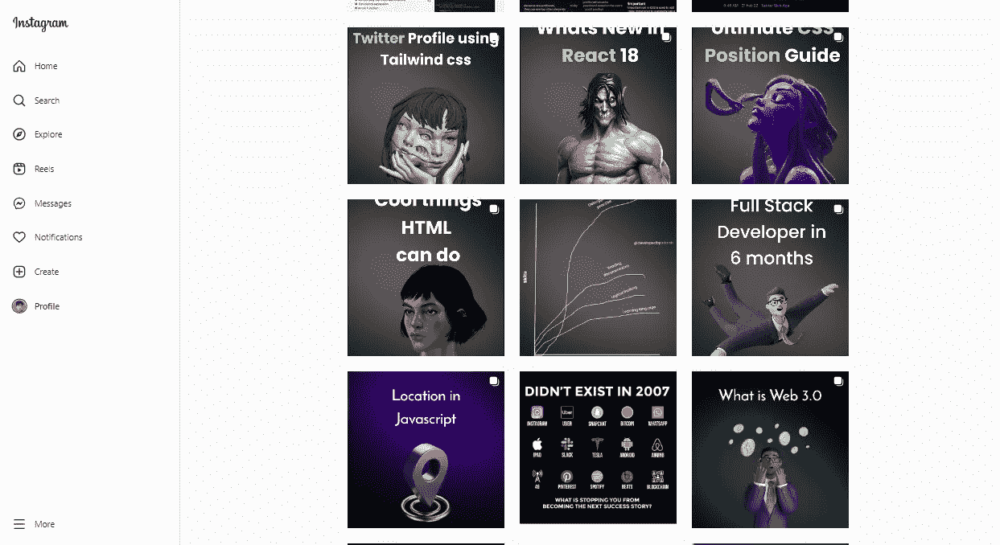
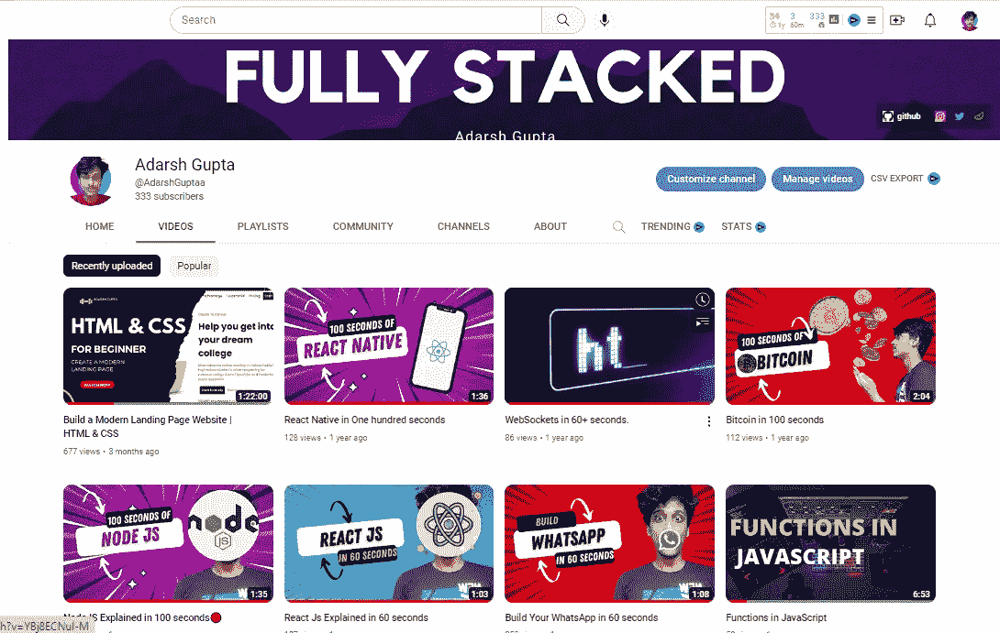
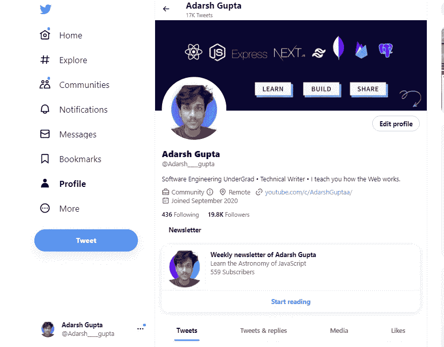
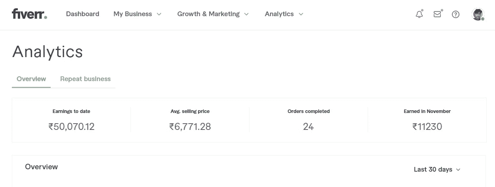
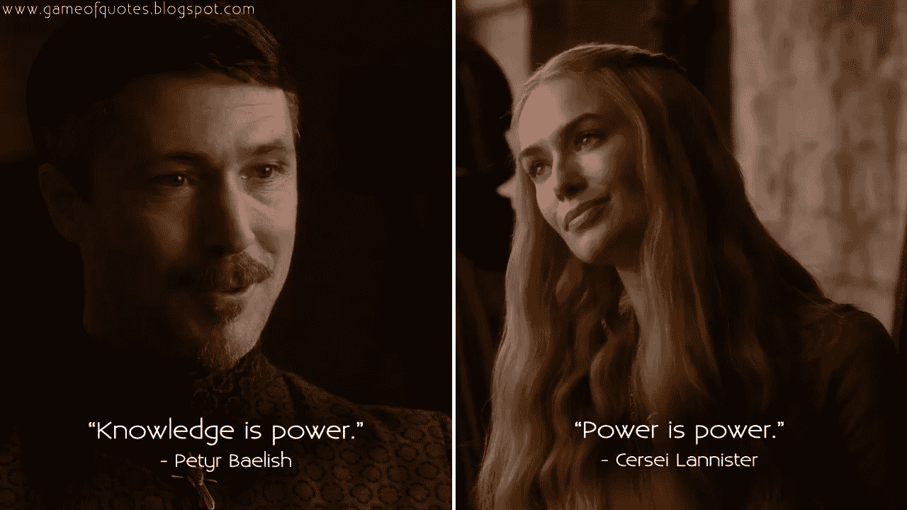

# 我在 2020 年开始认真编码，现在这就是结果

> 原文：<https://javascript.plainenglish.io/i-started-coding-seriously-in-2020-and-now-this-is-the-result-2770fd89b6d8?source=collection_archive---------2----------------------->

## 你可以在这里得到一些想法！

[Source](https://www.pexels.com/photo/boy-in-white-long-sleeve-shirt-playing-computer-game-4709291/)

是的，2020 年对几乎所有人来说都是艰难的一年，有些人失业了，有些人离开了我们。但是是的，我很好地利用了那一年，感谢 COVID 让我从所有事情中解脱出来！

## 一切是如何开始的！

我不太了解 YouTube，它有大量优秀的视频，所以我开始看 NPTEL，一个 IIT 的课程。

我从头到尾都很喜欢这门课，导师 Sudharshan Iyer 先生的俚语非常好，很容易理解。我什么也没做，只是看视频，生活很美好！

## 第二阶段

就像其他人一样，我开始查看 YouTube 频道，相信我，如果你不知道你在做什么，你只会看几个月，也许一年的“如何编码”视频。

你会看到这样的视频，觉得 10 分钟就能学会所有东西。尊重创作者，我们的心态就是这样，我们倾向于选择最容易的路径，最终，它是最差的路径。

## 认可阶段

我明白看这种视频对你没有任何帮助。我知道我们应该专注于一项特殊的技能，而不是学习一般的东西。

我开始关注 JavaScript，并决定深入研究 JavaScript。于是我搜了一下“学 JavaScript”！

你能猜到我选了哪一个吗？如果你是对的，我选择了聪明的程序员视频，而且很顺利。我完全**看了**视频，并认为自己是一名 JavaScript 开发人员。我只是一个好的倾听者，而不是一个好的实干家。

我一个人做不了任何事，我总是需要一个导师在我身边指导一个项目。太惨了，我都快放弃了！

## 为什么我没有放弃

我知道我学到了一些东西，但是我很困惑我怎么能用我学到的东西赚钱！我不知何故听说了 *Upwork* ，并开始申请那里的工作。有人联系我创建一个教育网站，这很简单。

那是发生在我身上最好的事情。我坐在电脑前赚钱。这次我对编码很认真。我参考了许多文章、博客和视频来了解一条清晰的道路，并决定将 web 开发作为我的职业。

## web 开发对我做了什么？

当我们搜索 web 开发时，出现的最流行的术语是 React JS。

由于 React 的大肆宣传，我对它很感兴趣。我看了一个又一个教程，犯了同样的错误。但这一次，我马上意识到我在“教程地狱”

但是我决定在教程的基础上进行各种项目，并制作了各种网站的几个克隆版，比如亚马逊、推特、脸书和 Instagram。我做到了，现在完全有信心做项目。

现在是时候赚点钱了！

## 我是如何赚钱的

我经常把我的项目截图贴在 Whatsapp 上，有人让我给他们做个网站，我就做了。

我得到了大约 100 美元，我觉得自己已经是一个百万富翁了。在那之后，我有许多其他的机会，从 100 美元到 750 美元不等。我非常高兴赚了一大笔钱。

我从 referrals、Fiverr 和 Upwork 那里获得了客户，在 2021 年的最后四个月里，我总共赚了大约 3000 美元。在那之后，我看到人们作为影响者或创造者从社交媒体中赚钱。

我努力成为一个创造者！

## 我的创造者之旅对我有什么帮助？

我开始在 Instagram 上创建内容，但我几乎没有任何互动，所以我很快就停止了在 Instagram 上创建内容！

然后我决定去 YouTube，又失败了！

我以为这个创造者之旅对我来说永远不会顺利，我几乎不再是一个创造者。但是 Twitter 向我展示了一个充满机遇的世界。

## 我是如何开始使用 Twitter 的

Twitter 曾经是我最不喜欢的社交媒体平台，我几乎没有用过它。但是现在我大部分时间都在用 Twitter。我从零开始，在 Twitter 上建立了 2000 名开发者的受众；对我来说这是一个巨大的破门机会。

相信我，拥有社交媒体真的会让你比其他人更有优势。Twitter 开辟了许多创收途径。我做过付费推广，最大的客户是 120 美元的客户。我得到了几个技术写作的机会，到目前为止已经写了大约 12+篇付费文章，并在 3 个月内赚了大约 2000 美元。

我确实有很多自由职业的机会，还有。

这一切都是因为我没有辞职，没有开始工作。我不是什么都知道，但我乐于学习，并有一种知识给你力量的心态。

[Credit](https://www.google.com/url?sa=i&url=https%3A%2F%2Fwww.pinterest.com%2Fpin%2F472455817131376983%2F&psig=AOvVaw29zXGiWOtQIvwK672QEfca&ust=1669010915417000&source=images&cd=vfe&ved=0CBAQjRxqFwoTCIDAj6iMvPsCFQAAAAAdAAAAABAE)

因此，如果你是一个开始你的编程生涯的新手，我希望有人在我开始的时候告诉我一些事情:

1.  开始时很难，但最终，你会跟上节奏的。
2.  拥有一个强大的投资组合或在线业务可以帮助你到达任何地方。
3.  不要什么都懂，什么都不懂。事实上，遵循这一点，学习关于某件事的一切和关于每件事的某些东西。
4.  是的，只有当你愿意花一些钱去学习的时候，你才能从科技中赚很多钱。首先，你会学到，然后你去掉“L”

## 结束了！

感谢你读到这里，你是一个了不起的读者！

说实话，这是我的人生经历。到目前为止，我在技术领域的头两年进展顺利。不要被那些说你的年龄、种族、性别和身高在科技领域很重要的人误导。如果你有学习的意愿，你绝对可以做到。

再次感谢&学习愉快！

*更多内容请看*[***plain English . io***](https://plainenglish.io/)*。报名参加我们的* [***免费周报***](http://newsletter.plainenglish.io/) *。关注我们关于*[***Twitter***](https://twitter.com/inPlainEngHQ)[***LinkedIn***](https://www.linkedin.com/company/inplainenglish/)*[***YouTube***](https://www.youtube.com/channel/UCtipWUghju290NWcn8jhyAw)*[***不和***](https://discord.gg/GtDtUAvyhW) *。对增长黑客感兴趣？检查* [***电路***](https://circuit.ooo/) *。***