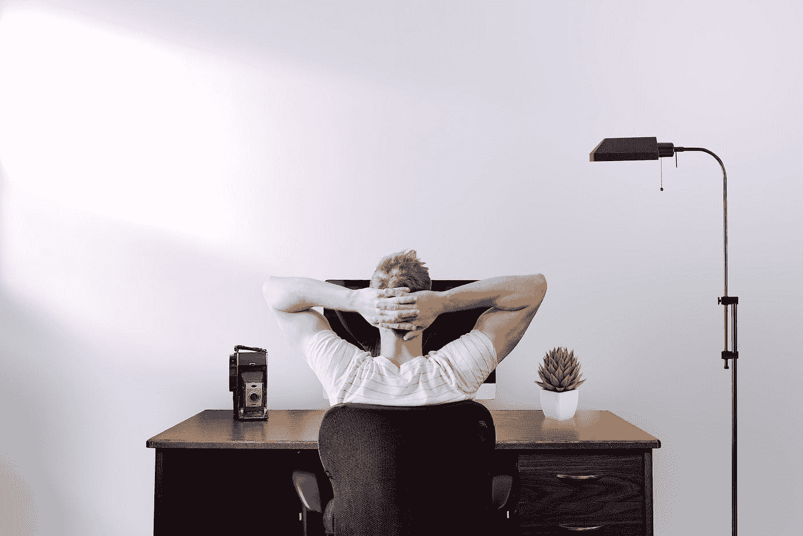

# 我认为在家做程序员是我的梦想工作

> 原文：<https://javascript.plainenglish.io/i-thought-working-from-home-as-a-programmer-was-my-dream-job-5d359e4f1e72?source=collection_archive---------10----------------------->

## 直到我的习惯变得完全混乱。

Photo by [Jason Strull](https://unsplash.com/@jasonstrull?utm_source=medium&utm_medium=referral) on [Unsplash](https://unsplash.com?utm_source=medium&utm_medium=referral)

在家总会让你比在办公室更“放松”一些，因为你不会有其他同事在场，更重要的是，不会有你的老板在场。

我在家做了差不多六个月的程序员。我的工作时间是从早上 9 点到下午 6 点。起初，我把自己组织得很好。我起得很早。我做好早餐和咖啡开始工作。然后渐渐地，我的习惯变得完全混乱。

我很晚睡觉看电影，因为我有在家工作的自由，我甚至在早上 9 点醒来。这时候，我打开了电脑。然后我开始工作。难以置信的晚。事实是，我最终甚至比在办公室里还要疲惫，这些是我在那段时间里注意到的一些事情。

1.  你很容易分心:例如，如果你开着电视，他们在播放一些令人兴奋的东西，如果你毫无头绪，你可能会分心好一阵子。
2.  如果你和你的家人住在一起，最终他们会向你寻求帮助:一些人，尤其是年长的人，不明白他们是在电脑上工作，或者也许他们忘记了事情的相关性，他们会送你。我不知道，去买午餐需要的东西，去办点事，或者去学校接你的弟弟，你可能没有足够的时间去做。
3.  由于前两点和注意力不集中，你可能会花比平时更长的时间去做在办公室里通常只需要很短时间的事情。
4.  有时候，他们可能会吹嘘你不在办公室，让你“工作过度”，这可能意味着你将不得不在一两个周末工作，或者可能在你应该在下午 6 点结束工作的时候，在晚上 9 点结束工作。

当然，这因人而异，虽然有很多积极因素，如舒适和穿着内裤工作，

我从我的经历和我的生活方式来说。总的来说，你必须比在办公室工作时更有秩序和责任心，从而避免打破远程谈话对你的期望。

*更多内容请看*[***plain English . io***](https://plainenglish.io/)*。报名参加我们的* [***免费周报***](http://newsletter.plainenglish.io/) *。关注我们关于*[***Twitter***](https://twitter.com/inPlainEngHQ)*和**[***LinkedIn***](https://www.linkedin.com/company/inplainenglish/)*。加入我们的* [***社区***](https://discord.gg/GtDtUAvyhW) *。**