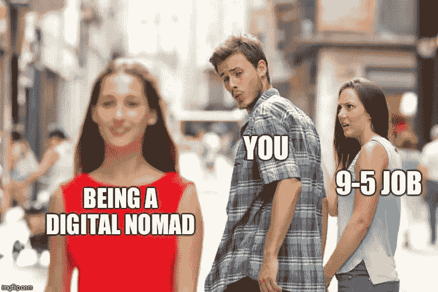
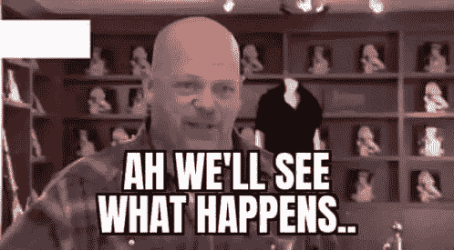

# 我把我的创业变成了开源

> 原文：<https://javascript.plainenglish.io/i-turned-my-startup-into-open-source-70eb0076f820?source=collection_archive---------0----------------------->

我在媒体上发了很多帖子，但是我想没有人知道我到底是谁:)

在过去的十年里，我一直在为各种公司扮演全栈开发人员和团队领导的角色。

工作了六年后，我觉得我需要改变。我辞掉了工作，成了一名数字流浪者😎

> *提醒一下，这是 covid 出现之前的时代，远程工作并不像今天这样。*

我和我的朋友一起旅行，没有工作，只是放松，我接到了我以前公司的电话。

“请来为我们工作。我们会让你远程兼职。”

回想当年，这听起来像是一场梦——事实也的确如此。

这是我在台湾旅行🤩

但很快，我有太多的空闲时间，所以我决定做点什么！

我有一堆失败的创业/项目。

直到我开始 Linvo🎉

Linvo 是一家好坏参半的创业公司。
一方面，它赋予销售和 HR 人物角色很多价值。
另一方面，它破坏了 Linkedin 的 T & S，这会让你被 Linkedin 封禁:(

我下定决心要取得成功，并创造出革命性的功能，如[屏幕共享应用](https://dev.to/novu/building-an-interactive-screen-sharing-app-with-puppeteer-and-react-12h7)。它工作了一段时间，但不可持续，我没有足够的钱来生活。

我飞回我的国家，在 Linvo 2.0 的一个合作空间工作了几个月。

在那里，我遇到了两个超级有趣的朋友:马頔和托莫，Novu 的创始人。

当时 Novu 并不成功，我们成了好朋友。我们讨论了营销、销售和产品。你说吧。

就在我准备再次飞往另一个国家的时候，他们为 Novu 筹集了 660 万美元🤩
他们将产品从营销/产品基础转变为开发者基础。

就在他们筹集资金让我加入 Novu 之前，我拒绝了。我必须发布 Linvo 2.0，看看会发生什么。

然后我飞到泰国，收到马頔发来的信息，问我是否改变了主意。所以我说也许，但是让我稍微处理一下 Linvo。

最后，过了一段时间，我决定是时候卖掉 Linvo，全押 Novu 了。

因此，当我与买家进行多重尽职调查时，我决定将一些 Linvo 代码用于开源。

作为 SaaS 的产品，这对 Linvo 并没有太大好处。

但是我觉得它把我和开源运动联系得更紧密了，这样我就可以更多地了解它的大部分内容了！

你可以在这里查看这个项目！:)
[https://github.com/linvo-io/linvo-scraper](https://github.com/linvo-io/linvo-scraper)

请给我一颗星星，让我知道我做了好事🙌🏻

爱你们所有人:)

*更多内容请看*[***plain English . io***](https://plainenglish.io/)*。报名参加我们的* [***免费周报***](http://newsletter.plainenglish.io/) *。关注我们关于*[***Twitter***](https://twitter.com/inPlainEngHQ)[***LinkedIn***](https://www.linkedin.com/company/inplainenglish/)*[***YouTube***](https://www.youtube.com/channel/UCtipWUghju290NWcn8jhyAw)*[***不和***](https://discord.gg/GtDtUAvyhW) *。对增长黑客感兴趣？检查* [***电路***](https://circuit.ooo/) *。***