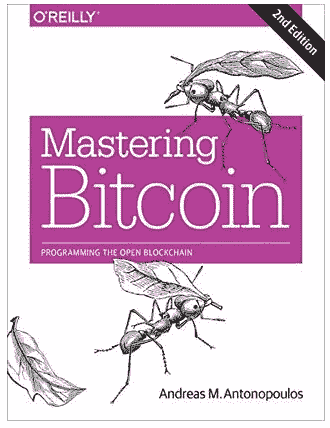

# 我想学习 web 3——以下是我在 7 天内是如何做到的

> 原文：<https://javascript.plainenglish.io/i-wanted-to-learn-web3-heres-how-i-did-it-in-7-days-35a9efa464c8?source=collection_archive---------2----------------------->

## 真的很简单。

Photo by [Brooke Cagle](https://unsplash.com/@brookecagle?utm_source=medium&utm_medium=referral) on [Unsplash](https://unsplash.com?utm_source=medium&utm_medium=referral)

更具体的说，我对 web 开发很熟悉，也用了很多年。这是我最初学习并用来赚钱的第一个技能。

然而，我的一些朋友建议说，web 开发正变得越来越广为人知，大多数人都知道它，这就是为什么它变得越来越有竞争力。

所以我决定让自己更有价值。为此，我可能会学习机器学习、数据科学、应用程序开发、Web3 开发、云计算或任何其他技能。

但是我想学一些与网络开发相关的东西。结果我选择了 web3 开发。

它与 web 开发相关联，学习起来相当新鲜。

现在，让我向你介绍一下我采取的步骤。

# 1.阅读白皮书

我们直说吧，我对此一无所知。所以最初，我只是想知道比特币是什么，它是如何工作的。我想尽快学会。

我可以通过观看视频、参加长时间的课程或阅读一本书来实现这一点。

然而，这需要时间。

我一直相信学习新事物的最好方法是通过文档。所以我继续阅读了中本聪的比特币白皮书。

说实话，这是一篇只有 9 页的简单的研究论文。

所以我不到一个小时就完成了。白皮书解释了一切，包括介绍，功能，支付矿工，等等。

是的，我也应该阅读[以太坊白皮书](https://ethereum.org/en/whitepaper/)，但是我选择不读。但是如果你愿意，你可以读一读。

# 2.看书

如果你在看了比特币或以太坊各自的白皮书后没有掌握它们。

还有一本简单易懂的书，涵盖了比特币白皮书中的所有内容。

source: Goodreads

而那就是[掌握比特币:编程开放区块链](https://amzn.to/3O0n9ze)。

事实上，我试图阅读它，但发现其中的概念与我已经从比特币白皮书中了解到的概念相同，因此我跳过了它。

是否阅读完全由你决定。如果你是初学者，我强烈推荐它。

# 3.学习 web 开发

如前所述，我有几年的 web 编程经验，不需要重新学习。

如果你是一个没有 web 开发前期知识的新手，要掌握 web 编程的基础需要一两个月的时间。

这里有一些资源可以帮助你。

如果你试图绕过 web 开发思路，会毁了你的职业生涯。要有耐心，掌握 HTML、CSS 和 JavaScript 的基础知识。

然后继续反应，角度，或 Vue。一些后端专业知识将非常有益。

我知道有不同的语言，所以请慢慢来。即使需要六个月，也要接受。

# 4.获取 Web3 技能

老实说，我不会把钱浪费在可以免费学习的东西上。这是我的血汗钱，所以我必须明智地使用它。

这就是我把注意力转移到 YouTube 的原因。而且实际上有免费的课程可以教你你需要知道的一切。

我看的第一个视频涵盖了我需要了解的关于区块链、编程语言、智能合约、Defi、ERC20、令牌、NFT 等等的所有内容。

这实际上是一门 16 个多小时的课程，将教会你一切。我花了大约四天时间才完成。

所以，总的来说，我在 5 天内完成了比特币白皮书，然后了解了区块链的发展。

现在我所要做的就是记住我所学的一切，为此我在另一个 YouTube 视频的帮助下创建了一个项目[。](https://youtu.be/99pYGpTWcXM)

虽然视频只有三个小时，但花了两天才完成。因此，我能很快理解它。

嘣，7 天左右，我学会了 web3 开发。

 [## 我是一个自学的 Web3 开发者，这里是我使用的资源

### 学习赚钱。

javascript.plainenglish.io](/im-a-self-taught-web3-developer-and-here-are-the-resources-that-i-used-f64b1909fed1) 

就这样——谢谢。

[*如果你喜欢阅读这样的故事，并想帮助我成为一名作家，请考虑成为一名中等成员*](https://nitinfab.medium.com/membership) *。每月花费 5 美元，你可以无限制地访问媒体内容。如果你通过我的链接注册，我会得到一点佣金。*

*更多内容请看*[***plain English . io***](https://plainenglish.io/)*。报名参加我们的* [***免费周报***](http://newsletter.plainenglish.io/) *。关注我们关于*[***Twitter***](https://twitter.com/inPlainEngHQ)*和*[***LinkedIn***](https://www.linkedin.com/company/inplainenglish/)*。查看我们的* [***社区不和谐***](https://discord.gg/GtDtUAvyhW) *加入我们的* [***人才集体***](https://inplainenglish.pallet.com/talent/welcome) *。*