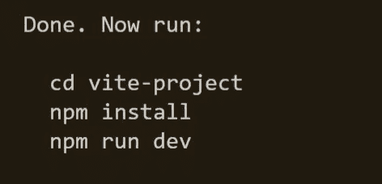

# 为什么你应该避免命令“创建-反应-应用”

> 原文：<https://javascript.plainenglish.io/i-will-never-use-create-react-app-again-80a162578b8?source=collection_archive---------14----------------------->

## 如何在不使用“create-react-app”命令的情况下更快更容易地启动 React 项目的指南。

对于我们在做之前必须学习的事情，我们通过做来学习。

**在你开始阅读之前，请给我一个关注和分享。**

如果您正在使用 React，并且在启动新项目时使用了命令“create-react-app ”,请停止，因为您需要尝试另一种方式来启动您的项目。

今天，我将带你走完这条路，这样你就可以更快更容易地构建你的下一个项目。

首先，打开您最喜欢的 IDE 并打开一个空文件夹来存储您的项目文件，然后在您的终端上运行下面的命令:

运行该命令后，它会询问您几个问题，关于项目名称、您想要使用什么框架，以及您想要使用 Typescript 还是 JavaScript 进行构建:

成功回答这些问题后，您将看到如何运行项目的详细信息:

只需导航您的项目，安装依赖项并运行命令`npm run dev`，即可看到如下结果:

如果你看到上面的屏幕，这意味着你成功地用 React 创建了一个新项目，正如上面已经提到的，你可以用这个方法使用你最喜欢的框架，这里有一个快速的注意，因为我们使用的是 Vite，无论何时你运行你的应用程序，你都会有更快的性能。

那都是我送的。希望这篇文章对你有帮助:)

如果你想在 LinkedIn 上联系，请点击下面的链接。

[AKIN KARAYUN | LinkedIn](https://www.linkedin.com/in/akin-karayun-ab3239bb/)

*更多内容请看*[***plain English . io***](https://plainenglish.io/)*。报名参加我们的* [***免费周报***](http://newsletter.plainenglish.io/) *。关注我们关于*[***Twitter***](https://twitter.com/inPlainEngHQ)[***LinkedIn***](https://www.linkedin.com/company/inplainenglish/)*[***YouTube***](https://www.youtube.com/channel/UCtipWUghju290NWcn8jhyAw)*[***不和***](https://discord.gg/GtDtUAvyhW) *。对增长黑客感兴趣？检查* [***电路***](https://circuit.ooo/) *。***