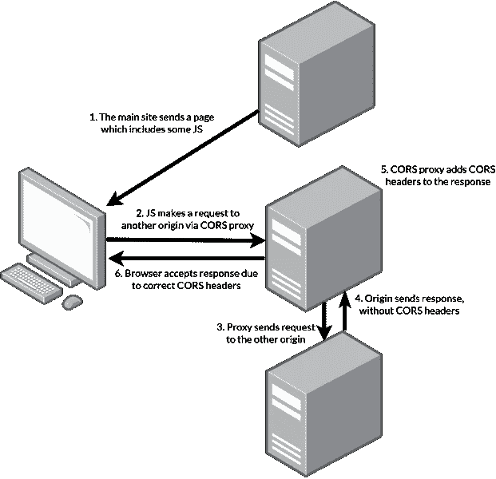

# 我写了一个 React 钩子来获取你的媒体文章

> 原文：<https://javascript.plainenglish.io/i-wrote-a-react-hook-that-fetches-your-medium-articles-ae0be127c977?source=collection_archive---------18----------------------->

我一直在寻找方法来改善我的作品集，最近我有了一个奇妙的想法，在我的网站上给我最新的媒体文章一个特殊的位置。

这个任务比预期的要困难，Medium 的 API 不是最好的……这就是为什么我决定写一个小小的 React Hook，让你的生活变得更容易！

# 安装和使用⚙️

你可以通过你喜欢的软件包管理器安装软件包。

**NPM**

`npm i use-medium`

**纱线**

`yarn add use-medium`

一旦你安装了`use-medium`，你就可以这样使用它了！

只要确保你用你的用户名代替了`driaug`，而没有了`@`。

# 它是如何工作的，🧑‍🍳

好吧，我告诉过你 Medium 的 API 不是最好的，但是它到底有什么问题。

当涉及到安全和 CORS 时，Medium 的 API 被很好地锁定。这意味着你不能从任何地方访问它。为此，我们必须看看 CORS 的代理。

我们已经成功地绕过了 CORS 错误，现在我们需要解析一些讨厌的 RSS，因为你为什么要给你的 RSS 字段一个可读的名字呢？

无论如何，我宁愿使用嵌套的名称和字段，比如`dc:creator._cdata`和`pubDate._text`！

在做了一些快速解析和重命名之后，我们现在有了一个可读的快速 React 挂钩，您可以使用它在 React 站点上显示您的中型文章！

# 大问题

## 它支持 TypeScript 吗？📖

当然有！所有类型的`use-medium`都是内置的，这意味着你不需要安装单独的类型。

## 它小吗？🏋️‍♀️

我尽量把`use-medium`做得小一点。这意味着，如果你缩小和 Gzip 它，你将最终略多于 14kB！

## 我可以带自己的代理人吗？👨‍💻

是的，你可以！使用 config 参数传递您自己的代理。

祝您愉快！💙

*更多内容请看*[***plain English . io***](https://plainenglish.io/)*。报名参加我们的* [***免费周报***](http://newsletter.plainenglish.io/) *。关注我们关于*[***Twitter***](https://twitter.com/inPlainEngHQ)*和*[***LinkedIn***](https://www.linkedin.com/company/inplainenglish/)*。查看我们的* [***社区不和谐***](https://discord.gg/GtDtUAvyhW) *加入我们的* [***人才集体***](https://inplainenglish.pallet.com/talent/welcome) *。*