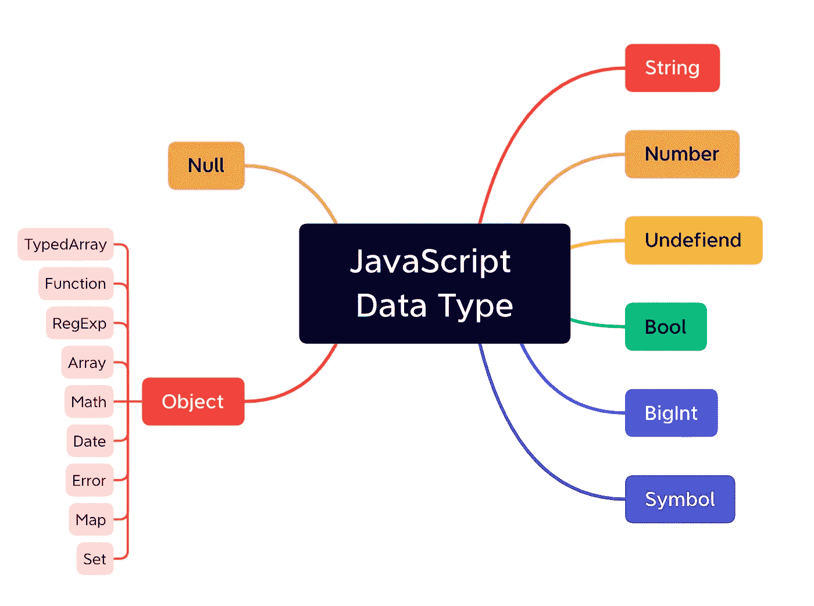

# 识别 JavaScript 数据类型:两种方法就足够了

> 原文：<https://javascript.plainenglish.io/identify-javascript-data-types-two-methods-are-enough-882e2c238e6b?source=collection_archive---------9----------------------->

## 我们知道，JavaScript 数据类型包括原语类型和对象类型。



*   **原始类型**:空、未定义、数字、字符串、布尔、符号、BigInt
*   **对象类型:**对象

对象类型有很多特殊类型，如 `Function`、`Array`、`RegExp`、`Math`、`Date`、`Error`、`Set`、`Map`，各种定型数组、`TypedArray`等。本文的目标是识别对象类型的基本类型和特殊类型。

你知道 JavaScript 中有多少种检测数据类型的方法吗？大多数人会告诉你以下 4 种方法。

*   类型 of
*   实例 of
*   构造器
*   Object.prototype.toString.call()

但是深入研究之后，你会发现它们每一个都可以用来识别数据类型，但是每一个都不能完全识别正确的数据类型。今天我要告诉你，你可以掌握`typeof`和`Object.prototype.toString.call()` 这两种数据类型，这样你就可以把后面的其他方法提升了。

首先，我们来看看`typeof`方法。

# 类型 of

```
typeof 'a'           // 'string'
typeof 1             // 'number' 
typeof NaN           // 'number'
typeof Infinity      // 'number'           

typeof true          // 'boolean'
typeof undefined     // 'undefined'
typeof Symbol('a')   // 'symbol'
typeof 1n            // 'bigint'
typeof null          // 'object'

typeof function() {} // 'function'
typeof []            // 'object'
typeof {}            // 'object'
typeof /a/           // 'object'
typeof new Date()    // 'object'
typeof new Error()   // 'object'
typeof new Map()     // 'object'
typeof new Set()     // 'object'
```

上面的代码显示了两件事:

*   `typeof`可以检测基本数据类型，除了`**Nan**`和`**Infinity**`
*   `typeof`将所有对象视为 Object 类型，即使`**NULL**`在语义上不是对象

`typeof`无法准确检测到`**Infinity**`和`**NaN**`，所以需要分别处理这两个。幸运的是，从 ES3 开始，Window 对象提供了两种方法来检测这两个特殊值——分别是`**Window.isNaN**`和`**Window.isFinite**`，检测一个变量是否“不是值”和一个变量是否有限。所以我们只需要把这两个分开处理，封装一个`getType`函数就可以了。

```
getType = function(arg) {
    var type = typeof arg;
    if (type === 'number') {
        if(isNaN(arg)) return 'NaN';
        if(!isFinite(arg)) return 'Infinity';
        return type;
    }
}
```

到目前为止，基本类型都能正确判断。如果只需要判断基本的数据类型，看到这里就够了。如果你想正确识别对象类型，那么请看下面的`toString()`方法。

# Object.prototype.toString.call()

`toString()`方法返回一个表示对象的字符串，我们可以把`this`改为指向要检测的值，然后返回当前检测值的信息。

```
Object.prototype.toString.call({})            // '[object Object]'
Object.prototype.toString.call(null)          // '[object Null]'
Object.prototype.toString.call(Symbol('a'))   // '[object Symbol]'
Object.prototype.toString.call(/a/)           // '[object RegExp]'
Object.prototype.toString.call(new Date())    // '[object Date]'
Object.prototype.toString.call([0, 1, 2])     // '[object Array]'
Object.prototype.toString.call(function() {}) // '[object Function]'
Object.prototype.toString.call(new Error())   // '[object Error]'
Object.prototype.toString.call(new Set())     // '[object Set]'
Object.prototype.toString.call(new Map())     // '[object Map]'
```

可见`toString()`方法可以很好的判断正确的对象类型，所以可以把它们结合在一起帮助我们。

```
const getType = function(arg){
    var type = typeof arg;
    if (type === 'number') {
        if(isNaN(arg)) return 'NaN';
        if(!isFinite(arg)) return 'Infinity';
        return type;
    } else {
        return Object.prototype.toString.call(arg).slice(8, -1).toLowerCase();
    }
}
```

使用`getType`功能，你可以看到所有结果完全匹配。

```
getType('a')          // 'string'
getType(1)            // 'number' 
getType(NaN)          // 'Nan'
getType(Infinity)     // 'Infinity'           

getType(true)         // 'boolean'
getType(undefined)    // 'undefined'
getType(Symbol('a'))  // 'symbol'
getType(1n)           // 'bigint'
typeof null           // 'object'

getType(function() {}) // 'function'
getType([])            // 'array'
getType({})            // 'object'
getType(/a/)           // 'regexp'
getType(new Date())    // 'date'
getType(new Error())   // 'error'
getType(new Map())     // 'map'
getType(new Set())     // 'set'
getType({})            // 'object'
getType(null)          // 'null'
getType(Symbol('a'))   // 'symbol
```

# 最后

让我们来谈谈`instaceof`和`constructor`方法。

`**instanceof**`是检查构造函数的 prototype 属性是否出现在实例对象的原型链上。即利用`B`的`A`实例来判断`A`是否是`B`的实例，即`A`的原型链上是否有`B`的构造函数。但由于我们可以任意修改原型的朝向，导致检测结果不准确，所以这种方法就是`**not safe**`。

`**constructor**`也是不准确的因为我们可以随意修改构造函数，所以这个方法也是`**not** **safe**`。

你有什么看法？大家说说吧。

*更多内容请看*[***plain English . io***](https://plainenglish.io/)*。报名参加我们的* [***免费周报***](http://newsletter.plainenglish.io/) *。关注我们关于*[***Twitter***](https://twitter.com/inPlainEngHQ)*和*[***LinkedIn***](https://www.linkedin.com/company/inplainenglish/)*。查看我们的* [***社区不和谐***](https://discord.gg/GtDtUAvyhW) *加入我们的* [***人才集体***](https://inplainenglish.pallet.com/talent/welcome) *。*