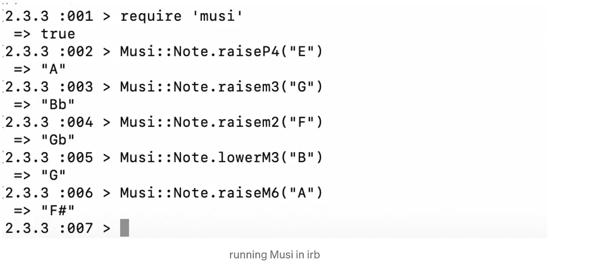
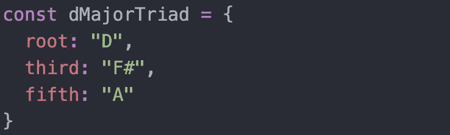
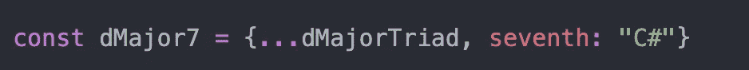

# 如果我再教音乐，它会是这样的——添加 JavaScript

> 原文：<https://javascript.plainenglish.io/if-i-ever-teach-music-again-it-will-look-like-this-adding-javascript-24f96e7c83f7?source=collection_archive---------20----------------------->

我对音乐和教育有着漫长而复杂的历史。我有几个硕士学位，我自学了几年音乐。我主要是教钢琴，虽然我的目标和愿望是成为一名音乐理论/听觉训练老师。

作为一名当今的软件开发人员，我觉得这是对音乐的一个极好的补充。

如果我再教音乐的话，那将是单独的乐理课，而且是乐理和 JavaScript 这样的计算机语言的串联课。我曾考虑建造某种课程，但还没有这样做。只是为了好玩，让我们从理论上来看它会是什么样子:

## **学生学习 JavaScript 来帮助他们理解音乐**

这是一种重要的 web 开发语言，也是我每天都在使用的语言。了解 JavaScript 有利于*大家*。音乐家们经常在日常工作中苦苦挣扎，而软件开发的工作可能比大多数工作都更受欢迎。

**= = = vs = =**

在 JavaScript 中，===是严格等于运算符。它比较值和数据类型。

==运算符只比较值。因此，当与==而不是===比较时，值为“7”的字符串将等于值为 7 的整数。

考虑音程 m3(小三度)。学音乐的学生常常很难将它与 a2(增秒)音程区分开来。脱离上下文单独播放，这些音程听起来完全一样。这两个音程的音或(值)相等或==。但是这些间隔的命名或(类型)是不同的。所以它们是*而不是*彼此严格相等或者===。

## **阵列和刻度**

为什么不一起学习这两个概念呢？数组是一种有序的数据类型，可以保存许多不同的值。音阶是一系列有序的音符。

const cMajorScale = ["C "，" D "，" E "，" F "，" G "，" A "，" B"]

要访问音阶的主音，只需访问数组的第一个值:cMajorScale[0]

使用一些熟悉的东西，比如标尺，可以帮助学生理解数组的概念。

## **JavaScript 对象和和弦**

不同的数据类型也能让我们更好地理解音乐。考虑一个带有键和值的 JavaScript 对象:

像这样显示数据，也是显示音乐和弦和音阶信息的一种非常直观的方式。这样很容易看出音符之间的关系。

如果我们使用 JavaScript 的 spread 操作符在现有和弦的基础上创建一个新和弦会怎么样？

这清楚地向我们展示了 D 大调三和弦和 D 大调七和弦之间的关系。

## **未来**

音乐和代码的相似之处显而易见。其实我之前写过一篇关于这个的文章:[音乐和代码上的并行](https://medium.com/p/c09258d24665)。

我不能肯定地说我什么时候或者是否会开发某种组合课程，或者会采取什么形式。在那之前，我会发布更多的交叉内容，看看这两个概念是如何相互作用的。

*更多内容请看*[***plain English . io***](http://plainenglish.io/)*。报名参加我们的* [***免费周报***](http://newsletter.plainenglish.io/) *。在我们的* [***社区***](https://discord.gg/GtDtUAvyhW) *获得独家获得写作机会和建议。*