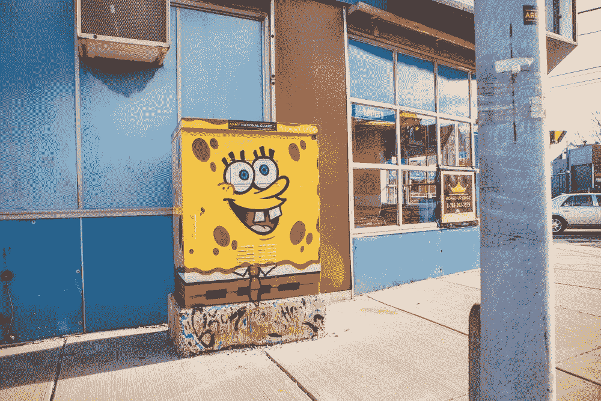
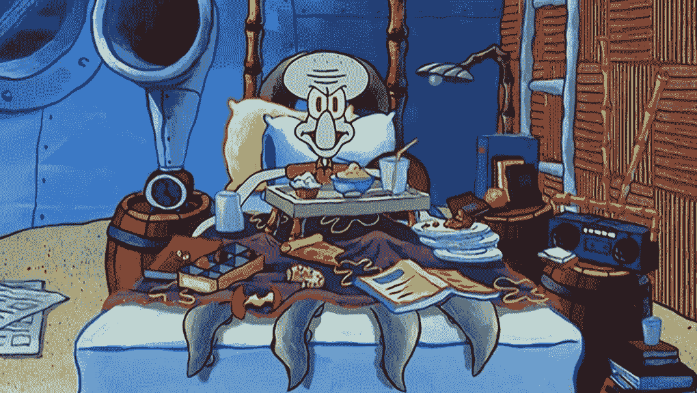
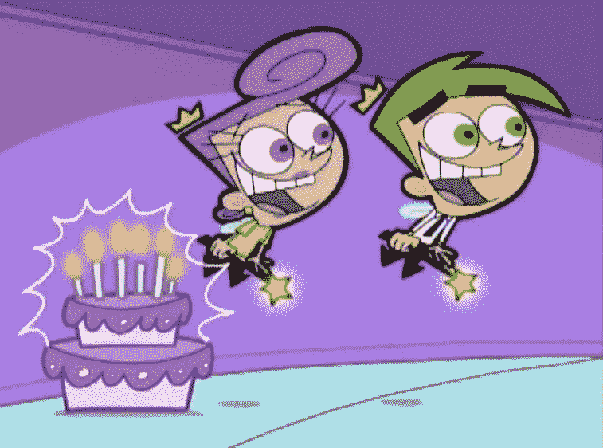
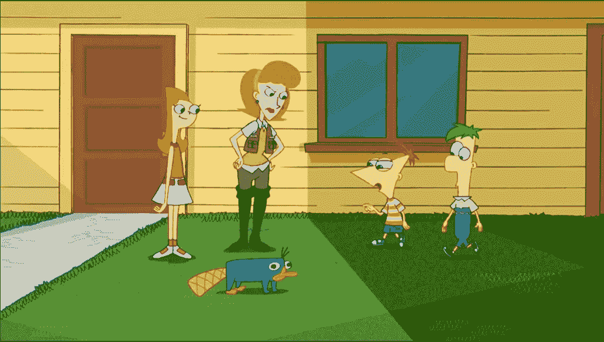
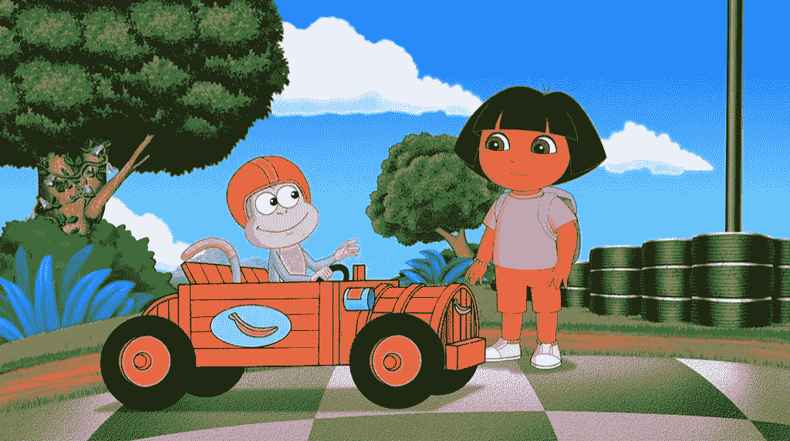
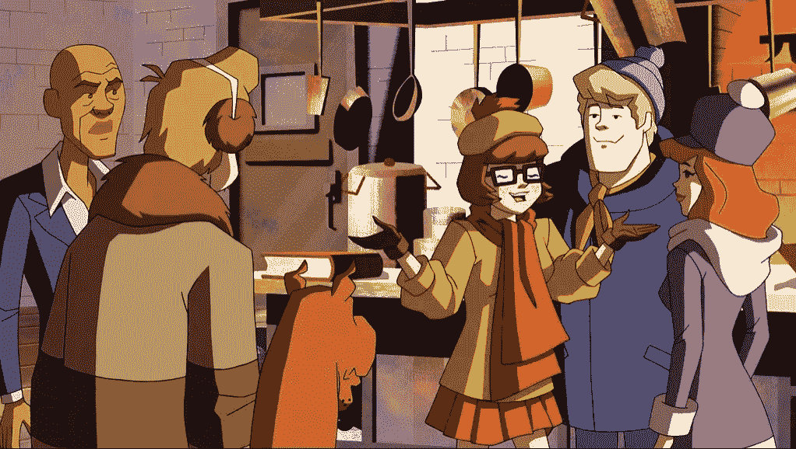
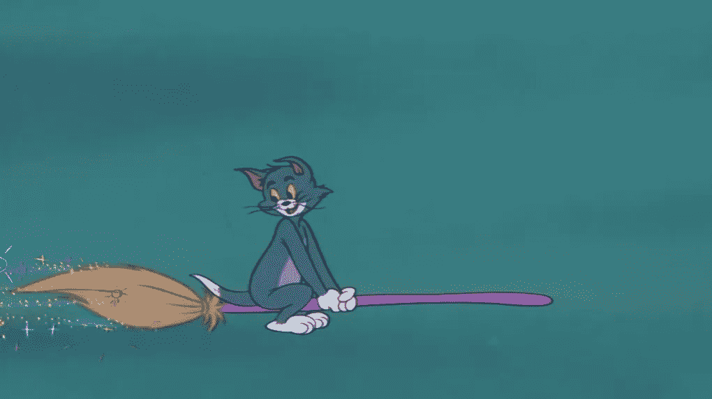
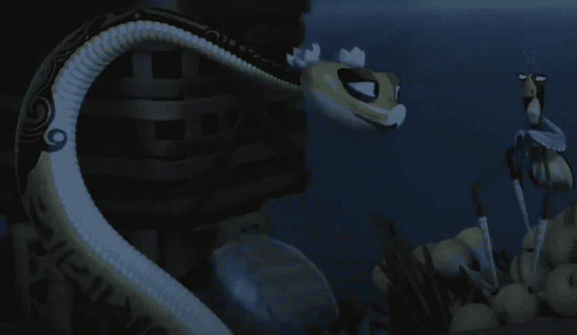
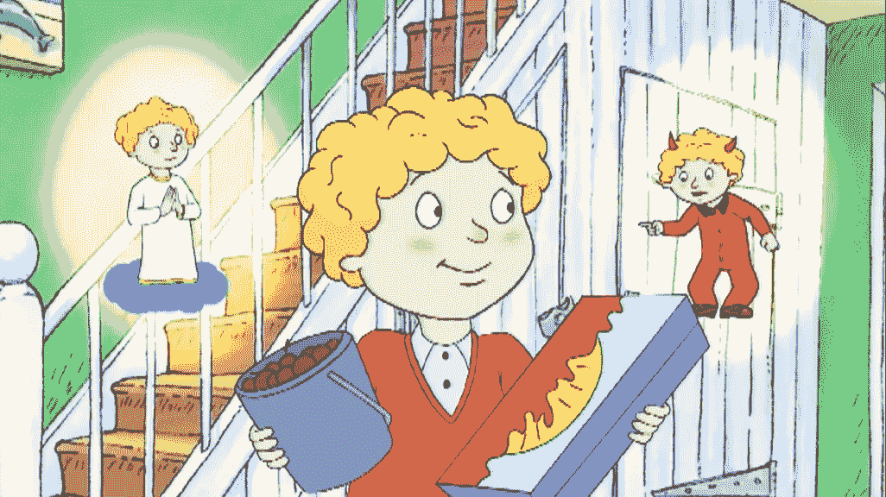
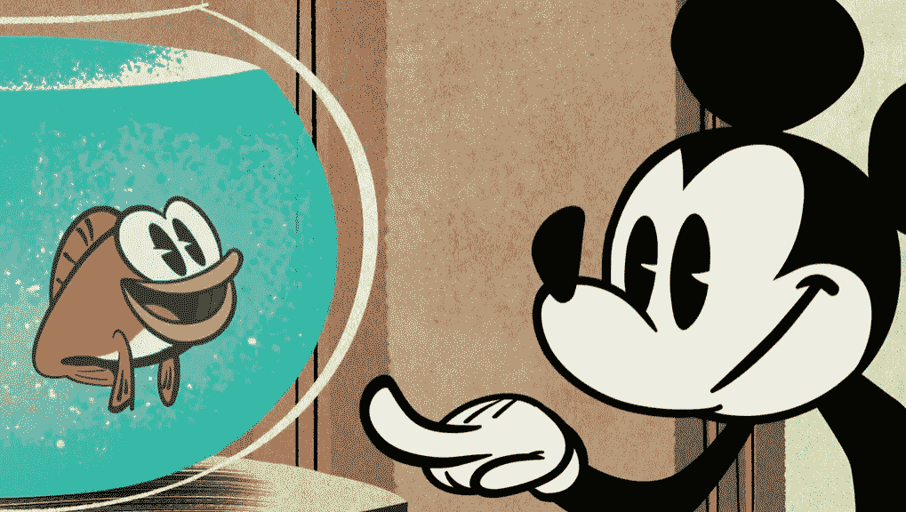

# 如果编程语言是卡通人物

> 原文：<https://javascript.plainenglish.io/if-programming-languages-were-cartoon-characters-41705e5210aa?source=collection_archive---------7----------------------->

## 让我们开心地将编程语言比作我们小时候既爱又恨的卡通人物

Photo by [todd kent](https://unsplash.com/@churchoftodd?utm_source=medium&utm_medium=referral) on [Unsplash](https://unsplash.com?utm_source=medium&utm_medium=referral)

动画电影和节目的纯粹怀旧意味着没有人，确切地说，没有人会老得不想再看它们。即使你是 16 岁、21 岁甚至 75 岁，这些节目也不会失去让我们粘在座位上的能力。

当然，编程也会让我们粘在座位上。通常，这是因为它让我们沉迷于创造性解决问题的世界，但其他时候，这是因为——你猜对了——一系列错误不知何故持续了 17 次不同的编辑，甚至是那些发誓要在 StackOverflow 上工作的人。哦好吧。

我在这里的观点是:编程语言经常会浪费我们一天的时间，因为它们经常有荒谬的语法要求，所以如果我们嘲笑它们，真的有那么糟糕吗？

适度的报复不会伤害任何人，所以我们把编程语言比作我们既爱又恨的卡通人物。

# c 作为 Squidward

Image from SpongeBob SquarePants

要求高(有大量的语法要求)并且容易发怒(源代码中的一个错误会导致终端上的几个错误),对于 C 来说，没有比来自海绵宝宝的 Squidward 更好的角色了。

# HTML/CSS 是相当奇怪的父母

Image from Fairly OddParents

虽然 HTML/CSS 可能不是真实的，但它们确实*神奇地*将源代码转换成了(希望)漂亮的东西。这就是为什么 HTML/CSS 会成为非常奇怪的父母。

# JavaScript 作为 Candace

就像 Candace 总是追着她那两个让她深感烦恼的麻烦哥哥一样，JavaScript 经常是一种不顾意愿不得不与 HTML/CSS 一起工作的语言。JavaScript 与 Candance 关系如此密切，它只需扮演她的角色。

# Python 作为靴子

# Java 作为 Welma

Image from Scooby-Doo Where Are You

聪明，优雅，可靠，Welma 遇到了她唯一的对手 Java，当谈到最受教授算法设计的教授们喜爱的语言时，她摘得了桂冠。

# 扮成汤姆去

Image from Tom & Jerry

根据许多开发者的说法，Go 努力窃取 Python 的胜利地位——这就像汤姆最终战胜他的对手杰里一样有可能发生。无论 T2 如何追逐他的梦想，它的追逐都像汤姆的一样毫无希望。去和汤姆简直是天作之合。

# 扮演毒蛇的科特林

Image from Kung Fu Panda

令人难以置信的聪明，但也很圆滑，Viper 至少试图成为新的 Welma，就像 Kotlin 试图成为新的 Java 一样。祝他们俩好运！

# VBA 饰演完美的彼得

Image from Horrid Henry

这张图片取自“彼得变得可怕”这一集，但老实说，对观众来说，彼得一直是令人讨厌的克星。尽管 VBA (Visual Basic for Applications)的初衷是好的，但令人遗憾的是，它似乎无缘无故地被人讨厌:多达 75.2%的开发人员表示不喜欢这种看似简单的语言。

# 像米老鼠一样的汇编程序

Image from Mickey Mouse

米老鼠这个角色无处不在:从米老鼠俱乐部到迪斯尼乐园门票，这个人很难被取代。就像装配工一样，他不可能很快去任何地方。

感谢您的阅读！有关类似内容，请查看以下文章:

 [## 如果编程语言是迪斯尼人物

### 让我们找点乐子，把编程语言比作迪士尼的恶棍

better 编程. pub](https://betterprogramming.pub/programming-languages-as-disney-villains-feb5b17c01ea)  [## 如果编程语言是希腊的神

### 一场喜剧

levelup.gitconnected.com](https://levelup.gitconnected.com/if-programming-languages-were-greek-gods-96c6e04fe02)  [## 如果编程语言有工作

### 你可能会雇佣其中的一些人

better 编程. pub](https://betterprogramming.pub/if-programming-languages-had-jobs-ad14239a40cc) 

*更多内容看* [***说白了。报名参加我们的***](http://plainenglish.io/) **[***免费周报***](http://newsletter.plainenglish.io/) *。在我们的* [***社区获得独家访问写作机会和建议***](https://discord.gg/GtDtUAvyhW) *。***