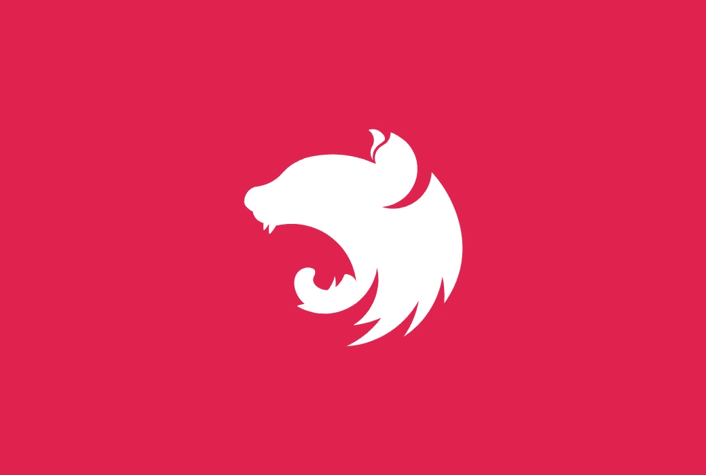

# NestJS 简介:如果你喜欢 Spring Boot，你会喜欢这个 Node.js 框架

> 原文：<https://javascript.plainenglish.io/if-you-like-spring-boot-then-youll-love-this-nodejs-framework-4e5c81a034f3?source=collection_archive---------3----------------------->

## 结合 Node.js 和 TypeScript 的优点来创建一个强大的框架。



我现在使用 **Node.js** 已经 4 年多了，从一开始，我就对 **Express** 无比忠诚。但是最近，在开始了一个又一个项目之后，我开始感觉到 **Express 在开始的时候需要大量的设置**。**许多特性不支持开箱即用** (CORS，主体解析器)，需要安装和设置额外的依赖项。

在我的许多学习项目中，我可以使用 **Spring Boot** ，并很快爱上了它。一切都被认为是**高效、轻松的，并且加速了开发过程**。

所以我决定看看“JavaScript Spring Boot”是否存在，经过一番研究，我最终找到了 [NestJS](https://nestjs.com/) ！

> NestJS 是一个基于 Express 的 TypeScript-Node.js 框架

在使用了一段时间后，我甚至认为它是一个**快速包装器**。

它的主要特点是**允许完全的 MVC 支持**和使用**类型脚本装饰器来声明模块**。它还支持**依赖注入**！

# 设置并运行您的 NestJS 项目

NestJS 团队明白，建立一个项目可能非常耗时。与 Express 不同，他们决定创建一个 **CLI** (命令行界面)来创建一个随时可用的小样板！

```
npx @nestjs/cli new my-nest-app
```

只需输入这个命令，CLI 将创建您的新项目准备运行！在安装过程中，您可以选择您最喜欢的依赖项管理器。随便挑你喜欢的吧！

一旦你的项目被创建，你所要做的就是运行它！只需运行命令:

```
npm run start:dev
```

就这样，您在端口 3000 上运行一个 API。你可以通过访问网址`http://localhost:3000`试试看，应该能看到`Hello world!`。

# 了解结构

如果你来自 Spring Boot 世界(甚至 Java 8+)，你应该对我们新项目的语法非常熟悉。

NestJS 由三种主要类型的文件组成:

*   **模块**:他们的目标是**声明**和**链接**所有文件在一起。
*   **控制器**:负责**通过创建**端点**向用户公开**API。
*   **服务**:它们是**可注入类**，用于管理你的业务逻辑，覆盖**应用和业务层**。

## 模块文件

如果您打开`app.module.ts`文件，您将看到一个空类，其中有一个有趣的装饰器:`@Module()`。

这个装饰器使用了 3 个参数，它们是:

*   **导入**:第一个参数(目前为空)是用来**链接模块之间的**。`AppModule`作为主模块，它将负责其他模块的导入。你应该**总是**有一个在`main.ts`文件中被调用的主模块。
*   **控制器**:一个 `@Controller`类的**数组。每次创建控制器时，都应该在相应的`controllers`数组中声明。**
*   **提供者**:一个`Injectable`类的数组。主要是服务，但也可以是任何有`@Injectable`装饰器的类。

`AppModule`本身在`main.ts`文件中声明，因为它是主模块。

## 控制器文件

现在，我们来看看`app.controller.ts`。在这种情况下，我们有一个用`@Controller`装饰器装饰的类。这意味着我们的类**可以用作控制器**并被添加到模块内的`controllers`数组中。

在内部，我们用装饰者`@Get`描述的方法`GET`创建了一个路由(我们之前访问过的那个)。

与 Express 不同，我们不必处理`response`对象来将响应发送回客户端。归还就足够了，并且简化了很多程序。

我们还可以看到，在控制器中，我们注入了`AppService`类。这是唯一可能的，因为该类是在模块类的 `**providers**`数组中声明的**。然后，我们可以在控制器方法中执行这个服务。**

## 服务文件

最后，我们打开`app.service.ts`看一看。

首先要注意的是装饰者`@Injectable`。这个装饰器使类**可用于依赖** **注入**，并允许我们在`providers`数组中声明它。

我们的服务只是提供一个名为`getHello`的方法，并在应用程序控制器中执行。

# 创建我自己的模块

首先，在创建我们的新模块之前，我们将对现有的应用程序进行一些清理。

扔掉`app.controller.spec.ts, app.controller.ts and app.service.ts`，因为我们不再需要它们了。

如果应用程序崩溃，请不要担心，我们会修复它！

打开我们的`app.module.ts`文件，并将其更改为如下所示:


app.module.ts

现在让我们创建三个新文件:

*   hello.module.ts
*   hello.controller.ts
*   hello.service.ts

## 创建和链接我们的模块

让我们从 hello 模块开始。打开`hello.module.ts`，粘贴以下内容:


hello.module.ts

这里没有什么新的，只是声明了一个新的模块。

现在，回到我们的`app.module.js`中，在`imports`数组中添加新的`HelloModule`。

## 创建和声明我们的控制器

下一步是创建控制器，并在新模块中声明它。

打开`hello.controller.ts`，粘贴以下内容:


hello.controller.js

这里，同样没有什么新东西，只是创建了一个控制器和方法的一个端点`GET`。

现在，将`HelloController`添加到我们模块的`controllers`数组中。

如你所见，我们正在返回一个硬编码的字符串。这并不好，相反，我们想与一个服务对话来获取字符串并返回它。这就是我们的`HelloService`要做的！

## 创造和提供我们的服务

打开`hello.service.ts`文件，粘贴以下内容:


hello.service.ts

如您所见，这只是一个简单的服务，其中一个方法返回一个字符串。

现在，在我们的模块中，将服务添加到`providers`数组中。

我们希望在之前创建的控制器中使用这个服务。编辑文件，使其看起来像这样:


hello.controller.ts

就是这样！重新加载`localhost:3000`，您应该能够看到我们的新服务集返回正确的字符串！

如果你想访问最终代码，你可以在我的 [Github repo](https://github.com/psyycker-medium/nest-article) 上找到它。

我真的很喜欢 NestJS，我认为它通过使用适当的 MVC 架构，使坚实的原则更加适用，给我们的后端带来了更多的健壮性。

我希望你喜欢这篇文章，不要犹豫，关注我或为更多！

*更多内容请看*[***plain English . io***](https://plainenglish.io/)*。报名参加我们的* [***免费周报***](http://newsletter.plainenglish.io/) *。关注我们关于*[***Twitter***](https://twitter.com/inPlainEngHQ)*和*[***LinkedIn***](https://www.linkedin.com/company/inplainenglish/)*。查看我们的* [***社区不和谐***](https://discord.gg/GtDtUAvyhW) *加入我们的* [***人才集体***](https://inplainenglish.pallet.com/talent/welcome) *。*