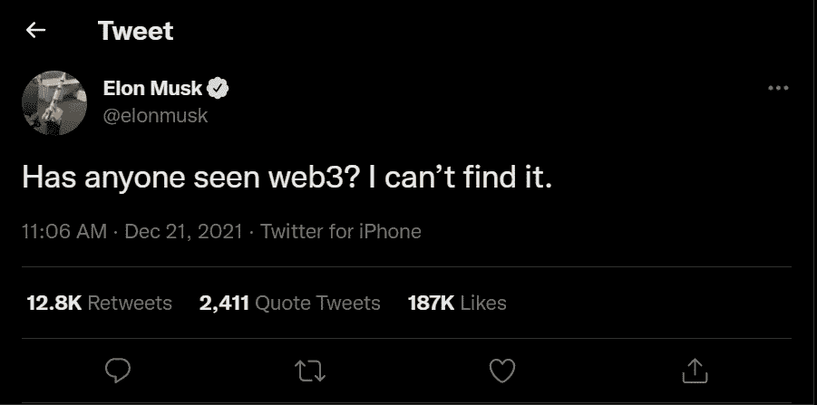

# 我是一个自学的 Web3 开发者，这里是我使用的资源

> 原文：<https://javascript.plainenglish.io/im-a-self-taught-web3-developer-and-here-are-the-resources-that-i-used-f64b1909fed1?source=collection_archive---------2----------------------->

## 学习赚钱。

Photo by [Annie Spratt](https://unsplash.com/@anniespratt?utm_source=medium&utm_medium=referral) on [Unsplash](https://unsplash.com?utm_source=medium&utm_medium=referral)

Web3 是一个有争议的话题。有些人喜欢 Web3，而有些人则嘲笑它。

所以你的感受由你自己决定。我并不想改变你的想法。但是让我告诉你，个人和开发者正在从中赚钱。

甚至我也不是加密世界的粉丝，在那里个人创造无意义的加密令牌。总的来说，个人创造了与比特币和以太坊相同的代币，但名称不同。是的，你可能会争论 XYZ 货币是否有更快的交易速度。

同样，拥有大量追随者的大亨埃隆·马斯克也支持 Dogecoin 和柴犬 coin。现在他在胡说什么 Web3。我不确定原因是什么。

Src: Twitter

先说说当初为什么学 Web3 吧。

所以，我已经做了几年的 web 开发人员，刚刚学习了 Web 3 技术来提高我的技能。如果将来它爆炸了，我会赚很多钱。另外，我学到了一些东西，给了我一些经验。

原因很简单。现在我们来谈正题。

你们大多数人可能知道 Web3 是什么。

如果你不知道我在说什么，这是互联网的一个阶段，你可以阅读，写作，拥有你的作品。简单地说，这是一个无人能控制的去中心化环境，没有中介，也可能没有数据被数字巨兽利用。

另一方面，Web 2.0 也有很多缺点，比如我们都听说过的公司出售用户数据的能力。

> **注意:**任何 Web3 课程都没有附属链接。所以不要担心我试图卖给你一些垃圾。

先说资源。

# 你需要学习网络开发

继 web 2.0 之后，web 3.0 是互联网的下一个阶段。因此，需要 web 2.0 技能。特别是帮助创建网站的网络开发技能。

简而言之，你必须学会 web 开发。

 [## 我是一个自学成才的网络开发人员，这里是我使用的资源

### 这同样会帮助你学习和成功。

javascript.plainenglish.io](/im-a-self-taught-web-developer-and-here-are-the-resources-that-i-used-d7f37c47cc1a) 

# YouTube 已经足够了

我不会强迫某人通过购买付费课程来获得技能。因为借助 YouTube 和互联网学习起来很简单。毫无疑问，你必须寻找最大的资源，并为此投入一些时间。

我从一开始就在 YouTube 的帮助下了解了 Web3。

比如:

**步骤 1)** [区块链是如何工作的——简单解释](https://youtu.be/SSo_EIwHSd4):它简单地解释了我需要知道的关于区块链技术及其运作方式的所有内容。

**第二步)** [什么是 Web 3.0？](https://youtu.be/nHhAEkG1y2U)下一步是了解 Web 3.0，我是通过观看另一个 YouTube 视频来了解的。

**Step 3)** [Solidity，Blockchain，和 Smart Contract 课程—初学者到专家 Python 教程](https://youtu.be/M576WGiDBdQ):现在我想学习更多关于编程的知识，这正是 freeCodeCamp 派上用场的地方。更具体地说，Patrick Collins 制作了一个视频，几乎解释了关于它的一切。

**步骤 4)** [使用以太坊智能合约和 Solidity 构建你的第一个区块链 App](https://youtu.be/coQ5dg8wM2o):最后，我想设计一个区块链 App，通过将它们付诸实践来帮助我记住所有的概念。我通过观看另一个 YouTube 视频做到了这一点。

我意识到它开始像一张简单的路线图。这是你作为一名 web3 开发者需要知道的。

这里有更多的 YouTube 频道。

 [## 想学区块链开发，下面是我订阅的 4 个 YouTube 频道

### 想学以致用才订阅。

nitinfab.medium.com](https://nitinfab.medium.com/want-to-learn-blockchain-development-here-are-the-4-youtube-channels-i-have-subscribed-8f3f34bdf76d) 

# 花一杯咖啡的钱学习技能

我们人类有一种倾向，那就是一旦我们买了某样东西，就只会把它发挥到最大的潜力。我的一个朋友曾经试图避免从免费资源中学习新技能，但在支付了数百美元的训练营之后，他获得了他需要知道的东西。

如果你有同样的习惯，你可以参加 Udemy 的简单课程。

Udemy 对我很有吸引力，因为它让我们花一杯咖啡的钱就能获得一项技能。我知道我在免费推广 Udemy，因为它值得。

*   [以太坊和坚固性:完整的开发者指南](https://www.udemy.com/course/ethereum-and-solidity-the-complete-developers-guide/)
*   [React 中的以太坊(下一篇 JS):完全指南](https://www.udemy.com/course/solidity-ethereum-in-react-next-js-the-complete-guide/)

我在 Udemy 上发现的一些最好的课程。

# Web 3 开发者免费指南

大多数开发人员，包括我自己，都利用谷歌来解决问题。有些人甚至试图通过博客或文档来学习一切。

这里有一些针对他们的顶级指南和资源。

*   [全栈以太坊开发完全指南](https://dev.to/dabit3/the-complete-guide-to-full-stack-ethereum-development-3j13)
*   [利用这些免费资源学习 web 3](https://web3.career/learn-web3)

就这样——谢谢。

 [## 通过我的推荐链接加入媒体

### 作为一个媒体会员，你的会员费的一部分会给你阅读的作家，你可以完全接触到每一个故事…

nitinfab.medium.com](https://nitinfab.medium.com/membership) 

*更多内容请看*[***plain English . io***](https://plainenglish.io/)*。报名参加我们的* [***免费周报***](http://newsletter.plainenglish.io/) *。关注我们关于*[***Twitter***](https://twitter.com/inPlainEngHQ)*和*[***LinkedIn***](https://www.linkedin.com/company/inplainenglish/)*。查看我们的* [***社区不和谐***](https://discord.gg/GtDtUAvyhW) *加入我们的* [***人才集体***](https://inplainenglish.pallet.com/talent/welcome) *。*