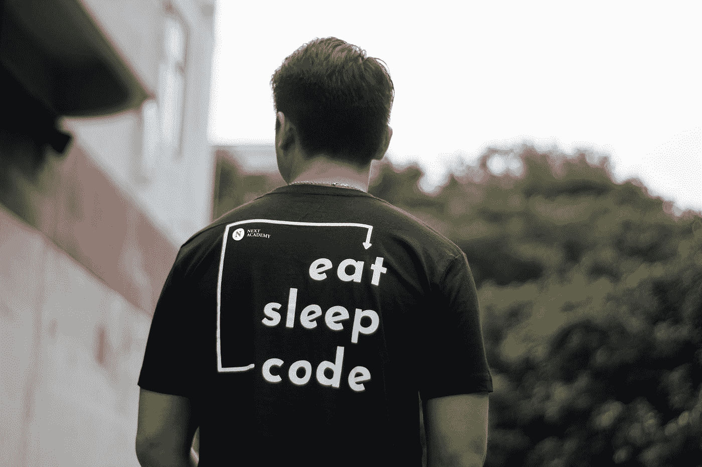

# 我正在编写兼职项目，以变得更加财务自由

> 原文：<https://javascript.plainenglish.io/im-coding-side-projects-to-become-more-financially-free-ae41eb821100?source=collection_archive---------2----------------------->

## 你所挣的是一个谎言。你的时间就是金钱

Author: [Polina Chistyakova](https://www.pexels.com/sk-sk/photo/kukurica-dieta-sledovanie-pozeranie-13417532/)

赚钱可能是最艰难的工作。

挣一美元要花我们很多时间。一旦我们赢得了它，我们就把它输给了我们的“雇主”他们强迫我们为他们工作来谋生。

我想尽快离开那个监狱。我的计划是通过编写辅助项目来实现。

以下是我的想法。

# 一个关于我强大的副业的故事

我的副业是一个简单的博客。

我花了三个星期才拼凑出来。当我这样做的时候，我开始创造内容，这样我就可以获得更多的用户。我想如果我能让 5000 人来看我的博客，我就有优势了。

令我惊讶的是，该博客在 3 个月内就有了 10，000 名用户。然后就攀升到了 3 万月活用户。

用户的积累是世界上最宝贵的资产之一。

对我来说最大的教训是，你认为对副业有益的想法并不总是最好的想法。通常是处决。

你认为会成功的事可能不会。你认为可怕的可能是所有想法中最好的。

# 副业的真相

副业的真相是，你不能突然指望数百万美元涌入，改变你的生活。

如果你想赚取副业收入，那么你必须根据你的兴趣选择副业项目。并不是所有的副业都会带来丰厚的回报。如果你希望从副业中获得可观的收入，那就需要一段时间。

大多数副业项目，比如我的这个，都很小。我的 React 博客“乐观代码”每月只赚几百美元。人们看着乐观的代码，认为“这是一个糟糕的兼职项目。你为什么要在这上面浪费时间？”

兼职项目的秘密在于你乐在其中，而不是投资者或其他人。世界上没有人的观点是重要的。人们不理解。没关系。他们不需要。

Photo by [NEXT Academy](https://unsplash.com/@next_academy?utm_source=medium&utm_medium=referral) on [Unsplash](https://unsplash.com?utm_source=medium&utm_medium=referral)

# 你所挣的是一个谎言

你的时间就是金钱。我在生活中越来越意识到这一点。

高工资是可以的。但是，把同样的薪水塞进你 240 多个小时的日历里是一个大问题。时间比金钱更重要。

我那些收入颇丰的朋友的日程表排得满满的。他们是英雄。正是他们让 Twitter 的时间线看起来像一场噩梦。

他们太忙了，不可能安排更多的会议或做任何额外的工作。那些日历是我们金融监狱的象征。

更少的会议和更多的时间做副业可能不会增加你的薪水。但是它会让你更快地获得财务自由。你只有有限的时间，所以要小心分配。

你从日历上得到的越多，你获得的财务自由就越多。

# 时间是真正的金钱

我们都没有足够的时间。我们必须为生活中我们想要的一切腾出时间。

过去几年我一直在寻找重新编程我大脑的方法。我的目标是用我在这个星球上的时间做我喜欢做的事情，并以此赚钱。

我厌倦了在我不真正喜欢的事情上花费时间，或者做与我自己的价值观不一致的事情。

时间是我们拥有的最宝贵的东西。

学会珍惜你的时间。

# 最后的话

许多编程人员在财务上是自由的。他们如何到达那里？

通过编码。通过建设副业。

通往财务自由的旁门左道可能会在一夜之间导致数百万美元的损失。但是即使没有，你仍然是财务自由的。那是没人谈论的隐藏真相。

抛开公司生活，创造你自己的未来。没那么难，但是需要时间。

[***订阅***](https://bernardbad.medium.com/subscribe) ***所以你不要错过我接下来的故事。***

*更多内容看* [***说白了。报名参加我们的***](https://plainenglish.io/) **[***免费周报***](http://newsletter.plainenglish.io/) *。关注我们关于* [***推特***](https://twitter.com/inPlainEngHQ) ，[***LinkedIn***](https://www.linkedin.com/company/inplainenglish/)*，*[***YouTube***](https://www.youtube.com/channel/UCtipWUghju290NWcn8jhyAw)*，以及* [***不和***](https://discord.gg/GtDtUAvyhW) *。对增长黑客感兴趣？检查* [***电路***](https://circuit.ooo/) *。***