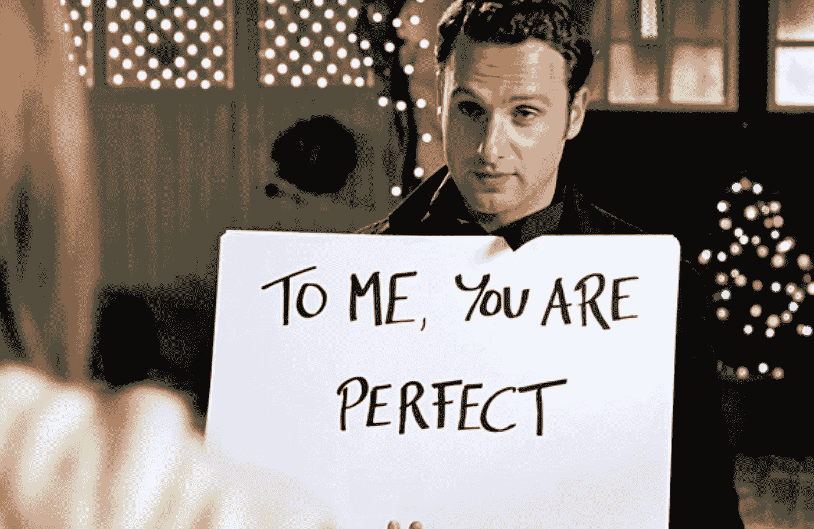

# 我将在 30 天内建造我自己的 SaaS

> 原文：<https://javascript.plainenglish.io/im-going-to-build-my-own-saas-in-30-days-f2c9d2cf8e1c?source=collection_archive---------7----------------------->

## 我告诉你如何做同样的事情

Taken by [The Lazy Artist Gallery](https://www.pexels.com/sk-sk/@thelazyartist?utm_content=attributionCopyText&utm_medium=referral&utm_source=pexels) on [Pexels](https://www.pexels.com/sk-sk/fotka/sebaisty-sen-sef-dzentlmen-999267/?utm_content=attributionCopyText&utm_medium=referral&utm_source=pexels)

为了启动一个成功的项目，你不需要一个从麻省理工学院毕业的大型开发团队。事实上，在接下来的 30 天里，我将独自建造我自己的 [SaaS](https://en.wikipedia.org/wiki/Software_as_a_service) 。如果你正在读这篇文章，你一定会很开心，因为我会告诉你怎么做。

我要**告诉你我到底要怎么做。**所以坐稳了听，因为知识就要掉了。我将从头到尾向您介绍构建项目的整个过程。我会和你分享所有的技术细节，商业方面，市场营销等。

不用说，你将体验到产品开发的整个过程。

> 如果您猜测这是一个长系列的第一部分，那么您的猜测是正确的。因此，如果您还没有订阅，请[现在就订阅，并保持更新。](https://bernardbad.medium.com/subscribe)

# 产品理念

产品开发中最可怕的部分。**几乎所有人都失败放弃的地方。**这是创意产生的时候，你需要思考你想要建造的东西。

许多人在这个阶段失败的原因是他们没有用正确的方式思考。或者更重要的是，他们心中没有正确的目标，意图不在正确的地方。大多数人不是在试图解决问题，或者帮助他人。他们只是希望他们的产品成功。

Credit: Getty Images/iStockphoto

老实说，我过去也犯过同样的错误。但这一次，会有所不同。这一次，我不会再想那个能让我发财的主意了。我会想出一个能解决问题的主意。

当你试图创造一个产品时，这就是你应该思考的方式。不要试图发明人们想要的东西，要试图发明人们需要的东西！

起初，这听起来简单明了。但是很快，你就会发现说起来容易做起来难。当我们开始考虑一般人时，他们想要太多的东西，而且他们很一般。试图创造一个能帮助大众的产品几乎是不可能的。这也正是我选择利基市场的原因。

更容易分析和剖析更小的人群。我们可以去他们消磨时间的地方，看看他们是什么样子，他们用什么语言交流。但最重要的是，我们可以了解他们面临什么问题。

我关注了一群有着相同兴趣的人，他们很可能有着相同的问题和抱负。我选择了一种更隐秘的方式，因为我选择了一群我是其中一员的人。

几分钟后，这个想法诞生了！

我将打造一款产品，帮助内容创作者完成一项非常耗时的任务。该产品将帮助他们更快地创建内容，这就是我现在要说的。

> 你不必选择你感兴趣的领域。但是如果有，就不用花时间研究了。你可以问问自己。我面临着什么问题？

既然我已经有了这个想法，我没有把我所有的额外积蓄都花在一个发布会上。**主要是因为 2 件事:**

*   尚未发布任何内容。
*   这个想法没有被证实。

# 验证这个想法

我已经有了主意。我也知道什么样的人会从中受益。大多数人会开始庆祝，向朋友和家人要钱，这样他们就可以外包一个开发团队。但我不会这么做的，现在还不会。

我的想法有一个巨大的问题。它只存在于我的脑海中，我真的不确定人们会对此说些什么。我相信这是一个常见的场景。**你有这个想法，听起来很棒，但当你告诉其他人时，他们并没有真正明白。**

也许这个想法不适合他们。但更有可能的是，它对你来说听起来很好，因为它是你创造的。换句话说，你有偏见。

Original Image by [Love Actually](https://www.imdb.com/title/tt0314331/)

因此，为了防止这种情况发生，**我们需要检查我们的产品在市场上是否有一席之地**。

首先，我们可以**检查是否已经创建了类似的东西**以及人们是否正在使用它。我们通常发现的是，我们参加聚会迟到了，已经有像我们这样的产品了。这种情况也发生在我身上，但并没有困扰我。

这正好证实了这个想法是好的，而且是有需求的。市场竞争是很平常的事情，没什么可怕的。但是，如果你发现你所在的市场存在巨大的垄断，而且它根本大到无法与之竞争，那就不值得你去努力。

另一方面，如果我们的想法如此有创意，以前没有其他人想过。我们需要用不同的方式来验证它。最直接的过程是**去一个你的目标群体花时间的地方，向他们推销。告诉他们你的想法，并询问他们是否会采用。**

无需构建任何东西，无需编写任何代码。我们已经知道我们的想法是否有潜力。

# 履行

最后是每个开发者梦寐以求的部分。现在，我们进入实现部分。在这一部分，我不会分享一些决定我的产品成功与否的代码片段。其实从所有的步骤来看，我觉得**实现是最不重要的。**

当然，我们需要构建没有任何缺陷的完美软件，但是**我们使用什么技术并不重要。**最重要的部分是做研究，看看什么适合你的用例。

在我的情况下，我需要在 30 天内**建造一些东西，我会独自完成。对于像我这样一个迟钝的程序员来说，这是相当快的。这就是为什么我需要一个能让我快速上手的解决方案。但是，我还需要考虑规模。**

我总是认为我的产品会成功。当这种情况发生时，我会添加新的功能，并扩展原有的功能。出于这个原因，我选择了一个可以让我做到这两点的技术堆栈。

> 如果你想听听我用的是什么技术栈，[敬请期待](https://bernardbad.medium.com/subscribe)。我将在本系列的下一部分揭示它。但是你可以打赌我在用 [React](https://reactjs.org/) 和 [Typescript](https://www.typescriptlang.org/) 。

正如我提到的，我独自处理实现部分。我的编程知识允许我这样做。这意味着我没有为开发支付任何费用。然而，**我牺牲的是别的东西。我在牺牲我的时间。**

Created by author

如果你没有足够的编程经验，或者你手头有一大笔钱。你可以选择另一种方式。这个选择是**雇佣其他人来为你处理编码。**

在像[UpWork](https://www.upwork.com/)on[to tal](https://toptal.com/)这样的网站上，有无数的自由职业者可以这样做。但是由于我对这种方法没有太多的经验，所以我不打算在这里进行更详细的描述。

关于实现，我要说的差不多就是这些了。你用什么不重要，谁来做不重要。重要的是你花了很多时间研究你的用例，而不仅仅是直接进入实现。

# 接下来的步骤

现在我检查了所有的框，我准备开始开发。我可以把屁股粘在椅子上，一行行写代码。我真的很兴奋能这样做，我迫不及待地想分享我的应用程序的第一个原型。

现在看来我得花时间开发了，也就是说这个故事不能继续写这篇文章了。事实上，它即将结束。不过，别担心，他们会越来越多。

在这个故事中，我与你分享了我在构建产品时的见解。毫无疑问，我会用它们来发布我的 SaaS。

这些见解会对我有帮助吗？这个项目会成功吗？还是我会彻底失败？

*请在评论中告诉我，你有什么想法？*

*我希望你喜欢这个故事。如果你想从我这里听到更多或阅读更多，请考虑使用* [***这个链接成为一个中等会员。***](https://bernardbad.medium.com/membership)

*更多内容看* [***说白了。报名参加我们的***](http://plainenglish.io/) **[***免费周报***](http://newsletter.plainenglish.io/) *。在我们的* [***社区不和谐***](https://discord.gg/GtDtUAvyhW) *获得独家获取写作机会和建议。***