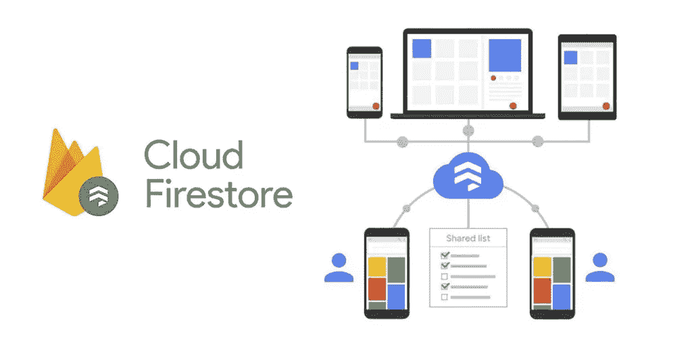
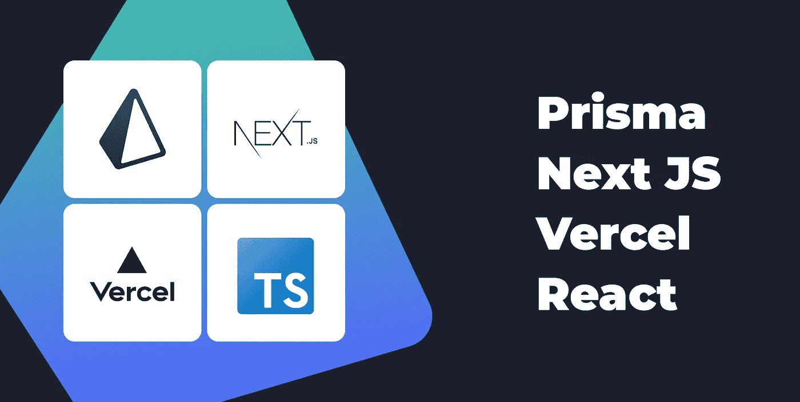

# 我要和 Firebase 说再见了

> 原文：<https://javascript.plainenglish.io/im-saying-goodbye-to-firebase-8a4b7635d69f?source=collection_archive---------0----------------------->

## 你也应该如此。

Captured by [Kripesh adwani](https://www.pexels.com/sk-sk/@kripesh-adwani-223818?utm_content=attributionCopyText&utm_medium=referral&utm_source=pexels) on [Pexels](https://www.pexels.com/sk-sk/fotka/jazero-volny-slobodny-bezstarostny-709143/?utm_content=attributionCopyText&utm_medium=referral&utm_source=pexels)

哦，天哪，我为什么要用 Firebase？如果我要数这些确切的话我说了多少遍，一只手根本不够。

过去几年我一直在使用 Firebase。在那段时间里，我经历了后端即服务解决方案的起起落落。但是从今天开始，这一时刻终于到来了，我们将永远告别**。**

我不确定我们是否会再次相遇，但我并不担心。原因很简单。我找到了一个完美的替代品。我打算**用这个替代品在 30 天内建造我自己的 SaaS。**

> 这是我在 30 天内建造 SaaS 系列的第二部分。尽可能透明地记录我的旅程。
> 
> 点击下面的文章，你可以阅读这篇文章的第一部分。

 [## 我将在 30 天内建造我自己的 SaaS

### 我告诉你如何做同样的事情

javascript.plainenglish.io](/im-going-to-build-my-own-saas-in-30-days-f2c9d2cf8e1c) 

在这个故事中，我将分享我使用 firebase 的经验。我喜欢它的什么，我讨厌它的什么，以及为什么我决定放弃它。我还将展示它的继任者，我将在下一个项目中使用的技术栈。

所以事不宜迟，让我们从我使用 firebase 的经历开始。

# 我对 Firebase 的体验

我在无数的项目中使用过 Firebase。**从我日常使用的小型实用程序**，**到生产就绪型应用程序。**老实说，到目前为止，它们运行平稳，没有任何问题。Deap Market 就是一个很好的例子。

现在我们知道我在个人项目中经常使用 Firebase。虽然听起来很神秘，但我也在我客户的项目中使用过。他们只是想把它用于他们的产品。他们不会让步。

话虽如此，我认为 Firebase **是一个很棒的工具**，可以让你快速原型化。它附带了大量有用的模块。并且它消除了在您开始构建应用程序时可能出现的大量障碍和问题。

当我开始使用 Firebase 进行项目时，我享受到了所有这些好处。在那一刻，我对 Firebase 感到非常幸运。然而，随着我的应用程序变得越来越复杂，我开始注意到一些问题。

[Original Source](https://media.makeameme.org/created/Problems-Problems-everywhere.jpg)

这些问题以不同的形式和规模出现。

有些问题并不严重，很容易解决。我所要做的就是找到某种变通办法。但是有些问题非常棘手，我尽了最大努力也无法解决。

我花了无数个小时试图找到解决方案，研究我的问题的根本原因是什么。所有这些行为让我找到了所有邪恶火焰的源头。这就是**云火商店。**

正如我很快意识到的， **Firebase 是一个伟大的工具，但它有巨大的局限性**(主要是因为 Firestore)。对于某些类型的应用和网站来说，它可以是一个很好的工具。但是对其他人来说，它弊大于利。

# 使用 Firebase

那么如何确定 Firebase 是否很适合你的项目呢？这其实很简单。你只需要问一个简单的问题。*“我是否需要，或者在某个时候是否需要对数据库执行复杂的查询？”如果答案是肯定的，**尽可能远离火焰基地。***

如果答案是否定的，再想一想，但这一次，更努力、更深入地想一想！如果答案仍然是否定的，那么您可以开始使用 Firebase，而不必担心任何问题。

# 为什么我要说再见

我说再见的原因是因为一件事。这个我已经提过了。在我看来，这是万恶之源。也是**Firebase 让那么多开发者失望的原因。我在某个地方听到或读到的所有对 Firebase 的憎恨，都是基于一个模块。**

如果你仍然不确定我在说什么，那就是**云 Firestore。**

[Original Source](https://cdn.hashnode.com/res/hashnode/image/upload/v1621529995590/4A2Gjpt5x.jpeg)

**Cloud Firestore** 是一个可通过原生 SDK 访问的 NoSQL 数据库。这是一个很酷的概念。您可以在项目中引入数据库。而且不需要学习任何数据库语言。更进一步来说，**你根本不需要了解任何关于数据库的知识**。

Firestore 似乎简单易用。来自天堂的礼物，对吗…？事实证明，我离真相不远了！

Firestore 的简单性实际上是它的局限性。当然，创建简单的数据库模式非常简单快捷。当然，获取数据轻而易举。

但是使用 Firestore 创建复杂的模式更具挑战性。使用复杂的过滤器或排序来获取数据？那是不可能的。

我已经很清楚地表达了我对 Firestore 的看法。但是，firebase 还提供了其他有用的模块。像**托管、无服务器功能、认证、存储**都捆绑在 Firebase SDK 中。许多开发人员正在利用它们来加速他们的编码过程。

你可以使用上面提到的所有模块。你可以用你选择的任何数据库来代替 Firestore。看起来 Firebase 所有不好的地方都解决了。我不反对，因为这是事实。而且浏览各种论坛，确实听到很多开发者的这个建议。

但老实说，我不认为这有什么意义。这主要是因为我找到了另一种选择。而且我更喜欢。它允许我使用 Typescript 构建 React 应用程序。它为我提供了解决方案，如**无服务器功能、认证、托管**、**数据库、**等等。最重要的是，它是完全免费的。

我希望你已经准备好听它是什么了。

# 我的下一个选择

它花了我一些章节，但我终于要谈论它了。我将最终**展示我正在使用的替代**堆栈，而不是 Firebase。所以没有任何进一步拖延，让我们开始吧。我选择了所谓的宣传堆栈，包括以下内容:

*   **下一个 JS + Typescript**
*   **Prisma + PostgreSQL**
*   **韦尔塞尔**

我已经用了很长时间了。我就是喜欢。如果你还没有尝试过，我强烈建议你这样做。

但是现在，让我们仔细看看堆栈的每个部分。

Created by Author

## 下一个 JS

正如我已经提到的，我正在使用 React。我无法想象事情会在短期内改变。然而，改变的是我使用它的方式。

我相信**服务器端渲染和类型脚本支持是必须的。由于这个原因(在其他原因之上)，我将选择 Next JS。**

> Next.js 为您提供了最佳的开发人员体验，包括生产所需的所有功能:混合静态和服务器渲染、类型脚本支持、智能绑定、路径预取等等。不需要配置。(来源:[下期 JS](https://nextjs.org/) )

## 普里斯马

数据库选择是显而易见的。我需要一个好的关系数据库。因此，我立即选择了 Postgres。

所以现在我有了一个数据库，我需要一个好的方法来管理它。Prisma 听起来是个不错的选择。它提供了这么多有用的工具，很难一一列举。但我最喜欢它的是**自动类型生成**。我需要做的只是在一个文件中定义一个模式，Prisma 将为我生成所有的 TypeSciprt 类型。

> Prisma 通过 PostgreSQL、MySQL、SQL Server、SQLite 和 MongoDB 的开源数据库工具包，帮助应用程序开发人员更快地构建并减少错误。(来源: [Prisma](https://www.prisma.io/docs/) )

## 韦尔塞尔

对于主机，我选择了 Vercel，只是因为它与 Next JS 非常匹配。

老实说，我以前从未使用过 Vercel 进行部署，但是这种转换非常简单。到目前为止，我没有遇到任何问题。

> Vercel 是一个用于前端框架和静态站点的平台，旨在与您的无头内容、商务或数据库集成。(来源:[维尔塞尔](https://vercel.com/))

[Original Source](https://memegenerator.net/img/instances/55737520.jpg)

# 我，火基地，和我们的未来

我试着尽可能说清楚。我和 firebase 在一起没有未来。就像任何不正常的关系一样，**我们必须分手，**我必须继续前进。事实上，我已经做了。

我看不到我们会再次相遇的场景。对于这种情况，我也不知道还能说些什么。我唯一能想到的就是包起来。所以开始了。

在这个故事里，我表达了我对 Firebase 的想法。我提到了我喜欢它的地方，我也说了我讨厌它的地方。此外，我透露了从现在开始我将使用的替换堆栈。但是现在，我想听听你的意见！

***你对 Firebase 有什么体验？***

我希望你喜欢这个故事。如果你想从我这里听到更多，或者阅读更多，可以考虑使用 [***这个链接***](https://bernardbad.medium.com/membership) ***成为一个中等会员。***

*更多内容请看* [***说白了就是***](https://plainenglish.io/) *。报名参加我们的* [***免费每周简讯***](http://newsletter.plainenglish.io/) *。关注我们*[***Twitter***](https://twitter.com/inPlainEngHQ)*和*[***LinkedIn***](https://www.linkedin.com/company/inplainenglish/)*。加入我们的* [***社区不和谐***](https://discord.gg/GtDtUAvyhW) *。*