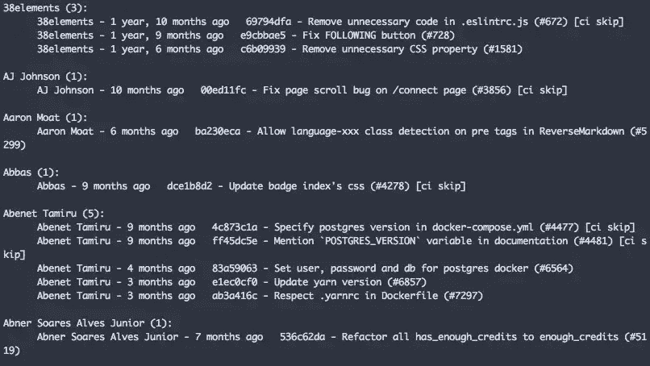
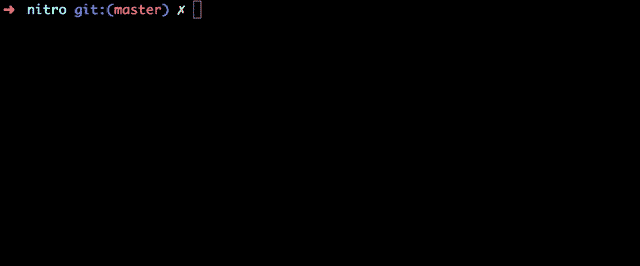
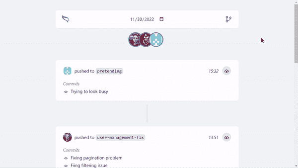
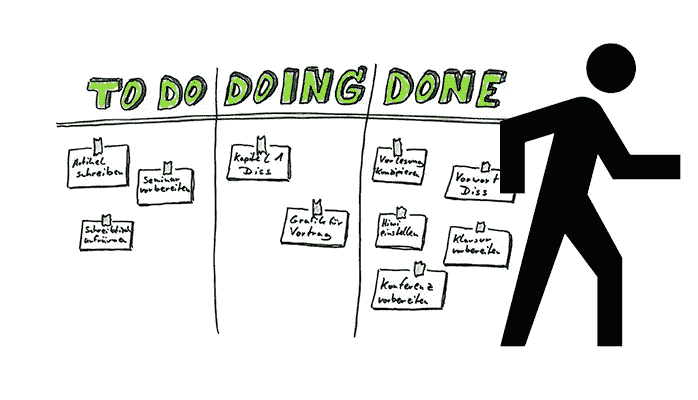

# 我用 Git 作为我的站立伙伴

> 原文：<https://javascript.plainenglish.io/im-using-git-as-my-standup-buddy-e3ddc06b28f3?source=collection_archive---------7----------------------->

## Git 不仅仅是版本控制系统

站立会议很无聊，但许多创业公司仍然这样做。

我过去常常花时间开玩笑，分享我那天做的事情，然后想知道为什么团队回答“好”，然后继续他们正在做的工作。

我知道单口站立的目的是让团队保持同步，并帮助他们调整目标。

但是现实生活中的单口相声不会做这些事情。

# 单口相声的问题是

我在许多公司工作过。无论在哪里，我听到的都是这个:

*   *我做过这个…*
*   *我会的……*
*   *没有屏蔽…*

还有一种模式叫走板。这个想法是分享董事会，一起检查任务。

这是一种更好的方式来查看发生了什么，但是没有多少团队在使用它。主要是因为看着写满未完成任务的黑板是非常可怕的。


Photo by [Hello I'm Nik](https://unsplash.com/@helloimnik?utm_source=medium&utm_medium=referral) on [Unsplash](https://unsplash.com?utm_source=medium&utm_medium=referral)

“我所做的模型”似乎是全世界所有工程团队中最常见的。

但是，我不喜欢它。

白天，我在多个功能上工作，审查许多开放的拉取请求。有时候我也会在多个项目之间切换。

结果我对自己做了什么没有一个清晰的概念。但这正是 Git T7 发挥作用的地方。

# 隐藏的 Git 用于站立

> Git 有自己的语言。像任何语言一样，你可以学会用新的方式来表达自己。

多年来，我一直使用 Git 来跟踪我的工作。简单有效，不需要任何额外的努力。

我所要做的就是保持我的提交消息简洁明了。

要查看您在 Git 上做了什么，您有两个选项:

*   *Git shortlog*
*   *Git 起立*

## Git 短日志

使用下面的命令，您将看到所有按作者分组的提交消息。

```
git shortlog --pretty=format:"%an - %ar%n %h - %s %n"
```



Credits: [Srebalaji Thirumalai](https://medium.com/u/3b40c612296?source=post_page-----e3ddc06b28f3--------------------------------)

您还可以通过扩展命令来过滤过去 24 小时的提交消息。

```
git shortlog --pretty=format:"%an - %ar%n %h - %s %n" --after="yesterday"
```

Git shortlog 是我进入 Git standups 世界的门户命令。但是，当我发现 [git-standup](https://github.com/kamranahmedse/git-standup) 的时候就停止使用了。

## Git 站立

正如这个工具的作者所描述的那样。

*“回想一下你在最后一个工作日做了什么。或者多管闲事，找别人做了什么。”*



Credits: [git-standup](https://github.com/kamranahmedse/git-standup)

我用上面提到的方法已经很久了。但是有几件事我不喜欢。

我最大的痛点是，他们没有团队精神。

不拉最新变化，看不到别人在做什么。直到所有的修改都被合并，你才能看到它。

这是困扰我很久的事情，也是我决定建立[gitineraly](https://gitinerary.com/)的原因。

# 每日站立姿势改善

> Gitinerary 监视并报告公司代码库内部发生的活动。



Gitinerary showcase

Gitinerary 提供实时进度报告，没有任何额外的麻烦。

一旦开发人员开始提交、推送变更和发出拉取请求，Gitinerary 将在其时间线上显示该活动。

## 每日站立的 Gitinerary

在文章的开始，我提到了一个叫做[走板](https://tech.deliveryhero.com/spice-up-your-daily-standup-walking-the-board-with-a-conductor/)的站立模型。



Credits: [David. E. Manske](https://www.linkedin.com/pulse/twist-daily-stand-up-walk-board-david-e-manske-mba/)

这个想法是分享董事会，一起检查任务。

仔细想想，Gitinerary timeline 是你的项目板的简化版。而且我相信它可以作为基础，或者是你日常单口相声的补充。

您将看到团队中每个开发人员的成就。你会知道做了什么，你会看到你的回购发生的一切。

如果你想尝试一下，你可以通过安装 [GitHub 应用](https://github.com/marketplace/gitinerary)来实现。

# 最后的想法

我正试图尽可能多地利用 Git 进行单口相声。它给了我一个几乎完整的每个人都在做什么的历史。

我不用问，Git 告诉我。我不用记，Git 给我看。

准备好[用 Git](https://gitinerary.com/) 提高你的单口相声了吗？

*更多内容看* [***说白了就是 io***](https://plainenglish.io/) *。报名参加我们的* [***免费周报***](http://newsletter.plainenglish.io/) *。关注我们关于*[***Twitter***](https://twitter.com/inPlainEngHQ)，[***LinkedIn***](https://www.linkedin.com/company/inplainenglish/)*，*[***YouTube***](https://www.youtube.com/channel/UCtipWUghju290NWcn8jhyAw)*[***不和***](https://discord.gg/GtDtUAvyhW) ***。****

****对缩放您的软件启动感兴趣*** *？检查出* [***电路***](https://circuit.ooo/?utm=publication-post-cta) *。**