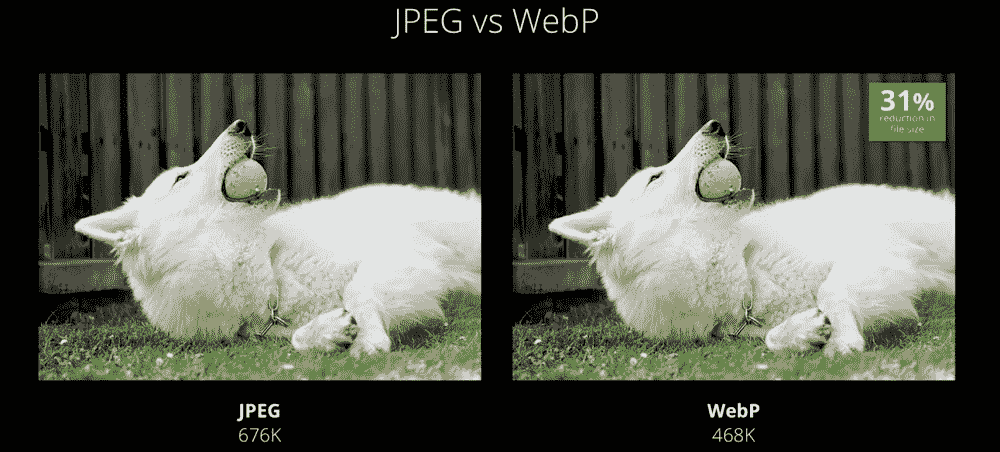

# 2022 年浏览器中的图像优化

> 原文：<https://javascript.plainenglish.io/image-optimization-in-the-browser-in-2022-8691a3fa35d2?source=collection_archive---------8----------------------->


Photo by [Qingbao Meng](https://unsplash.com/@ideasboom?utm_source=medium&utm_medium=referral) on [Unsplash](https://unsplash.com?utm_source=medium&utm_medium=referral)

在这篇文章中，我将讨论一些实践，这些实践允许您优化站点上图像的加载和呈现。

# 图像缓存

客户端缓存是浏览器将文件存储在本地以便不被再次访问的能力。这对图像和 CSS/JavaScript 文件非常有用。当用户浏览页面时，如果不使用浏览器上的缓存机制，浏览器将不断请求相同的文件。

哪些文件应该被缓存由 Cache-control 和 Expires HTTP 头控制。服务器随响应一起发送这样的头，指示浏览器是否将该文件保存到本地存储。

## 缓存控制

Cache-control HTTP 头用于控制浏览器缓存。它必须与所有需要缓存的文件一起传输。它具有以下格式:

```
Cache-Control: **private**, max-age=0, no-cache
```

*   私有意味着缓存只能在用户的浏览器上工作。相反，您可以使用 public 语句。这允许在公共代理服务器上进行缓存(通常出现在公司中)。
*   无缓存意味着不能缓存请求。
*   max-age 是缓存结果的时间。以秒为单位设定。

## 期满

可选的 HTTP Expires 标头指定浏览器刷新缓存的日期和时间:

```
Expires: Mon, 20 Mar 2024 00:00:00 GMT
```

浏览器最早将在 2024 年发送第二次请求，直到那时它将使用缓存

此标头应与 Cache-Control 结合使用。

# 现代图像格式

WebP 是 Google 在 2010 年开发的一种文件格式。它的特点是一个先进的压缩算法，允许您减少图像的大小，而没有明显的质量损失。

目前，几乎所有现代[浏览器](https://caniuse.com/webp)都支持这种格式。



平均而言，webp 图像的重量减少了 25–35%。尽管所有这些足以让你相信 WebP 的好处，但是仅仅依赖一种非后备格式仍然不是一个好主意。在不支持 WebP 的浏览器中，图像会被破坏。

我们可以使用<picture>元素回退到 WebP。这个 HTML5 元素允许我们为一个图像添加多种格式。</picture>

webp 优势:

*   带有压缩 WebP 图像的网站工作速度更快。处理小文件花费的时间更少。即使这篇文章只有不到 100 张图片，压缩也会让你免于太长的下载时间。
*   当用户通过智能手机访问网站时，将花费更少的移动流量。

# 垂直空间的保留

不久前，最新版本的浏览器学会了在布局中为加载的图像预留空间，从而防止可能的布局偏移( [CLS](https://web.dev/cls/) )。为了让浏览器为上传的图像保留空间，您必须设置它的宽度和高度属性。

# 惰性装载

我们将一些资源定义为不太重要，以便推迟加载它们，直到真正需要它们的时候。因此，您可以在特定的时间点减少网络和处理器的负载。

img 元素的 loading 属性可以用来告诉浏览器延迟加载图像，直到用户达到与图像交互的阶段，比如滑动页面。

```
<**img** src="testImage.webp" **loading**="**lazy**" />
```

今天，并非所有的[浏览器](https://caniuse.com/loading-lazy-attr)都支持加载属性。因此，惰性加载技术也可以使用数据属性和 JavaScript 来实现。

# 响应性

使用 srcset 和 sizes 属性，可以指定同一图像的多个变体。浏览器将计算并选择下载为用户设备提供最佳图像尺寸和图像质量比例的那个。

# img 标签的解码属性

属性允许您控制是否允许浏览器尝试并行加载您的图像。如果这样做会导致问题，您可以指定`sync`来禁用异步加载。这在应用于`[](https://developer.mozilla.org/en-US/docs/Web/HTML/Element/img)`元素时很有用，但在用于屏幕外图像对象时可能更有用。

`sync`

同步解码图像，以便与其他内容一起进行原子呈现。

`async`

异步解码图像以减少呈现其他内容的延迟。

`auto`

默认模式，表示没有解码模式的首选项。浏览器决定什么最适合用户。

```
<**img** **src**="testImage.jpg" **decoding**="**async**" />
```

# 内容可见性

content-visibility CSS 属性控制一个元素是否呈现它的内容，同时强制一组强大的容器，允许用户代理潜在地省略大量的布局和呈现工作，直到需要时为止。基本上，它使用户代理能够跳过元素的呈现工作(包括布局和绘画),直到需要它为止——这使得初始页面加载速度更快。

当设置为 auto 时，属性通知浏览器图像在布局中的定位可以延迟，直到它接近用户的显示区域。当用户翻阅网站页面时，浏览器将决定图像与视窗的距离。当到达一定距离时，DOM 元素将被渲染，之后图像将被加载。

```
**img** {
  **content-visibility**: auto;
}
```

# 结论

今天我们已经回顾了一些最相关的网络图像优化方法。我希望这些材料对您有用，并且您现在已经准备好在您的项目中使用这些实践。在这篇小文章中不可能解释所有的主要观点。

*更多内容请看*[***plain English . io***](https://plainenglish.io/)*。报名参加我们的* [***免费周报***](http://newsletter.plainenglish.io/) *。关注我们关于*[***Twitter***](https://twitter.com/inPlainEngHQ)*和*[***LinkedIn***](https://www.linkedin.com/company/inplainenglish/)*。查看我们的* [***社区不和谐***](https://discord.gg/GtDtUAvyhW) *加入我们的* [***人才集体***](https://inplainenglish.pallet.com/talent/welcome) *。*