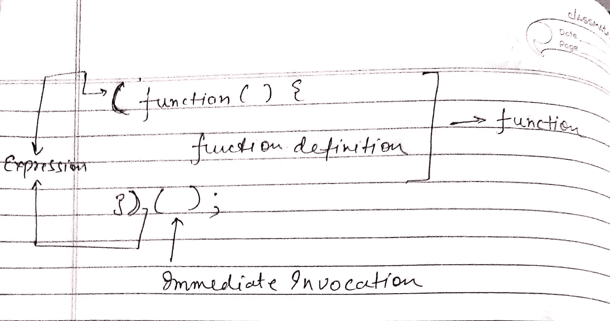

# JavaScript 中的立即调用函数表达式(IIFE ):简化介绍

> 原文：<https://javascript.plainenglish.io/immediately-invoked-function-expression-iife-in-javascript-a-simplified-introduction-faa119930c48?source=collection_archive---------10----------------------->


Photo by [Luca Bravo](https://unsplash.com/@lucabravo?utm_source=medium&utm_medium=referral) on [Unsplash](https://unsplash.com?utm_source=medium&utm_medium=referral)

立即调用的函数表达式也称为 iife(读作 *iify* )是一旦被定义就被调用或触发的函数。一旦它们被调用，就不会再被调用。

开发人员经常发现这个概念很难理解。今天，在这篇文章中，我们将尝试用一种简单的方式来理解它。

那么，让我们开始这次旅程吧。让我们先来分解一下生活意味着什么——立即**I**I**I**n 召唤 **F** 功能 **E** 表达。

我们必须注意的第一个也是最重要的一个术语是单词 **Function** 。

```
**// Section One** function myName(name) {return name;}
```

这是一个名为 myName()的简单函数。

现在，下一个我们必须注意的术语是**函数表达式**。让我们看看如何将上述函数塑造成函数表达式。

```
**// Section Two**let myName = function (name) {return name;};
```

上面的部分表示一个函数表达式，其中匿名或未命名函数的函数定义被分配给变量 myName。

现在，一旦我们清楚了表达函数的上述两种方式，有趣的部分就来了。在 JavaScript 中，每当我们在( )中定义任何东西时，它都被当作一个表达式来计算。

```
**Section 3**("ABC")
```

即使没有左操作数，上面提到的块本身也作为 JavaScript 中的表达式进行计算。

好吧，你一定想知道现在我们只是看到一些随机的方块，但是我们的生活到底在哪里。快到了😏

现在，让我们重写第 3 节，其中我们将传递第 2 节中的匿名函数，而不是字符串。

```
(function (name) {return name;});
```

上面的代码块也是一个函数表达式。

但是我们如何调用这个函数表达式呢？很简单，就像我们调用任何常规函数一样，通过使用()。

```
(function (name) {return name;})();
```

朋友们，这是一个立即调用的函数表达式(IIFE)。

另一种生活方式是计算一个函数表达式，并将返回的属性赋给一个变量。在这里，我的名字将得到生命的返回值。

```
let myName = (function () {return 'ABC';})();console.log(myName);   // ABC
```

生命也可以参数化。就像常规函数一样，我们在调用函数时传递参数。类似地，当调用一个 life(即在()括号中)时，我们可以发送所需的参数，这些参数在 life 中是可访问的。

```
let myName = (function (name) {return name;})('XYZ');console.log(myName);            // XYZ
```

你一定注意到了，在我们所有的用例中，我们总是定义一个匿名函数。但这不是强制性的，也不总是如此。我们也可以定义一个命名函数，但是这个函数名只能在函数内部访问，不能在函数外部访问。比如说

```
(function getCounter(number) {console.log(number);number++;number < 3 ? getCounter(number) : null;})(0);
```

这里，正如你所看到的，我们已经定义了一个命名函数 ***getCounter*** 并且我们在函数中使用它进行一些递归处理。所以，如果你想在函数中使用匿名函数，那么你可以使用一个命名函数。

有一件非常重要的事情你必须永远记住。

在一个生命中定义的所有函数和变量的作用范围仅限于这个特定的生命，而不在生命之外。对生命之外的作用域变量/函数的任何访问都将导致引用错误。

例如，如果我们试图在外部访问上述函数，我们将得到一个引用错误。

这是生活的基本介绍。我知道，我们走了很长的路才到达这里，但这是理解整个术语所必需的。

你可以参考这个快照作为快速复习。



Immediately Invoked Function Expression

我不想让这个概念太大，所以我把它分成两部分。在下一部分中，我们将关注使用 IIFEs 的用例及好处。

在此之前，如果您有任何疑问或反馈，请在回复中告诉我。

你可以在这里阅读我的其他文章[，另外，你可以订阅我的时事通讯，获取我发表的最新文章。](https://medium.com/@avinash.dev21987)

*更多内容看* [***说白了就是 io***](https://plainenglish.io/) *。报名参加我们的* [***免费周报***](http://newsletter.plainenglish.io/) *。关注我们关于*[***Twitter***](https://twitter.com/inPlainEngHQ)*和*[***LinkedIn***](https://www.linkedin.com/company/inplainenglish/)*。加入我们的* [***社区***](https://discord.gg/GtDtUAvyhW) *。*