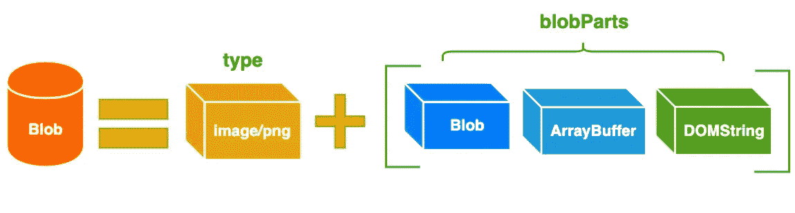

# 用 JavaScript 实现大文件的并发上传

> 原文：<https://javascript.plainenglish.io/implement-concurrent-upload-of-large-files-in-javascript-53519a0d2eee?source=collection_archive---------2----------------------->


如果你想学习打字，那么不要错过**掌握打字**系列。本系列将以动画的形式介绍 TypeScript 的核心知识和技术。


[Bytefer](https://medium.com/@bytefer?source=post_page-----53519a0d2eee--------------------------------)

## 掌握打字稿系列

[View list](https://medium.com/@bytefer/list/mastering-typescript-series-688ee7c12807?source=post_page-----53519a0d2eee--------------------------------)47 stories

在 [**如何在 JavaScript**](/how-to-implement-concurrency-control-in-javascript-df4da29f81c4) 中实现并发控制一文中，我详细分析了 [async-pool](https://github.com/rxaviers/async-pool) 库如何使用`Promise.all`和`Promise.race`函数实现异步任务的并发控制。

并发控制的流程如下图所示:


之后，我在下面的文章中介绍了[异步池](https://github.com/rxaviers/async-pool)库的实际应用:

[](https://blog.bitsrc.io/implement-concurrent-download-of-large-files-in-javascript-4e94202c5373) [## 用 JavaScript 实现大文件的并发下载

### 如何用 JavaScript 从零开始一步步实现多线程下载器来提高下载…

blog.bitsrc.io](https://blog.bitsrc.io/implement-concurrent-download-of-large-files-in-javascript-4e94202c5373) 

现在我将介绍如何使用 async-pool 库提供的 **asyncPool** 函数来实现大文件的并发上传。

也许你也知道上传大文件的解决方案。为了提高上传的效率，我们一般使用`Blob.slice`的方法将大文件按照指定的大小进行切片，然后并发上传文件块。**所有组块上传成功后，通知服务器合并组块。**


看了上图，相信你已经对大文件上传方案有了一定的了解。接下来，我们简单介绍一下 Blob 和 File 对象。

# Blob 和文件对象

## Blob 对象

Blob(二进制大型对象)表示二进制类型的大型对象。在数据库管理系统中，二进制数据存储为单个实体的集合。Blobs 通常是图像、声音或多媒体文件。JavaScript 中 Blob 类型的对象表示不可变的、类似文件的原始数据。为了更直观地理解 Blob 对象，我们先用 Blob 构造函数创建一个 **myBlob** 对象，如下图所示:


如上所示， **myBlob** 对象有两个属性:size 和 type。其中，size 属性用于表示数据的大小(单位), type 是 MIME 类型，单位为字节。Blob 对象由可选类型和 Blob 部分组成:



请注意，Blobs 不一定以 JavaScript 的原生格式表示数据。例如，文件接口基于 Blob，继承了 Blob 的功能，并对其进行了扩展，以支持用户系统上的文件。

## 文件对象

文件对象通常从作为用户使用`<input>`元素选择文件的结果而返回的文件列表对象中检索，或者从拖放操作的数据传输对象中检索。

文件对象是一种特殊的 Blob，可以在 Blob 可以使用的任何上下文中使用。特别是，`FileReader`、`URL.createObjectURL()`、`createImageBitmap()`和`XMLHttpRequest.send()`接受 Blobs 和文件。

在大文件上传的场景中，我们会使用`Blob.slice()`的方法，将大文件按照指定的大小进行切片，然后并行上传组块。接下来，我们来看看如何实现大文件上传。

# 如何实现大文件上传？

为了更好地理解下面的内容，我们来看一下整体流程图:


了解了上传大文件的流程后，我们先来定义一下上述流程中涉及到的一些辅助功能。

## 1.定义 calcFileMd5 函数

此函数用于计算文件的 MD5 值(数字指纹)。在这个函数中，我们使用`FileReader` API 分块读取文件的内容，然后通过 [spark-md5](https://github.com/satazor/js-spark-md5) 库提供的方法计算文件的 MD5 值。

## 2.定义异步池函数

asyncPool 函数用于实现异步任务的并发控制。该函数接受 3 个参数:

*   并发性:并发限制数(> = 1)
*   iterable:输入的可迭代对象，如 String、Array、TypedArray、Map 和 Set。
*   iteratorFn:接受两个参数的迭代器函数:每次迭代的值和 iterable 对象本身。迭代器函数应该返回一个承诺或者是一个异步函数。

## 3.定义 checkFileExist 函数

checkFileExist 函数用于检测文件是否已经上传。如果它已经存在，它将返回文件的 url，否则它将返回上传的块 id 列表:

```
function checkFileExist(url, name, md5) {
  return request
    .get(url, {
      params: {
        name,
        md5,
      },
    })
    .then((response) => response.data);
}
```

checkFileExist 函数中使用的请求对象是由 axios.create 方法创建的 Axios 实例:

```
const request = axios.create({
  baseURL: "[http://localhost:3000/upload](http://localhost:3000/upload)",
  timeout: 10000,
});
```

有了请求对象，我们可以轻松地发送 HTTP 请求。在 checkFileExist 函数内部，我们会发起一个 GET 请求，携带的查询参数是文件名和文件的 MD5 值。

## 4.定义上传功能

调用 checkFileExist 函数后，如果发现文件没有上传或者只上传了文件的一部分，将继续调用 upload 函数执行上传任务。在 upload 函数中，我们使用前面介绍的 asyncPool 函数来实现异步任务的并发控制，如下所示:

对于切片文件块，实际的上传操作将通过 uploadChunk 函数执行:

```
function uploadChunk({ url, chunk, chunkIndex, fileMd5, fileName }) {
  let formData = new FormData();
  formData.set("file", chunk, fileMd5 + "-" + chunkIndex);
  formData.set("name", fileName);
  formData.set("timestamp", Date.now());
  return request.post(url, formData);
}
```

## 5.定义 concatFiles 函数

所有的块上传到服务器后，我们需要通知服务器执行块合并操作。这里我们定义了 concatFiles 函数的功能:

```
function concatFiles(url, name, md5) {
  return request.get(url, {
    params: {
      name,
      md5,
    },
  });
}
```

## 6.定义 uploadFile 函数

基于上面定义的帮助器函数，我们可以根据上传大文件的总体流程图实现 uploadFile 函数:

# 大文件并发上传完整示例

定义了 uploadFile 函数后，实现大文件并发上传的功能就非常简单了。具体代码如下:

```
<!DOCTYPE html>
<html lang="en">
  <head>
    <meta charset="UTF-8" />
    <meta name="viewport" content="width=device-width, initial-scale=1.0" />
    <meta http-equiv="X-UA-Compatible" content="ie=edge" />
    <title>Concurrent Download Demo</title>
    <script src="[https://cdn.bootcdn.net/ajax/libs/axios/0.21.1/axios.min.js](https://cdn.bootcdn.net/ajax/libs/axios/0.21.1/axios.min.js)"></script>
    <script src="[https://cdn.bootcdn.net/ajax/libs/spark-md5/3.0.0/spark-md5.min.js](https://cdn.bootcdn.net/ajax/libs/spark-md5/3.0.0/spark-md5.min.js)"></script>
  </head>
  <body>
    <input type="file" id="uploadFile" />
    <button id="submit" onclick="uploadFile()">Upload File</button>
    <script>
      // Omit helper functions defined earlier
    </script> 
 </body>
</html>
```

由于完整的示例代码内容很多，这里就不放具体代码了。但是你可以在[要点](https://gist.github.com/semlinker/6f65bfed7637ad50b2efd1ebeb3d6231)上找到完整的代码。最后，让我们创建一个用于接收文件块和合并文件块的文件服务器。

# 创建文件服务器

在客户端完成大文件并发上传的功能后，我们将使用 Koa 开发一个简单的文件服务器。关于 Koa 的相关知识这里就不介绍了，直接看代码吧:

用`node simple-file-server.js`命令启动文件服务器后，我们可以在浏览器中上传指定的文件。当文件成功上传后，在服务器目录中，我们可以看到文件块和合并的文件，如下图所示


本文介绍了如何在 JavaScript 中使用 async-pool 库提供的 **asyncPool** 函数来实现大文件的并发上传。此外，我们还使用 spark-md5 库来计算文件的数字指纹。如果你对数字指纹感兴趣，可以自己去了解一下。

# 资源

[](https://developer.mozilla.org/en-US/docs/Web/API/Blob) [## blob-Web API | MDN

### blob 对象表示 Blob，它是不可变的原始数据的类似文件的对象；它们可以作为文本阅读或…

developer.mozilla.org](https://developer.mozilla.org/en-US/docs/Web/API/Blob) [](https://blog.bitsrc.io/implement-concurrent-download-of-large-files-in-javascript-4e94202c5373) [## 用 JavaScript 实现大文件的并发下载

### 如何用 JavaScript 从零开始一步步实现多线程下载器来提高下载…

blog.bitsrc.io](https://blog.bitsrc.io/implement-concurrent-download-of-large-files-in-javascript-4e94202c5373) [](https://github.com/rxaviers/async-pool) [## GitHub - rxaviers/async-pool:用有限的资源运行多个承诺返回和异步函数…

### 这个库的目标是使用本地异步迭代器(ES9)，本地异步函数和本地承诺来实现…

github.com](https://github.com/rxaviers/async-pool) 

*更多内容请看*[***plain English . io***](https://plainenglish.io/)*。报名参加我们的* [***免费周报***](http://newsletter.plainenglish.io/) *。关注我们关于* [***推特***](https://twitter.com/inPlainEngHQ)[***领英***](https://www.linkedin.com/company/inplainenglish/)**和* [***不和***](https://discord.gg/GtDtUAvyhW) ***。****