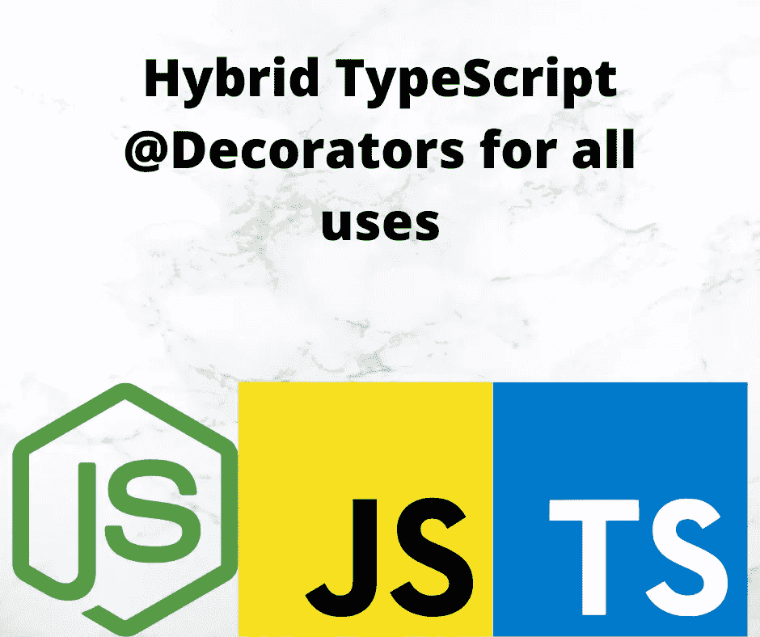

# 在 TypeScript 中实现混合装饰函数

> 原文：<https://javascript.plainenglish.io/implement-hybrid-decorator-functions-in-typescript-f6d24bc5abb0?source=collection_archive---------17----------------------->

## 如果小心处理，装饰者可以附加到许多对象类型



Image by Author using logos from corresponding projects

关于 TypeScript 装饰器的文档描述了每种装饰器类型的函数签名。这意味着每个装饰器必须为特定的目标对象类型实现。但是，通过仔细定义的方法签名，我们可以构造装饰器来处理任何对象类型的装饰。

在本文中，我们将讨论在 TypeScript 装饰函数中使用的各种函数签名。通过仔细检查参数，我们可以推断出装饰器附加到了哪种对象上。这是因为，如果我们查看装饰函数签名的完整列表，我们会注意到有一个模式。然后我们可以定义类型保护函数来检测哪个模式被使用，并且可靠地知道装饰器被附加到哪个对象类型。

使用函数来测试用于调用装饰函数的函数签名，我们可以确定它附加到哪种对象。这将允许装饰器用于任何对象类型。本文的目标是一个可以在所有五种上下文中使用的装饰器:类、属性、访问器、参数和方法

这些功能在[装饰检查员](https://www.npmjs.com/package/decorator-inspectors)包中可用。

本文是系列文章的一部分:

*   [装修工入门](/deep-introduction-to-using-and-implementing-typescript-decorators-a9e876ad0d43)
*   [类装修工](https://itnext.io/deep-introduction-to-class-decorators-in-typescript-23005ea5d035)
*   [物业装修工](/a-deep-introduction-to-property-decorators-in-typescript-8ef011169ec)
*   [访问器装饰器](/typescript-accessor-decorators-in-depth-take-control-over-get-and-set-accessor-methods-8b85c95124f9)
*   [参数装饰器](/introduction-to-parameter-decorators-in-typescript-b0042b5474ed)
*   [方法装饰者](/a-deep-introduction-to-method-decorators-in-typescript-6045d52e10a6)
*   **混合装修工** *本条*
*   [用装饰器使用反射和反射 API](/using-the-reflection-and-reflection-metadata-apis-with-typescript-decorators-c56ba9c690c7)
*   [使用装饰器进行运行时数据验证](/runtime-data-validation-in-typescript-using-decorators-and-reflection-metadata-3219fdf5dfb5)

要使用 decorator，必须在 TypeScript 中启用两个特性，所以请务必[阅读本系列的 decorator 介绍文章](/deep-introduction-to-using-and-implementing-typescript-decorators-a9e876ad0d43)。

# TypeScript 装饰函数的方法签名概述

回顾一下本系列其他文章中使用的装饰函数签名，我们可以得到这些签名:

```
const accessorfunc = (target: Object,
                         propertyKey: string,
                         descriptor: PropertyDescriptor) => {};
const constructorfunc = (constructor: Function) => {};  
const methodsfunc = (target: Object, propertyKey: string,
                     descriptor: PropertyDescriptor) => {};  
const parametersfunc = (target: Object,
                         propertyKey: string | symbol,
                         parameterIndex: number) => {};  
const propertiesfunc = (target: Object, member: string)  => {};
```

例如，类装饰器只接受一个参数，可以命名为`target`。属性装饰器只接受两个参数。其他三个装饰者有三个论点，他们之间有区别。parameters decorator 在第三个参数中使用了一个`number`。访问器和方法装饰器都将一个`PropertyDescriptor`作为第三个参数，但是对象的构造方式有所不同。

附属于访问器的装饰器接收一组参数，而附属于类的装饰器接收其他参数。每种装饰器类型的装饰器函数必须能够处理任何一组参数，并且能够区分不同的使用。

这意味着我们需要一个通用的函数签名来匹配每种装饰类型。

经过考虑和测试，我们决定采用这种方法来处理每种情况:

```
(target: Object, propertyKey?: string | symbol, 
  descriptor?: number | PropertyDescriptor)
```

`target`参数是通用的，而另外两个是可选的。然后，对于另外两个，要适应的值有变化。此签名处理所有变体。

这将是装饰函数的函数签名，可用于五种装饰类型中的任何一种。接下来需要的是类似于类型保护的函数来测试参数。

请记住，在 TypeScript 中，类型保护函数接受一个参数，并测试该参数以确保它属于某种类型。

# 混合装饰函数概念的测试用例

创建这个类定义是为了测试混合装饰函数是否可行。

```
@Decorator class HybridDecorated {
     @Decorator
     prop1: number; @Decorator
     prop2: string; @Decorator
     method(
         @Decorator param1: string,
         @Decorator param2: string
     ) {
         console.log(`inside method function`);
         return { param1, param2 };
     } #meaning: number = 42;
     @Decorator
     get meaning() { return this.#meaning; }
     set meaning(nm: number) { this.#meaning = nm; } 
}
```

这需要一个函数`Decorator`，它成功地检测出它在哪个上下文中，或者换句话说，装饰函数附加到了哪种对象上。

# 原型化 decorator 来处理 decorator 使用的所有 TypeScript

给定前面显示的通用函数签名，`Decorator`函数必须这样定义:

```
function Decorator(target: Object,
      propertyKey?: string | symbol,
      descriptor?: number | PropertyDescriptor) { console.log(`Decorator target`, target);
     console.log(`Decorator propertyKey`, propertyKey);
     console.log(`Decorator descriptor`, descriptor);
}
```

实际上，如果您构建了一个包含上述类定义和这个`Decorator`实现的文件(例如`first.ts`，您将得到以下输出:

```
$ npx ts-node lib/hybrid/first.ts 
Decorator target {} 
Decorator propertyKey prop1 
Decorator descriptor undefined 
Decorator target {} 
Decorator propertyKey prop2 
Decorator descriptor undefined 
Decorator target {} 
Decorator propertyKey method 
Decorator descriptor 1 
Decorator target {} 
Decorator propertyKey method 
Decorator descriptor 0 
Decorator target {} 
Decorator propertyKey method 
Decorator descriptor {
   value: [Function: method],
   writable: true,
   enumerable: false,
   configurable: true 
} 
Decorator target {} 
Decorator propertyKey meaning 
Decorator descriptor {
   get: [Function: get meaning],
   set: [Function: set meaning],
   enumerable: false,
   configurable: true 
} 
Decorator target [class HybridDecorated] 
Decorator propertyKey undefined 
Decorator descriptor undefined
```

这证明了这个概念是可行的，TypeScript 装饰函数可以成功地附加到所有五种可装饰的对象类型上。

# 测试混合装饰器所附着的对象类型

以下功能来自[装饰检查员](https://www.npmjs.com/package/decorator-inspectors)包。

为了使这些功能简单一点，我们从这个开始:

```
const isset = (val) => {
     return typeof val !== 'undefined' && val !== null; 
}; 
const notset = (val) => {
     return (typeof val === 'undefined') || (val === null); 
};
```

这些用于确保参数实际上有一个值。如果它不是`undefined`也不是`null`，那么它就有一个值。

```
export const isClassDecorator = (target: Object,
     propertyKey?: string | symbol,
     descriptor?: number | PropertyDescriptor) => { return (isset(target)
          && notset(propertyKey)
          && notset(descriptor)); 
};
```

类装饰器只在第一个参数中有一个值。

```
export const isPropertyDecorator = (target: Object,
     propertyKey?: string | symbol,
     descriptor?: number | PropertyDescriptor) => { return (isset(target)
          && isset(propertyKey)
          && notset(descriptor)); 
};
```

属性装饰器只在前两个参数中有值。

```
export const isParameterDecorator = (target: Object,
     propertyKey?: string | symbol,
     descriptor?: number | PropertyDescriptor) => { return (isset(target)
          && isset(propertyKey)
          && isset(descriptor)
          && typeof descriptor === 'number'); 
};
```

参数装饰器在三个参数中都有值，第三个是一个数字。

```
export const isMethodDecorator = (target: Object,
     propertyKey?: string | symbol,
     descriptor?: number | PropertyDescriptor) => { if ((isset(target)
      && isset(propertyKey)
      && isset(descriptor)
      && typeof descriptor === 'object')) {
         const propdesc = <PropertyDescriptor>descriptor;
         return (typeof propdesc.value === 'function');
     } else {
         return false;
     } 
}
```

方法装饰器在所有三个参数中都有值，第三个参数是一个对象，即 PropertyDescriptor。该描述符在`value`字段中存储了一个函数。

```
export const isAccessorDecorator = (target: Object,
     propertyKey?: string | symbol,
     descriptor?: number | PropertyDescriptor) => { if ((isset(target)
      && isset(propertyKey)
      && isset(descriptor)
      && typeof descriptor === 'object')) {
         const propdesc = <PropertyDescriptor>descriptor;
         return (typeof propdesc.value !== 'function')
          && (typeof propdesc.get === 'function'
           || typeof propdesc.set === 'function');
     } else {
         return false;
     } 
}
```

访问器装饰器类似于方法装饰器。不同之处在于`value`字段没有功能，而`get`和/或`set`字段有功能。

# 在混合装饰函数中使用装饰类型保护

让我们演示如何构建一个装饰函数，使用这些函数处理所有五种场景:

```
import {
     isClassDecorator, isPropertyDecorator, isParameterDecorator,
     isMethodDecorator, isAccessorDecorator 
} from 'decorator-inspectors';function Decorator(target: Object, propertyKey?: string | symbol,
     descriptor?: number | PropertyDescriptor) { if (isClassDecorator(target, propertyKey, descriptor)) {
         console.log(`Decorator called on class`, target);
     } else if (isPropertyDecorator(target,
                           propertyKey, descriptor)) {
         console.log(`Decorator called on property ${target} ${String(propertyKey)}`);
     } else if (isParameterDecorator(target,
                           propertyKey, descriptor)) {
         console.log(`Decorator called on parameter ${target} ${String(propertyKey)} ${descriptor}`);
     } else if (isMethodDecorator(target,
                           propertyKey, descriptor)) {
         console.log(`Decorator called on method ${target} ${String(propertyKey)}`, descriptor);
     } else if (isAccessorDecorator(target,
                           propertyKey, descriptor)) {
         console.log(`Decorator called on accessor ${target} ${String(propertyKey)}`, descriptor);
     }
     else {
         console.error(`Decorator called on unknown thing`, target);
         console.error(`Decorator called on unknown thing`, propertyKey);
         console.error(`Decorator called on unknown thing`, descriptor);
     } 
}
```

这将从`decorator-inspectors`包中导入功能。函数`Decorator`使用通用装饰方法签名。然后，它使用这些函数来确定在哪个上下文中使用它，并输出适当的消息。如果使用不当，底部的消息将会打印出来。

如果我们在上面显示的示例类中使用这个装饰函数，我们会得到以下输出:

```
$ npx ts-node lib/hybrid/second.ts  
Decorator called on property [object Object] prop1 
Decorator called on property [object Object] prop2 
Decorator called on parameter [object Object] method 1 
Decorator called on parameter [object Object] method 0 
Decorator called on method [object Object] method {
   value: [Function: method],
   writable: true,
   enumerable: false,
   configurable: true 
} 
Decorator called on accessor [object Object] meaning {
   get: [Function: get meaning],
   set: [Function: set meaning],
   enumerable: false,
   configurable: true 
} 
Decorator called on class [class HybridDecorated]
```

如您所见，一切都被正确识别。消息打印的顺序恰好与[使用和实现 TypeScript 装饰器的深度介绍](/deep-introduction-to-using-and-implementing-typescript-decorators-a9e876ad0d43)中讨论的求值顺序相匹配

# 摘要

在查看不同的 TypeScript decorators 包时，可以看到在多个对象类型上经常使用相同的 decorator 名称。要做到这一点，装饰器必须检查它的参数，以确定它在哪个上下文中使用。

这些函数将使您能够在装饰函数中做同样的事情。

# 关于作者

[***大卫·赫伦***](https://davidherron.com) *:大卫·赫伦是一名作家和软件工程师，专注于技术的明智使用。他对太阳能、风能和电动汽车等清洁能源技术特别感兴趣。David 在硅谷从事了近 30 年的软件工作，从电子邮件系统到视频流，再到 Java 编程语言，他已经出版了几本关于 Node.js 编程和电动汽车的书籍。*

*最初发表于*[*https://techsparx.com*](https://techsparx.com/nodejs/typescript/decorators/hybrid-decorators.html)*。*

*更多内容请看* [***说白了就是***](https://plainenglish.io/) *。报名参加我们的* [***免费每周简讯***](http://newsletter.plainenglish.io/) *。关注我们* [***推特***](https://twitter.com/inPlainEngHQ) *和*[***LinkedIn***](https://www.linkedin.com/company/inplainenglish/)*。加入我们的* [***社区不和谐***](https://discord.gg/GtDtUAvyhW) *。*