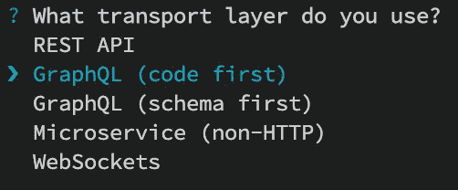
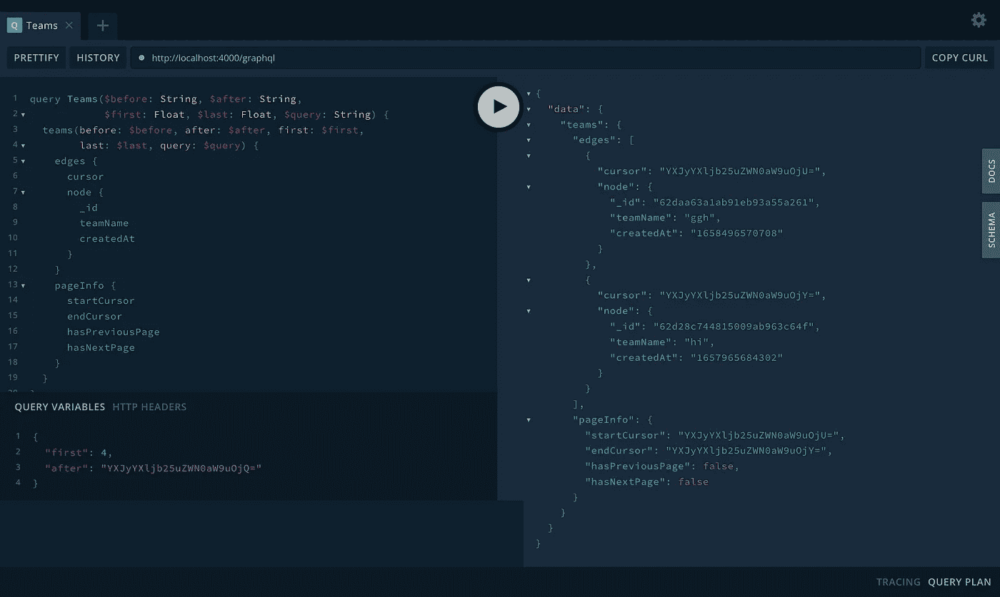

# 用 GraphQL 中继实现 NestJS 中的中继游标连接规范

> 原文：<https://javascript.plainenglish.io/implement-relay-cursor-connections-specification-in-nestjs-with-graphql-relay-9ba96c4bca79?source=collection_archive---------5----------------------->

## 在 NestJS 中实现基于 GraphQL 中继光标的分页的简单步骤。


Photo by [Dayne Topkin](https://unsplash.com/@dtopkin1?utm_source=medium&utm_medium=referral) on [Unsplash](https://unsplash.com?utm_source=medium&utm_medium=referral)

GraphQL 中的分页是一项非常艰巨的任务。没有好的架构，它会变得相当混乱和令人沮丧。

本文将构建一个简单的接口来实现 relay 风格的 GraphQL 分页，您可以在任何 NestJS GraphQL 项目中使用它。这个接口的目的是保持你的代码整洁、简单和有组织。

因此，没有进一步的行动，让我们进入正题。

## 什么是中继光标连接规范

如果你们中的任何人对什么是中继光标连接规范以及为什么我们应该在实现 GraphQL 分页时使用它有疑问，我在几个月前已经写了一篇文章解释了原因。下面附上文章:

[](/best-practices-to-work-with-graphql-pagination-8f0d1f9937c2) [## 使用 GraphQL 分页的最佳实践

### 再也不用担心使用 GraphQL 分页了

javascript.plainenglish.io](/best-practices-to-work-with-graphql-pagination-8f0d1f9937c2) 

*总之，Relay Cursor Connections Specification，简称 Cursor Connections Specification，旨在为 GraphQL 客户端提供处理分页最佳实践的选项，并通过 GraphQL 服务器支持相关元数据。*

GraphQL 分页同时维护游标连接规范的一个示例是:

```
{
  user {
    id
    name
    friends(first: 10, after: "opaqueCursor") {
      edges {
        cursor
        node {
          id
          name
        }
      }
      pageInfo {
        startCursor
        endCursor
        hasPreviousPage
        hasNextPage
      }
    }
  }
}
```

## 履行

**步骤 1:** 我们需要做的第一步是在我们的 NestJS 应用程序中安装`graphql-relay`。我们可以通过在终端中运行以下命令来安装这个软件包:

```
npm install graphql-relay
```

步骤 2: 在一个公共文件夹中创建一个名为`relay.types.ts`的新文件，最好是在一个共享的 DTO 中。然后，将下面的代码粘贴到`relay.types.ts`中。

**步骤 3:** 现在，在同一个目录下创建另一个名为`connection.args.ts`的文件，并粘贴以下代码:

我们已经成功地设置了主接口，以后可以在我们的 NestJS 项目中使用它来实现基于游标连接规范的分页。

## 如何使用它

因为我们实现了主接口，所以是时候使用它了。让我们首先创建一个资源，我们将使用它进行分页。

**步骤 4:** 在 NestJS 中，我们可以通过键入以下命令轻松创建资源:

```
nest g resource teams
```

当它问你“你用什么传输层？”，输入如下的第二个:



之后，它会问你，“你想生成 CRUD 入口点吗？(是/否)”。输入`Y`。

**步骤 5:** 现在让我们定义资源的实体。

在这里，我使用 Mongoose，因为我在我的项目中使用 MongoDB，但是它可以与任何 ORM 和数据库配置一起工作。

**第六步:**让我们在`teams`模块的 DTO 文件夹中创建另一个名为`team.response.ts`的文件。

**第 7 步:**让我们更改用于实现 GraphQL 分页的`teams.resolver.ts`:

**第八步:**最后，我们来修改一下`teams.service.ts`文件。

## 决赛成绩

成功修改所有更改后，我们可以看到下面的输出:



## 结论

从上面的实现中，我们可以看到我们的解析器和服务更加干净和简单。然而，我们可以在应用程序中获得接力式分页的强大功能。

这种方法效率更高。无论我们的应用程序变得多么庞大，分页的实现都会更加简单，但也更加强大。

## 参考

1.  [https://codesandbox.io/s/q4cto](https://codesandbox.io/s/q4cto)
2.  [https://relay.dev/graphql/connections.htm](https://relay.dev/graphql/connections.htm)

*通过*[***Linkedin***](https://www.linkedin.com/in/ludehsar/)*或* [***与我联系我的网站***](https://rashedul-alam.com/) *。*

*更多内容请看*[***plain English . io***](https://plainenglish.io/)*。报名参加我们的* [***免费每周简讯***](http://newsletter.plainenglish.io/) *。关注我们关于*[***Twitter***](https://twitter.com/inPlainEngHQ)*和*[***LinkedIn***](https://www.linkedin.com/company/inplainenglish/)*。查看我们的* [***社区不和谐***](https://discord.gg/GtDtUAvyhW) *加入我们的* [***人才集体***](https://inplainenglish.pallet.com/talent/welcome) *。*