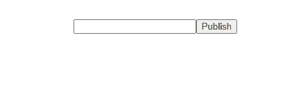
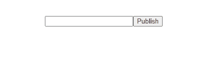
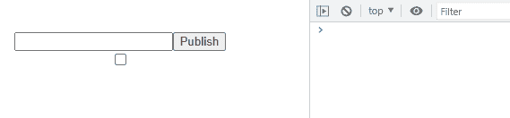
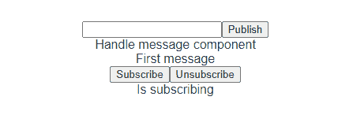

# 在 Vue.js 中实现 PubSub 模式

> 原文：<https://javascript.plainenglish.io/implement-the-pubsub-pattern-in-vue-js-8a36a7a37b19?source=collection_archive---------3----------------------->

## 在 Vue.js 项目中实现 SubPub 模式的一个简单方法是使用 PubSubJs 库和一个自定义钩子。


Photo by [Pavan Trikutam](https://unsplash.com/es/@ptrikutam?utm_source=unsplash&utm_medium=referral&utm_content=creditCopyText) on [Unsplash](https://unsplash.com/s/photos/call?utm_source=unsplash&utm_medium=referral&utm_content=creditCopyText)

# PubSub 模式和 PubSub.js 是什么？

首先，我认为我们应该了解什么是发布/订阅模式。根据维基百科，我们对这种模式有一个简短的定义:

> 发布-订阅是一种消息传递模式，其中消息的发送者(称为发布者)不将消息直接发送给特定的接收者(称为订阅者)，而是将发布的消息分类，而不知道可能有哪些订阅者(如果有的话)。类似地，订阅者表达对一个或多个类别的兴趣，并且仅接收感兴趣的消息，而不知道存在哪些发布者(如果有的话)。

简而言之，我们可以用发布者和订阅者这两个东西来定义这个模式。发布者(Pub)的任务是向一个主题发送消息。订阅者(子)任务是接收(或处理)来自主题的消息。这样，我们可以用这种模式使一些动作变得更容易。

关于 PubSubJS，是用 JavaScript 写的实现这种模式的库。在本文中，我将使用这个库，因为它很受欢迎且易于使用。如果你喜欢用其他库或者方式，那就这样吧。

我可能会向您展示这种模式的一个广泛使用的案例。在购物网站中，当用户向购物车中添加商品时，我们需要在一些组件中执行一些操作。我知道我们可以使用全局状态(Redux，Vuex…)来存储购物车的数据。我知道我们可以使用全局状态(Redux，Vuex…)来存储购物车的数据。我们的任务只是观察产品列表的变化。这是一个好方法，但是它也给你的逻辑带来了一点复杂性。因为您需要编写一些逻辑来检查(或比较)产品列表中的更改。使用 PubSub，您只需发布一条消息到主题“add_new_product_to_cart ”,内容是该产品的数据。每个监听这个主题的组件可以简单地处理它。

# 基本工具

在开始在我们的应用程序中实现发布-订阅模式之前，我们应该考虑我们需要给我们的应用程序带来什么特性。除了发布消息和订阅主题这两个必不可少的特性之外，我认为我们还有许多其他的特性要做。但是为了保持这篇文章的简单，我只添加了另外两个特性:取消订阅和检查订阅者的订阅状态。

在本文中，我将制作一个 Vue 3 项目的演示。首先，我们需要创建一个 Vue 项目。我们有很多方法可以做到这一点。对我来说，我将运行这个命令来启动一个新的 Vue 项目:

```
vue create pubsub-demo
```

然后，让我们用这个命令安装 PubSubJS:

```
yarn add pubsub-js
```

之后，我们需要一个地方来存储我们的源代码。我将在“/src/PubSub”中创建一个目录。此外，直接从 PubSubJS 调用方法，我认为我们应该让两个类来做，我们的组件将与它们一起工作。他们是订阅者和发布者。我将在这里为它们定义一些基本方法:

使用 Publisher，我们可以创建具有特殊主题的实例。这个类为我们提供了一个方法“publish ”,将消息发布到我们在创建这个实例时定义的主题。

关于 Subscriber，这个类是用一个特殊的主题和一个回调创建的。它有两个方法 subscribe 和 unsubscribe。通过它们，我们可以控制订阅者的订阅状态。如果我们运行 subscribe 方法，当我们的主题收到消息时，我们的回调将被调用。

基于 PubSubJS 文档，我将像这样定义两个类:

为了测试这些类，我们需要创建两个组件。第一个组件是 PublishMessage。在那里，我们将放置一个文本框和一个按钮。当一个按钮被点击时，这个组件将从一个文本框中发布一个文本作为一个特殊主题的消息。让我们在“src/components/PublishMessage”中创建这个组件。

在这个组件中，我使用了带有一个反应变量“value”和一个函数“publish”的组合 API，该函数将一个值作为消息从“value”发布到主题“test_topic”。当我们点击“发布”按钮时，这个“发布”功能将被调用。

在我们创建了发布消息的组件之后，我们将再创建一个组件来接收来自主题的消息。在这个组件中，我们将放置一个订户。该订户将收听“test_topic”并显示消息。让我们看看代码:

然后，我们可以通过将我们创建的组件添加到我们的应用程序中来测试这个演示。可能是这样的:

```
<PublishMessage /><HandleMessage />
```

让我们通过键入一些单词并单击 Publish 按钮来测试这个演示。



如你所见，成功了！我们可以创建许多独立的组件，并在需要它们一起通信时应用这种方式。

# PubSub 的自定义挂钩

在我们开始定制我们的 PubSub 之前，我想稍微注意一下“它是可选的”。我们可以直接调用 Subscriber 实例，没问题。但是通过一个定制的钩子，我们可以包装我们的一些逻辑，使它在组件级别上更容易使用。我们可以用钩子做一些事情:

*   用少于代码行创建一个新实例。
*   卸载组件时取消订阅主题。
*   为我们提供一个反应数据，以检查用户的订阅状态。

现在，我们在这里做一个新的自定义钩子“/src/PubSub/usePubSub.js”。在这个文件中，我们将创建两个自定义挂钩“usePublish”和“useSubscribe”。

关于“usePublish”钩子，它很容易制作。只需要创建并返回一个新的 Publisher 实例，如下所示:

只需要在组件上做一点修改就可以使用这个钩子，而不是直接创建一个 Publisher 实例。这是我们的变化:

在我们修改之后，让我们再次测试我们的演示。



它仍然有效。现在，我们将进入下一部分，为创建订阅者定制一个钩子。与 usePublish 相同，我们将把代码从组件级移动到我们的钩子，如下所示:

在组件中，我们可以更新我的源代码以使用自定义挂钩:

让我们来看看演示:


成功了！通过这一步，我们已经将几乎所有我们做过的事情从一个组件转移到了一个定制的钩子上。然后，我们会做一些新的东西。让我们从卸载组件时取消订阅主题开始。为此，Vue 为我们提供了一个复合 API“on unmounted”。在那里，我们可以在组件被卸载之前处理一些我们想做的事情。

为了测试这个变化，我将在这个钩子的“onUnmounted”中放一个“console.log”。然后我将创建一个复选框来切换 HandleMessage 组件。我们只需要在控制台检查结果。



根据结果，我认为它起作用了。我们将进入下一个也是最后一个部分，返回订阅状态的反应数据。为此，我们需要添加一个反应变量，并在钩子中返回它。每次用户调用方法“subscribe”或“unsubscribe”时，我们都会更新该变量的值。就这么办吧，我觉得就这么简单。

在这个钩子中，我们添加了一个更多的反应变量“isSubcribing”。当用户调用方法“subscribe”或“unsubscribe”时，我们将更新该变量的值。现在，这个钩子将返回两个函数和一个变量，而不是订户实例。为了测试这一部分，我们需要在组件中对它进行一些修改。首先，我们需要添加两个按钮来更改订阅状态。其次，我们需要以文本形式显示订阅状态。这是我们修改后的组件:

现在，让我们来测试一下。



Tada！成功了。我们可以在“第一条消息”中看到，它工作正常。在我们点击了 Unsubscribe 按钮之后，文本发生了变化，而 HandleMessage 组件没有对任何新消息做出反应。然后，当我们点击 Subscribe 按钮时，这个组件恢复正常工作。

随着这些变化，我认为我们不能在我们的组件中做更多的思考，比如通过“订阅”变量控制“渲染视图”,而不是创建一个更多的反应变量。

# 结论

这是一篇短文，提供了另一种方法来支持 Vue 中组件之间的通信。我希望这篇文章能对你们有所帮助。如果你对 Vue 或者其他什么有其他想法，请告诉我。

为了写这篇文章，我阅读了一些文件:

[](https://en.wikipedia.org/wiki/Publish%E2%80%93subscribe_pattern) [## 发布-订阅模式-维基百科

### 在软件架构中，发布-订阅是一种消息传递模式，消息的发送者(称为发布者)不…

en.wikipedia.org](https://en.wikipedia.org/wiki/Publish%E2%80%93subscribe_pattern) [](https://github.com/mroderick/PubSubJS) [## GitHub-mroderick/pub subjs:JavaScript 的无依赖发布/订阅

### JavaScript 的无依赖性发布/订阅。通过创建一个帐户为 mroderick/PubSubJS 的开发做贡献…

github.com](https://github.com/mroderick/PubSubJS) 

这里是 GitHub 仓库，里面有我们演示的全部源代码:

[](https://github.com/tasynguyen3894/pubsub-demo-vue) [## GitHub-tasynguyen 3894/pub sub-demo-vue

### 此时您不能执行该操作。您已使用另一个标签页或窗口登录。您已在另一个选项卡中注销，或者…

github.com](https://github.com/tasynguyen3894/pubsub-demo-vue) 

感谢阅读。


Photo by [Arfan Abdulazeez](https://unsplash.com/@procaffeinator?utm_source=unsplash&utm_medium=referral&utm_content=creditCopyText) on [Unsplash](https://unsplash.com/s/photos/green-tea?utm_source=unsplash&utm_medium=referral&utm_content=creditCopyText)

通过 [Linkedin](https://www.linkedin.com/in/thaisangnguyen3894/) 或 [Twitter](https://twitter.com/tasyit) 联系我。

*更多内容看* [***说白了就是***](https://plainenglish.io/) *。报名参加我们的* [***免费周报***](http://newsletter.plainenglish.io/) *。关注我们关于* [***推特***](https://twitter.com/inPlainEngHQ) ， [***领英***](https://www.linkedin.com/company/inplainenglish/) *，*[***YouTube***](https://www.youtube.com/channel/UCtipWUghju290NWcn8jhyAw)*，以及* [***不和***](https://discord.gg/GtDtUAvyhW) *。对增长黑客感兴趣？检查* [***电路***](https://circuit.ooo/) *。*