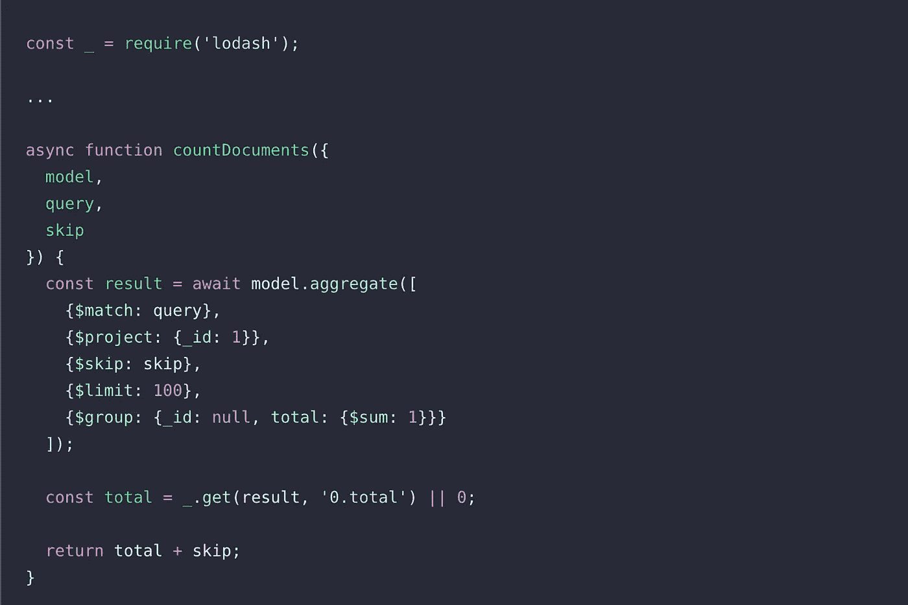

# 使用 Node.js 和 MongoDB 改进分页搜索

> 原文：<https://javascript.plainenglish.io/improve-pagination-search-with-node-js-and-mongodb-ac38795d9ddd?source=collection_archive---------1----------------------->

Photo by [Martin Shreder](https://unsplash.com/@martinshreder?utm_source=medium&utm_medium=referral) on [Unsplash](https://unsplash.com?utm_source=medium&utm_medium=referral)

当我们列出数据时，一个好的实践是对来自服务器的结果进行分页，并为客户端创建一种请求新页面(更多元素)的方式。

使用 Node.js 和 MongoDB 时，有两种创建分页的常见模式:

*   在查询数据时使用`.skip(X).limit(Y)`:基本上我们定义一个每页的大小(“限制”)并计算“跳过”值
*   使用`{_id: {$lt: FIRST_MONGO_ID, $gt: LAST_MONGO_ID}}`和`.sort(_id: -1}`:这里我们保留了第一个和最后一个显示元素的引用，并且总是在这些值之间寻找元素

一些文章谈到了这一点:

*   [https://docs . MongoDB . com/manual/reference/method/cursor . skip/# pagination-example](https://docs.mongodb.com/manual/reference/method/cursor.skip/#pagination-example)
*   [https://medium . com/swlh/MongoDB-pagination-fast-consistent-ece2a 97070 f 3](https://medium.com/swlh/mongodb-pagination-fast-consistent-ece2a97070f3)
*   [https://www . code mentor . io/@ arpitbhayani/fast-and-efficient-pagination-in-MongoDB-9095 flbqr](https://www.codementor.io/@arpitbhayani/fast-and-efficient-pagination-in-mongodb-9095flbqr)

我们的问题是:来自两个不同 mongo 集合的分页元素列表，一个有大约 400.000 个元素，另一个有将近 200 万个元素。随着元素数量的增加，请求时间也会增加。让我们来看一些数字。

对于第一页:

*   请求时间:16.37 秒
*   回应:`{items: [...], page: 1, pageSize: 10, total: 14225}`

最后一页:

*   请求时间:37.61 秒
*   回应:`{items: [...], page: 1426, pageSize: 10, total: 14255}`

关于实施的一些细节:

*   `skip` + `limit`是这里使用的分页策略
*   我们计算与查询匹配的元素总数，即使我们只返回定义的页面大小*我们每次想要返回的页面数量

改进是基于功能和技术的变化。

**的功能变化**是基于如何处理一长串结果。就像当你在 google 中寻找一些过于普通的东西时，一开始你不会得到所有可用的页面(元素的总数)，但你会得到一定数量的页面，当你在列表中前进时，你会得到新的页面(其他数量的元素)。这完全有道理，因为你会为一些可能不需要的东西付出高昂的代价(计算所有可用元素的时间)。如果有太多的元素，您应该改进搜索条件，减少元素数量。

**的技术变化**与 Mongo 如何执行搜索以及我们如何处理数据有关。一些需要更改或验证的内容:

*   拥有正确的索引，并基于这些字段执行查询
*   在查询中使用投影。不要从集合中获取所有元素。只获取列表需要的属性(当您需要其余的属性时，只需通过 id 执行一个简单的查询并获取它们)
*   每次我们寻找有限数量的元素来更新总数，在我的例子中是 100 个元素(这意味着 10 页 10 个元素)。代码类似于

让我们看看请求时间的改进

对于第一页:

*   请求时间:732 毫秒
*   回复:`{items: [...], page: 1, pageSize: 1, total: 100}`

对于最后一个可见页面(加载时将出现此页面):

*   请求时间:1.87 秒
*   回复:`{items: [...], page: 20, pageSize: 10, total: 542}`

很明显，改进非常大，对客户来说也是生产力。

所以，正如我们在这里看到的，功能性的改变比技术性的改变更重要。每次，我们都需要评估我们将如何使用技术来为用户获得最佳解决方案。在这种情况下，减少显示数据的时间比告诉用户我们总共有多少个元素更重要(我们有太多元素，所以它没有正确的时序响应重要)。我们不需要每次都进行重大而复杂的技术变革，也许我们需要更多地“跳出框框思考”。

希望这对某人有所帮助。

*更多内容看* [***说白了就是 io***](http://plainenglish.io/) *。报名参加我们的* [***免费周报***](http://newsletter.plainenglish.io/) *。在我们的* [***社区获得独家访问写作机会和建议***](https://discord.gg/GtDtUAvyhW) *。*