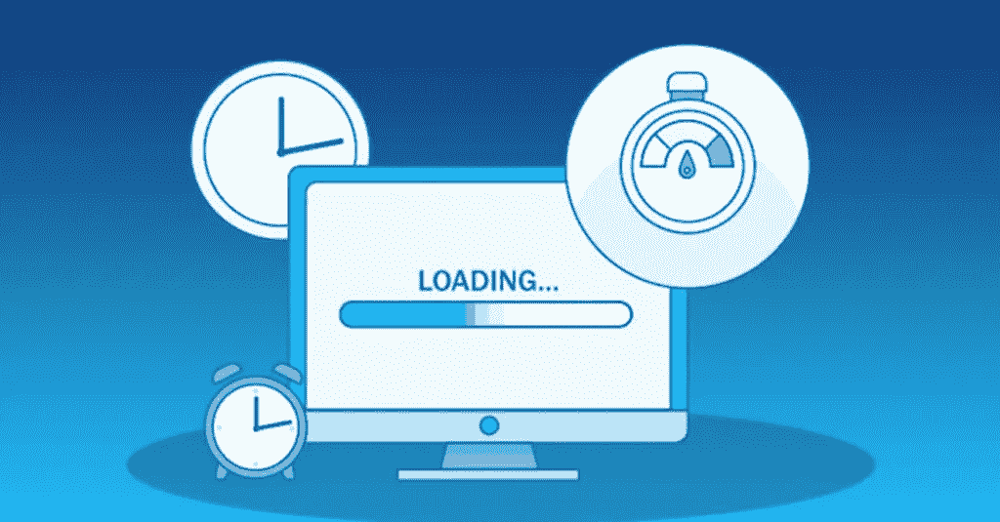
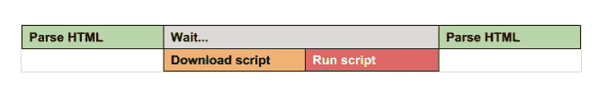

# 改善 Web 应用程序的初始加载时间

> 原文：<https://javascript.plainenglish.io/improve-the-initial-load-time-of-your-web-application-514773f1181b?source=collection_archive---------4----------------------->

## 关于如何优化 web 应用程序初始加载时间的教程。



嗨伙计们！在本帖中，我们将看到如何优化 web 应用程序的初始加载时间。当访问一个网站时，最终用户的满意度很大程度上受该网站首次交互所用时间的影响。

有时，为庞大/不断增长的应用程序实现有意义的优化变得非常困难。但是，通过仔细检查代码和使用一些性能改进技术，我们可以增强应用程序的加载性能。让我们探索几种方法。

# 1.使用异步和延迟



**Normal (Synchronous) Execution**

*Async* 和 *defer* 允许在不阻塞 HTML 解析器的情况下加载脚本，这意味着用户甚至可以在脚本完全加载之前看到页面内容。
这两个脚本的主要区别是——异步脚本在下载完成后立即执行，而脚本在 DOM 交互后延迟执行。【[阅读更多](https://calendar.perfplanet.com/2016/prefer-defer-over-async/)】。

如果您的脚本依赖于其他脚本，建议使用 *defer。*

```
**<script *async* src="script1.js"></script>
<script *defer* src="script2.js"></script>**
```

我们可以应用 async/defer，并在像 [Lighthouse](https://github.com/GoogleChrome/lighthouse) 这样的工具下测试我们的应用程序，比较前后的结果。但是，请耐心等待，它可能不会显著改善加载时间，但如果使用得当，至少可以略微改善加载时间。

# 2.预取技术

[预取](https://developer.mozilla.org/en-US/docs/Glossary/Prefetch)是在后台下载内容时，安全地假设用户稍后将在应用程序中使用该内容。

**preconnect** 用于尽早连接/与资源进行网络握手，在资源将被使用期间为我们节省一些时间。

```
<link rel='preconnect' href='https://*****.com'> 
```

**预取**用于当我们想在某个东西被使用之前获取它，并且我们确信它将在我们的应用程序中的某个地方被使用。这里，重要的是不要加载非常大的资源，因为这些资源将存储在浏览器缓存中以备将来使用。

```
<link rel='prefetch' href='https://****/images/logo.png'>
```

上述技术可以用来加载字体，静态图像或脚本。

# 3 .实施 CDN(内容交付网络)

内容交付网络( [CDN](https://www.akamai.com/our-thinking/cdn/what-is-a-cdn?gclid=Cj0KCQjw-fmZBhDtARIsAH6H8qigkkgq8P-lyAqvqP55LqS3Nw5QIq7JvdcA4VmnVcJhlPDtG_MfdrgaAukiEALw_wcB&utm_source=google&utm_medium=cpc&utm_campaign=F-MC-52609&utm_term=MD%20CDN&utm_content=India&ef_id=Cj0KCQjw-fmZBhDtARIsAH6H8qigkkgq8P-lyAqvqP55LqS3Nw5QIq7JvdcA4VmnVcJhlPDtG_MfdrgaAukiEALw_wcB:G:s&s_kwcid=AL!5241!3!540841767043!e!!g!!akamai%20cdn!1165726767!48582467930) )是一组地理上分布的服务器，它们通过使 web 内容更接近用户来加速 web 内容的交付。cdn 将网页、图像和视频等内容缓存在靠近您的物理位置的代理服务器中。这让你可以看电影、下载软件、查看银行余额、在社交媒体上发帖或购物，而不必等待内容加载。

当请求的内容被 CDN 的服务器缓存(预先保存)时，最终用户的 ISP 或移动提供商通过连接到 CDN 网络上的服务器来获得该内容，而不是等待他们的请求直接到达源。

我们可以托管字体，静态文件和 CSS，图像等。通过 CDN。

# 4.代码清理和遵循最佳实践

这是一个耗时但卓有成效的方法。我们可以重新审视我们的代码库，进行代码重构和清理。一些技术是—

*   删除 ES6 应用程序中未使用的代码片段、第三方包和导入
*   跟随[摇树](https://web.dev/reduce-javascript-payloads-with-tree-shaking/)方式导入一个包。*树摇动*是 JavaScript 上下文中常用的术语，用于消除死代码

```
import _ from 'lodash'
;import * as utils from "../../utils/utils";// can be effectively written asimport {isEmpty, pickBy} from 'lodash';
import {util1, util2} from "../../utils/utils";
```

*   当你需要执行需要大量执行时间的代码时，使用 [web workers](https://developer.mozilla.org/en-US/docs/Web/API/Web_Workers_API/Using_web_workers)
*   将 JavaScript 代码放在网页顶部会降低性能。放在最下面就好。
*   避免使用全局变量，因为当从函数内部或另一个作用域引用全局变量时，脚本引擎需要检查整个作用域，当局部作用域丢失时，变量将被销毁。
*   JavaScript 文件可能非常大，这可能会影响网站的加载时间。Gzip 是一个很好的软件，可以用来压缩你的 JavaScript 文件。

# 整体性能的延迟加载

我们可以为那些对于第一次渲染不重要的资源实现延迟加载。当优化初始页面加载时，这可能不是我们的第一个方法，但它可以在需要一些用户交互的第一页上实现，比如滚动/导航。
技术—

*   任何带有`type="module"`的脚本标签都被视为一个 [JavaScript 模块](https://developer.mozilla.org/en-US/docs/Web/JavaScript/Guide/Modules)，默认情况下会被延迟。
*   CSS 必须很薄，尽可能快地交付，并且建议使用媒体类型和查询来解除对呈现的阻止。
*   加载属性< img >或< iframe >元素上的*加载*属性可用于指示浏览器延迟加载屏幕外的图像 iframe，直到用户滚动到它们附近。

```

<iframe src="video-player.html" title=".. ." loading="lazy"></iframe>
```

*   [代码分割](https://webpack.js.org/guides/code-splitting/) /捆绑——JavaScript、CSS 和 HTML 可以被分割成更小的块。

这个帖子到此为止。感谢阅读！

*更多内容看* [***说白了。报名参加我们的***](https://plainenglish.io/) **[***免费周报***](http://newsletter.plainenglish.io/) *。关注我们关于* [***推特***](https://twitter.com/inPlainEngHQ) ，[***LinkedIn***](https://www.linkedin.com/company/inplainenglish/)*，*[***YouTube***](https://www.youtube.com/channel/UCtipWUghju290NWcn8jhyAw)*，以及* [***不和***](https://discord.gg/GtDtUAvyhW) *。对增长黑客感兴趣？检查* [***电路***](https://circuit.ooo/) *。***