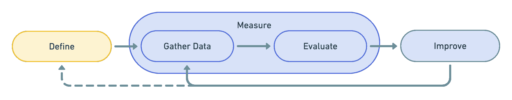
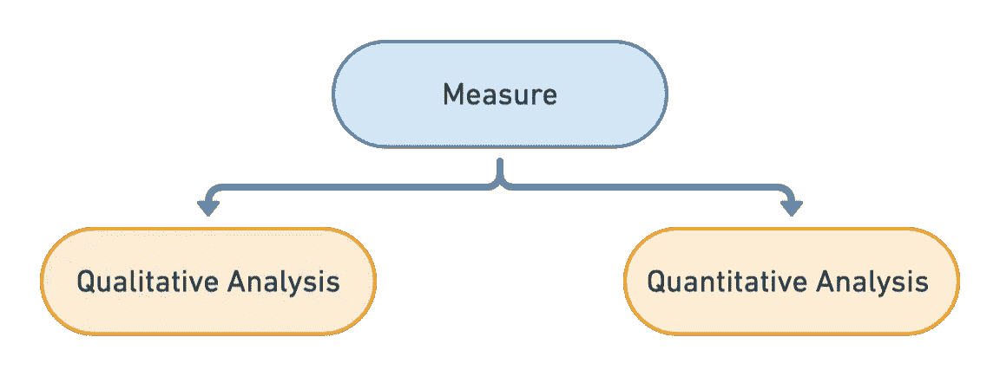
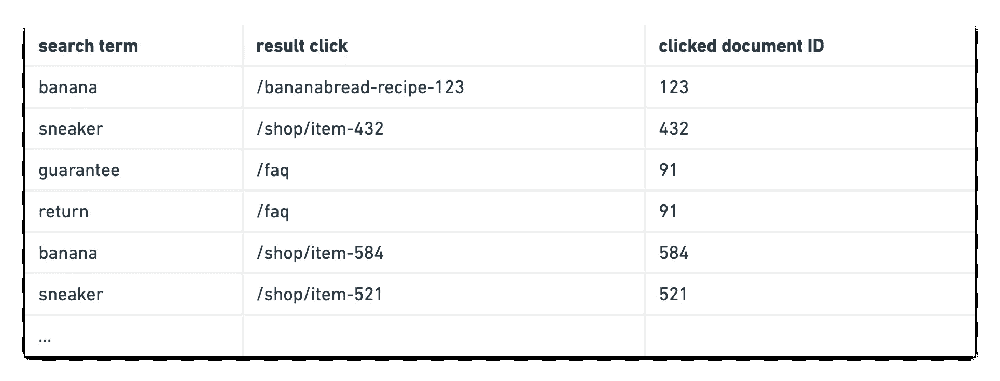

# 优化全文搜索引擎

> 原文：<https://javascript.plainenglish.io/improve-your-full-text-search-ec1138c201d3?source=collection_archive---------20----------------------->

## 如何根据真实用户反馈调整全文搜索引擎

在设计全文搜索及其搜索查询的过程中，我们经常假设客户将如何使用我们的搜索引擎。这只会出错。


Photo by [Christian Rucinski](https://unsplash.com/@xtchris?utm_source=ghost&utm_medium=referral&utm_campaign=api-credit) / [Unsplash](https://unsplash.com/?utm_source=ghost&utm_medium=referral&utm_campaign=api-credit)

在这篇博文中，我将向您展示我们如何利用真实世界的用户数据，基于定量分析来调整搜索引擎。我将回答以下问题:

*   全文搜索中用于信息检索的关键指标是什么？
*   我们如何利用真实世界的用户数据来改进我们的全文搜索？
*   如何对我们的全文搜索引擎进行定量分析？
*   我们如何确保更改 Elasticsearch 查询不会对全文搜索引擎的整体质量产生负面影响？
*   我们如何持续地提高全文搜索引擎的质量？

我将深入定义关键指标，收集真实世界的用户数据，对全文搜索进行定量分析，最后迭代改进我们的关键指标。



## TL；速度三角形定位法(dead reckoning)

*   定义搜索引擎的目标并选择匹配的 KPI
*   记录用户的搜索词及其结果点击。认为日志是基本事实，相信用户找到了想要的结果
*   使用该日志根据用户的查询来计算我们的搜索引擎的 KPI。我们的 KPI 将是我们搜索引擎成功的一个衡量标准。
*   在没有重新评估我们的 KPI 之前，永远不要更改 Elasticsearch 查询、索引模式或数据。

# 定义关键指标

在我们开始优化之前，我们必须非常清楚我们希望我们的搜索引擎实现的目标。我们的搜索引擎应该覆盖什么样的信息需求？谁使用搜索引擎？

我们的客户对单一结果感兴趣吗(例如，我接下来应该看哪部电影？我应该买哪双运动鞋？)或一个可能结果的列表，以获得一个概览(例如，我在哪些电子邮件中写了关于即将到来的夏季派对的内容？哪些文档是关于客户 X 的？).

根据用例，我们可以定义关键性能指标(KPI)来衡量搜索引擎的成功。信息检索常用的 KPI 大致可以分为两类:敏感性和特异性。

*敏感度* 衡量在第一批结果中找到相关匹配的成功程度。

*特异性* 衡量在第一个结果中找到所有相关记录的成功程度。

根据用例及上下文选择相关的 KPI。

# 敏感度 KPI

我们希望在搜索结果的顶部向客户展示最佳匹配的结果。在大多数情况下，如果想要的结果不在搜索页面的前 X 个结果中，或者不在搜索结果的第一页，客户就会离开。

**Hit-Rate@K** 客户请求命中的查询在前 K 个结果中的百分比。越高越好。如果我们的数据库中只有一个相关结果，这与 Recall@K(见下文)相同。

**MRR** [平均倒数排名](https://en.wikipedia.org/wiki/Mean_reciprocal_rank)计算客户请求点击的平均点击位置。越高越好。

# 特异性 KPI

我们希望为客户提供一个可能匹配的列表，按照匹配的降序排列。排名不是那么重要，但是必须列出所有相关的结果。

**回忆@K** 前 K 个结果中列出了多少个想要的结果？越高越好。0.6 的 Recall@10 表示在前 10 个结果中检索到 5 个期望结果中的 3 个。

**DCG
如果一个高度相关的结果被列在搜索结果的底部，就会受到惩罚。**

## 更多 KPI

这只是可能的 KPI 的一个选择。查看这篇维基百科文章，了解更多文档和更多评估方法:

 [## 评估措施(信息检索)-维基百科

### 信息检索系统的评价标准是用来评估检索结果满足用户需求的程度

en.wikipedia.org](https://en.wikipedia.org/wiki/Evaluation_measures_%28information_retrieval%29) 

# 措施

在我们定义了我们的关键指标之后，我们现在可以测量和评估我们当前的搜索引擎实现。

为了能够进行测量，我们首先需要一些数据。有两种选择:定性分析和定量分析。



当我们进行定性分析时，我们将我们的评估集中在单个用例上，并尽可能地努力生成测试数据的基本事实。这意味着我们为一组给定的查询字符串手动定义所有匹配的文档。这通常是乏味的工作，并且只涵盖了我们搜索引擎用例的很小一部分。因此，我们将仅对一组选定的非常重要的用例进行定性分析。

另一方面是定量分析:我们拥有的数据越多越好。它不一定总是 100%准确。对于定量分析，我们可以使用来自搜索引擎用户的日志数据。

# 收集数据

收集运行中的搜索引擎的日志数据。记录客户搜索的内容以及他点击的结果。

如果我们假设点击的结果是给定搜索查询的最佳匹配，那么我们可以使用日志数据来评估我们的搜索引擎。虽然这是一个假设，可能不是 100%准确，但我们比依赖我们的直觉或只为经理优化要好得多，他说最贵的运动鞋应该列在顶部。

为了收集日志数据，我们需要在搜索结果页面上实现一些跟踪。一旦用户点击搜索结果，我们就跟踪用户的搜索词以及被点击的搜索结果的 ID。对于进一步的长期分析，记录被点击的搜索结果的排名通常是有用的(它是第一个显示的结果还是在第 24 位？).但是对于我们的用例，我们目前只需要搜索词以及点击的结果。这应该会得到如下日志列表:



确保收集足够的日志数据。大约有 100，000 个搜索词，结果点击对应该没问题。如果适用，还要考虑搜索行为的季节性差异。日志数据应该提供我们的用户搜索行为的全面图片。

# 评价

现在，我们可以将这些数据输入到我们的搜索引擎中，并计算每个搜索词的关键指标——结果点击对。

把它带到我们的搜索查询中。假设我们在文档的*标题*字段上使用一个[简单匹配查询](https://www.elastic.co/guide/en/elasticsearch/reference/current/query-dsl-match-query.html):

```
GET /_search
{
  "query": {
    "match": {
      "title": "banana"
    }
  }
}
```

为了计算 Recall@10 KPI 分数，我们可以自己执行查询并计算分数，或者使用[排名评估 API](https://www.elastic.co/guide/en/elasticsearch/reference/current/search-rank-eval.html) 。为此，我们将数据日志的每个条目添加到排名评估 API 请求的 requests 数组中。用户的搜索词进入*requests[]request . query . match*查询，点击的文档 ID 作为文档列在 *requests[]中。评级*数组:

```
POST /my-index/_rank_eval
{
  "requests": [
    {
      "id": "test_query_1",                                  
      "request": {                                              
          "query": { "match": { "title": "banana" } }
      },
      "ratings": [                                              
        { "_index": "my-index", "_id": "bananabread-recipe-123", "rating": 1 }
      ]
    },
    {
      "id": "test_query_2",
      "request": {
        "query": { "match": { "title": "apple" } }
      },
      "ratings": [
        { "_index": "my-index", "_id": "apple-pie-531", "rating": 1 }
      ]
    }
  ],
  "metric": {
    "recall": {
      "k": 10,
      "relevant_rating_threshold": 1
    }
  }
}
```

这将提供我们的最终 KPI 指标分数:

```
{
  "rank_eval": {
    "metric_score": 0.4,
    "details": { ... }
  }
}
```

使用集成的排名评估 API，您可以轻松地[将指标更改为 MRR(*mean _ reciprocal _ rank*)](https://www.elastic.co/guide/en/elasticsearch/reference/current/search-rank-eval.html#_mean_reciprocal_rank)。

现在你已经准备好了！ *metric_score* 是对我们搜索引擎的第一次评价。这将是我们的 KPI，我们现在将努力改进它。

# 改进和适应

随着我们的搜索引擎的第一次评估，我们有一个我们的现状质量的概述。我们可能已经看到一些查询或搜索组合表现不佳。

现在是时候分析我们的结果了。我们能改进我们的搜索查询吗？也许我们需要改变我们的索引模式？也许我们需要改进或增强我们的数据？我们是否仍然有正确的绩效指标来衡量满足客户信息需求的质量？

所以我们有四种不同的方法来改进我们的搜索引擎:

*   弹性搜索查询
*   索引模式
*   索引数据
*   KPI 指标

根据结果调整搜索引擎，并确保在每次更改后重新运行评估。通过坚持明确定义的性能指标，您可以避免意外优化超过目标和无意中降低搜索引擎。

# 结论

使用用户的搜索数据来衡量我们搜索引擎的成功。尝试通过迭代过度优化和测量来优化搜索引擎。更改搜索查询、索引架构或增强文档数据。每次更改后，一定要重新计算搜索引擎的 KPI，以避免意外优化超过目标，无意中降低搜索引擎的性能。

你还想知道什么？在评论中告诉我们或者[联系](https://smartive.ch/)！

*更多内容看* [***说白了。报名参加我们的***](https://plainenglish.io/) **[***免费周报***](http://newsletter.plainenglish.io/) *。关注我们关于* [***推特***](https://twitter.com/inPlainEngHQ)[***领英***](https://www.linkedin.com/company/inplainenglish/)**和* [***不和***](https://discord.gg/GtDtUAvyhW) ***。******