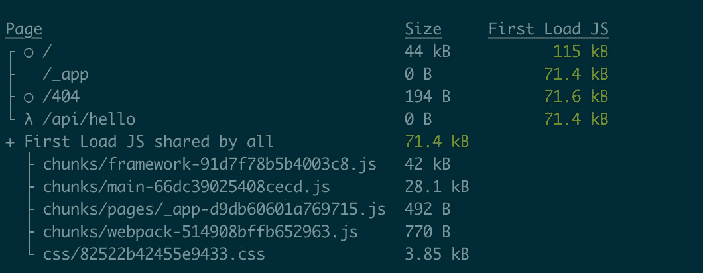
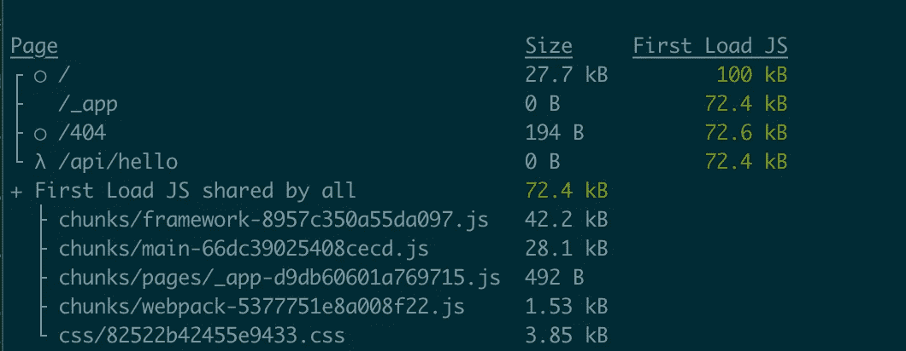
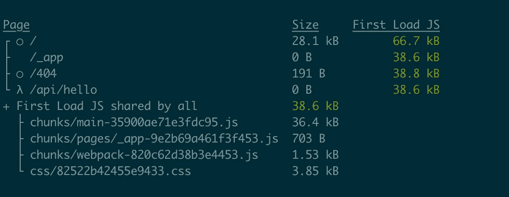
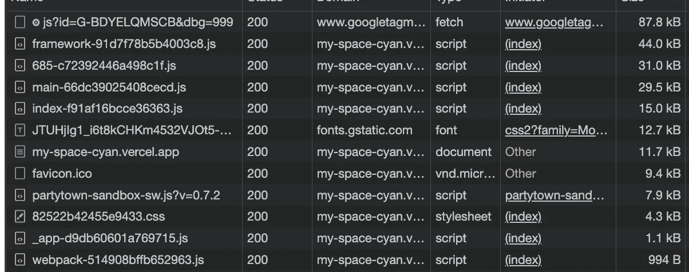
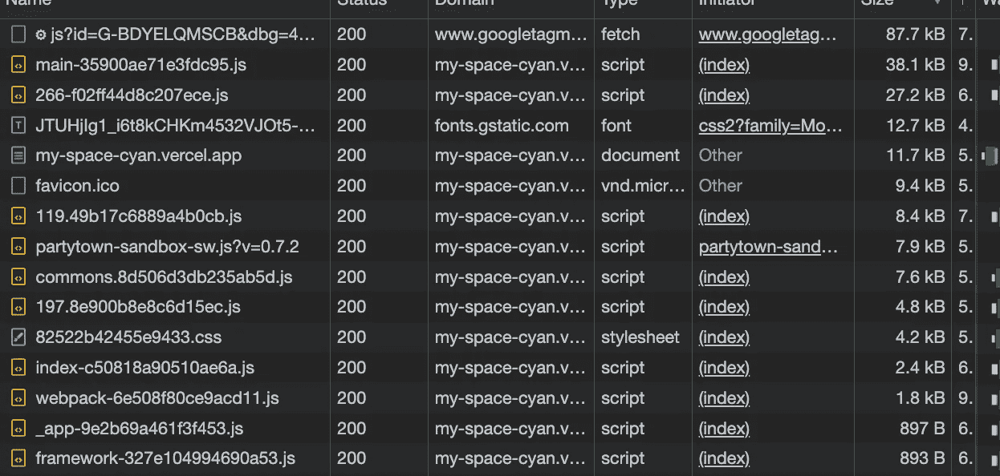

# 在 10 分钟内提高 Next.js 应用程序的性能

> 原文：<https://javascript.plainenglish.io/improve-your-nextjs-apps-performance-in-10-minutes-fb7c597be021?source=collection_archive---------4----------------------->


# 介绍

我们都知道 Next.ks 是相当重量级的，尤其是相对于 Svelte Kit 或者 Nuxt.js 而言，优化并不是每个人都喜欢的东西。您的产品所有者可能不想在优化上浪费时间，而更喜欢运输功能。您的 QA 和测试人员可能不想回归测试所有可能受影响的特性。

这篇文章是一个关于 Next.js 优化的简单教程，所以你可以在最短的时间内获得更好的性能，灯塔得分

# 重新定位您的第三方脚本

如果你的应用有谷歌分析，Hotjar，脸书像素…或任何第三方脚本。您可能希望将这些脚本重新定位到服务工作者和主线程之外。

我有一篇关于这个的文章[就在这里](https://duckylele.medium.com/use-your-third-party-scripts-without-the-performance-hit-with-partytown-b2860cd27007)

相信我，这不会花很长时间，结果可能会让你大吃一惊。

# 使用动态导入

Next.js 支持用`import()`惰性加载外部库，用`next/dynamic`惰性加载组件。通过减少呈现页面所需的 JavaScript 数量，延迟加载有助于提高初始加载性能。组件或库仅在使用时被导入并包含在 JavaScript 包中。

`next/dynamic`是`[React.lazy](https://reactjs.org/docs/code-splitting.html#reactlazy)`的延伸。当与`[Suspense](https://reactjs.org/docs/react-api.html#reactsuspense)`结合使用时，成分可以延迟水合作用，直到悬置边界被解决。

例如，我的主页有 4 个大块，但在第一次加载时只显示其中一个，用户必须滚动才能看到其他块。所以我不想一开始就加载全部 4 个:

```
const Overview = dynamic(() => import('./Overview'));
const Project = dynamic(() => import('./Projects'));
const Contact = dynamic(() => import('./Contact'));
```

现在让我们看看结果

之前:



之后:



您可以看到第一个负载 JS 从 115kb 减少到 100kb，不多，但它是诚实的工作

# 预先行动而不是反应

Next.js 构建在 react 之上，但 Preact 是一个 JavaScript 库，被认为是 React 的轻量级 3kb 替代方案，具有相同的现代 API 和 ECMA 脚本支持。

所以如果你的 app 只是一个普通的 Next.js app，我看不出有什么理由不用 Preact。它的缺点是缺乏社区支持。

如何实施:

*   首先，您必须安装 Preact
*   打开您的`next.config.js`文件并重新分配 react:

```
 webpack: (config, { dev, isServer }) => {
    if (!dev && !isServer) {
      Object.assign(config.resolve.alias, {
        react: 'preact/compat',
        'react-dom/test-utils': 'preact/test-utils',
        'react-dom': 'preact/compat',
      });
    }
    return config;
  },
```

现在看看性能:



束的大小明显更小。

但不仅如此，让我们看看生产中的情况:

以前



在...之后



你可以看到所有的 JS 文件都变小了。

# 结论

有许多其他方法可以提高你的应用程序性能，但是它们需要更多的工作和研究。

我希望上面的方法对你有用，如果没有，请在下面评论，我们会找到最好的方法！

*报名参加我们的* [***免费周报***](http://newsletter.plainenglish.io/) *。关注我们关于*[***Twitter***](https://twitter.com/inPlainEngHQ)，[***LinkedIn***](https://www.linkedin.com/company/inplainenglish/)*，*[***YouTube***](https://www.youtube.com/channel/UCtipWUghju290NWcn8jhyAw)*，以及* [***不和***](https://discord.gg/GtDtUAvyhW) ***。***

***有兴趣缩放你的软件启动*** *？检查* [***电路***](https://circuit.ooo?utm=publication-post-cta) *。*