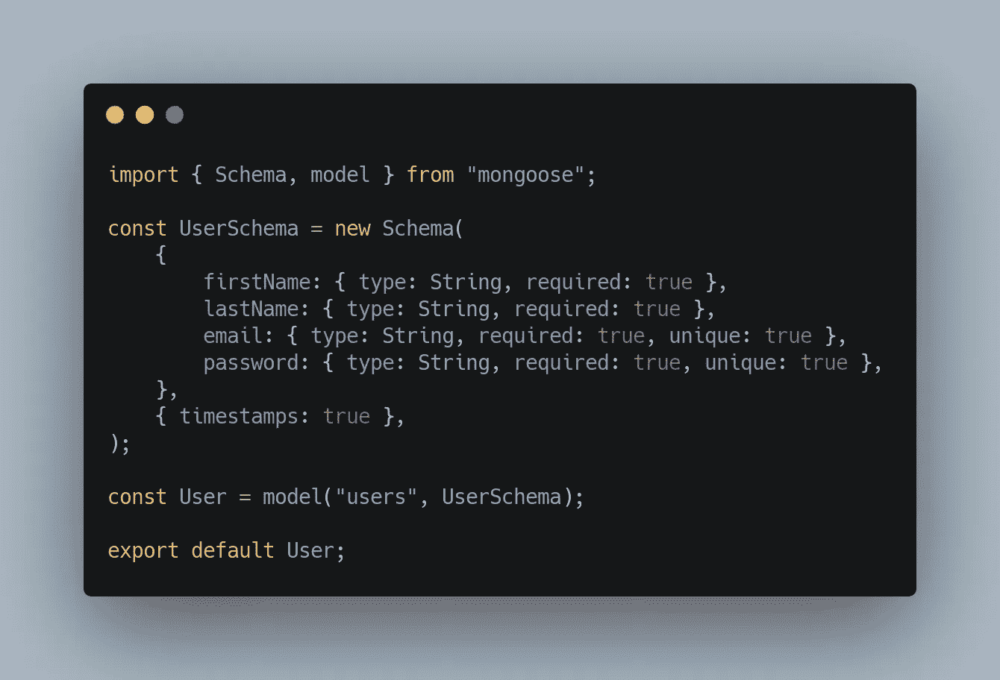
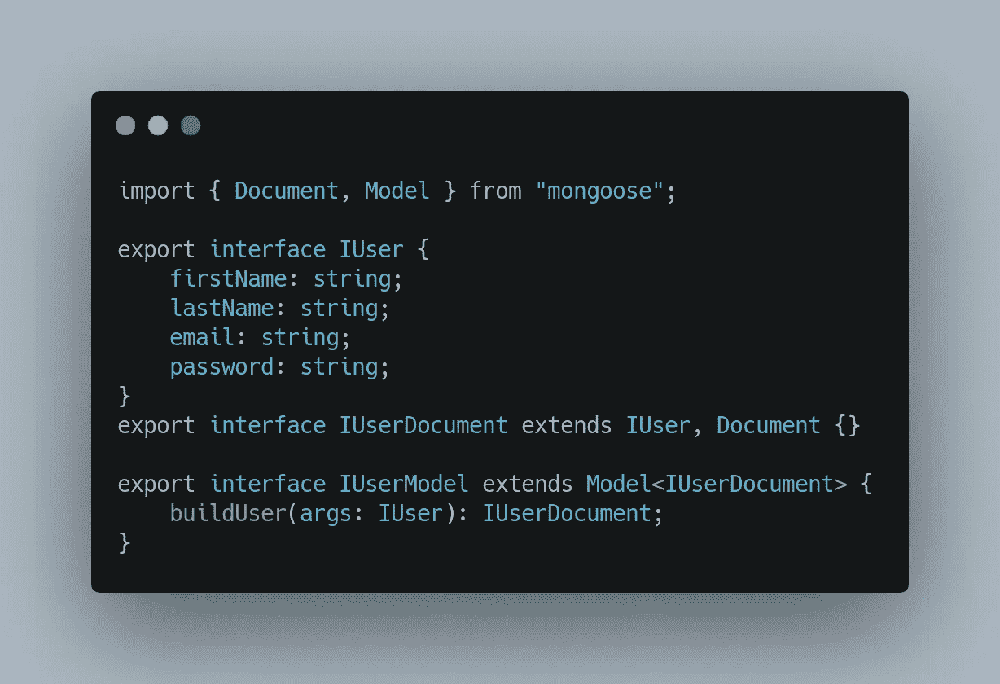
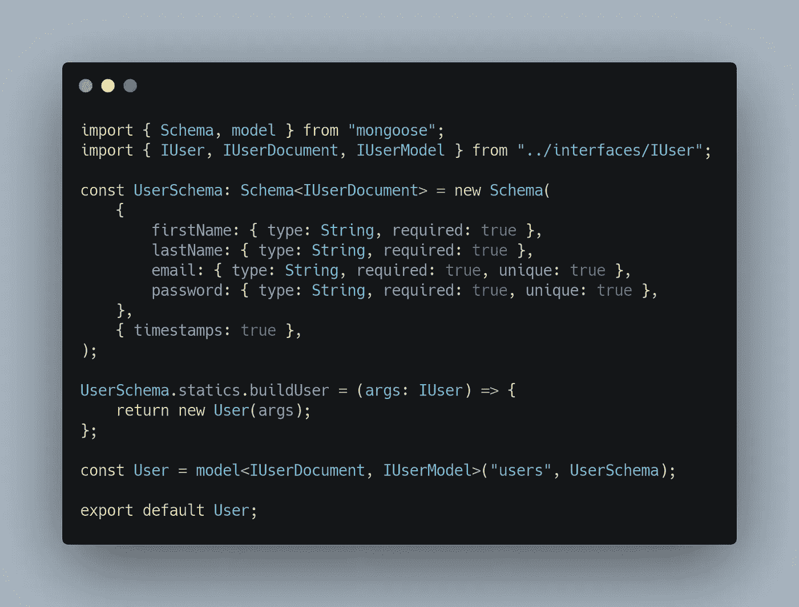

# 如何用 TypeScript 改进你的 Mongoose 模型

> 原文：<https://javascript.plainenglish.io/improving-mongoose-model-with-typescript-9a349f41c71?source=collection_archive---------0----------------------->

## 使用 TypeScript 来改进类型检查，并向您的 Mongoose 模型添加静态方法。

[*Source: a-z-animals.com*](https://a-z-animals.com/media/2021/11/What-Eats-Snakes-Mongoose.jpg)

# 什么是猫鼬？

哈哈的笑..不要混淆。我不会在这里谈论我们照片上的小朋友。有几种方法可以让 MongoDB 与 Node.js 应用程序一起工作，其中一种方法是使用一个名为 Mongoose 的外部库。如果你访问官方猫鼬页面，你会发现:

> 优雅的 [mongodb](https://www.mongodb.com/) 对象建模为 [node.js](https://nodejs.org/en/)

我得说这是千真万确的。

但是总有空间让我们的代码，我们的生活，比以前更好。为了使 Mongoose 模型更好，我们引入 TypeScript。公平的警告，将 TypeScript 添加到任何现有的项目中可能看起来像是大量的工作。从某些方面来说，这实际上是很大的工作量。但是回报真的很好…

# 🛠创建了一个猫鼬模型/模式

为了让我们的应用程序代码能够与 MongoDB 通信，我们必须首先创建一个定义，称为模型/模式。我们可以把它看作是我们的数据的蓝图，以及什么样的数据应该被允许给用户。

使用 TypeScript 时，创建一个类型或接口是个好主意。用隐式类型定义定义属性真的很有帮助。

# 💻代码时间

## ➕只是 JavaScript 第一

考虑下面的例子。这里，我们为`User`创建一个模型，它将注册或登录到我们的应用程序中。用户需要提供他们的`firstName`、`lastName`、`email`和`password`进行注册，并提供`email`和`password`进行登录。很简单，对吧？我们的 Mongoose 模型看起来会像这样(用普通的 JavaScript):

User model defined in JavaScript.

## ➕添加类型脚本接口

是时候把打字稿拿来了。让我们定义我们的`interface`，它将被用来对我们的`User`模型进行类型检查。

Interfaces used for User model — IUser, IUserDocument, and IUserModel

1.  `IUser` —定义`User`的外观、用户对象的属性以及允许的数据类型。
2.  `IUserDocument` —定义当我们运行任何类型的查询从 MongoDB 获取数据时，模式和响应文档结构的外观。IUserDocument 扩展了`IUser`和`Document`接口，实现了两者的属性。
3.  `IUserModel` —定义最终的`User`模型将会是什么样子，它将具有什么属性，以及它将包含什么额外的方法(如果有的话)。

你可能会好奇那个`UserSchema.statics.buildUser`是什么？通常，我们会做一些类似于`let newUser = new User({...properties})`的事情来创建一个新用户。这正是在`buildUser(args: IUser)`方法中发生的事情，作为静态方法附加到`UserSchema`上。

## 🚨代码，集合！

现在，我们有了普通的 JS 代码和 TS 接口，是时候把它们合二为一了。

Final User model with TypeScript interfaces added

1.  `Schema<IUserDocument>` —定义模式结构、预期属性和各自的数据类型。
2.  `buildUser(args: IUser): IUserDocument` —静态方法，附加到模型上，只是另一种创建新用户的方式，而不是使用`new User({...data})`。
3.  最后，`User`是一个 Mongoose 模型，它返回一个类型为`IUserDocument`的文档，并且具有在`IUserModel`中定义的方法和属性。

我们有了！用接口定义的更安全的`User`模型。如果在创建新用户时传递了错误的数据类型，TypeScript 编译器会立即对我们大喊，并抛出错误。

[在猫鼬官方网站上阅读更多关于猫鼬的信息](https://mongoosejs.com)。永远记住，没有比官方文件更好的了。

感谢阅读🙏

如果您喜欢这篇文章，请务必查看我的其他文章，其中我谈到了 React 和 Node.js。

🚀结束！

*更多内容请看*[***plain English . io***](https://plainenglish.io/)*。报名参加我们的* [***免费周报***](http://newsletter.plainenglish.io/) *。关注我们关于*[***Twitter***](https://twitter.com/inPlainEngHQ)*和*[***LinkedIn***](https://www.linkedin.com/company/inplainenglish/)*。查看我们的* [***社区不和谐***](https://discord.gg/GtDtUAvyhW) *加入我们的* [***人才集体***](https://inplainenglish.pallet.com/talent/welcome) *。*