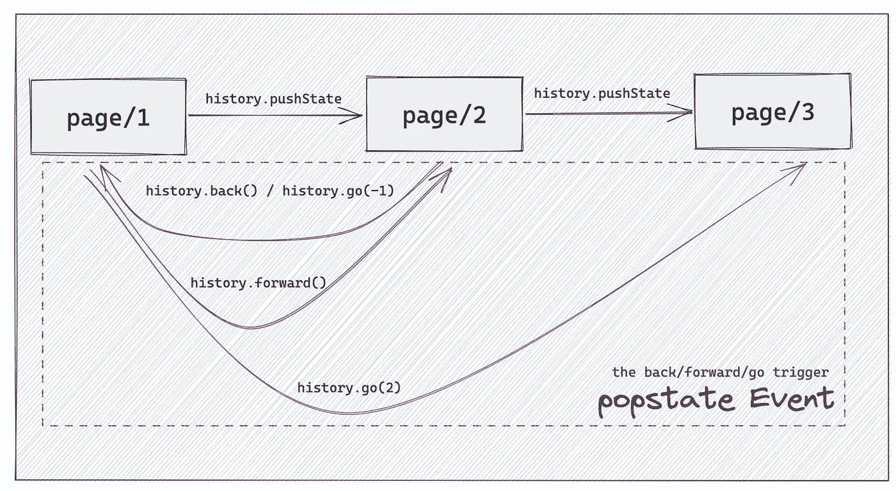

# 使用 H5 历史 API 改善页面体验

> 原文：<https://javascript.plainenglish.io/improving-page-experience-with-h5-history-api-1a23b64041a2?source=collection_archive---------6----------------------->


Photo by [Richy Great](https://unsplash.com/@richygreat?utm_source=medium&utm_medium=referral) on [Unsplash](https://unsplash.com?utm_source=medium&utm_medium=referral)

当我们用谷歌搜索某样东西时，会有很多结果。如果第一页没有期望的结果，我们可以切换到下一页，当我们点击浏览器返回图标时，我们可以继续看到上一页的内容。

是的，这是一次很好的经历，我们怎样才能让我们的页面变成这样。在本文中，我们将学习如何使用 H5 历史 API 来实现这个功能。

## 历史 API 简介

[历史应用编程接口](https://developer.mozilla.org/en-US/docs/Web/API/History_API)提供了许多有用的方法和属性，我们可以导航回页面并操作历史堆栈的内容。



我们可以用`history.pushState/replaceState`打开新的页面，用`history.forward`向前，用`history.back`向后，甚至可以用`history.go`方法从会话历史中加载一个特定的页面。

当我们向前或向后移动时，无论是使用历史 api 还是使用浏览器导航图标，都会触发`window.onpopstate`事件，我们可以做一些与页面相关的事情。

## 创建带有分页的页面

我们将为 unsplash 的猫图片创建一个页面:

每个人都可以使用 [unsplash](https://unsplash.com/) 的 open api 来检索图片，我们在这里搜索猫图片，每页显示 9 张图片。

当我们点击下一步按钮，然后刷新页面时，页面状态会丢失，并且会显示第一页的图片。所以我们可以通过在 url 中添加分页来解决这个问题。

## 使用历史应用编程接口将分页参数添加到 url

我们可以使用`history.pushState`在不刷新页面的情况下更改网址。因此，当我们单击“下一步”按钮时，我们将分页参数添加到 url 搜索中:

```
history.pushState(null, '', `${window.location.pathname}?page=${currentPage+1}`);
// don't forget to reload the next page pictures
fetchDataFromUnsplash(currentPage+1);
```

当我们点击 pre 按钮时，只需使用`history.back`方法返回最后一页。

[Codepen.io](https://codepen.io/bitbug/full/oNyBZNO) 不支持更改在 iframe 中执行的代码的历史状态。我在本地复制了这段代码，并使用 gif 来显示效果:


当我们点击“下一步”或“前一步”按钮时，分页信息将被保存到 url 搜索参数中。所以当我们刷新页面时，总是会显示上次访问的视图。您可以在此代码中查看更多详细信息:

## 最后

在本文中，我们将学习如何使用 H5 历史 API 来记录分页参数，以获得更好的体验。虽然它只使用 history.pushState 并监听 popstate 事件，但这是 react-router 的基础。

希望这能对您有所帮助，还有另一篇与历史 API 相关的文章:

[](/two-tips-of-history-to-improve-page-experience-947223666f71) [## 2 个提高页面体验的历史技巧

### 使用历史的 scroll restore 属性和 pushState/replaceState 的状态参数来恢复滚动…

javascript.plainenglish.io](/two-tips-of-history-to-improve-page-experience-947223666f71) 

*更多内容请看*[***plain English . io***](https://plainenglish.io/)*。报名参加我们的* [***免费周报***](http://newsletter.plainenglish.io/) *。关注我们关于*[***Twitter***](https://twitter.com/inPlainEngHQ)[***LinkedIn***](https://www.linkedin.com/company/inplainenglish/)*[***YouTube***](https://www.youtube.com/channel/UCtipWUghju290NWcn8jhyAw)*[***不和***](https://discord.gg/GtDtUAvyhW) *。对增长黑客感兴趣？检查* [***电路***](https://circuit.ooo/) *。***