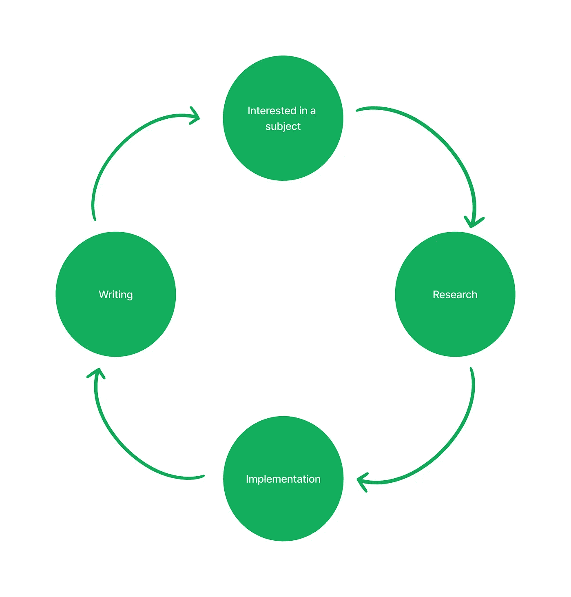

# 2022 年，我找到了一个简单的方法来完成我的兼职项目

> 原文：<https://javascript.plainenglish.io/in-2022-i-found-a-simple-method-to-accomplish-my-side-projects-238721f59918?source=collection_archive---------5----------------------->

## 让个人项目充满乐趣，而不是负担

Photo by [Felipe Furtado](https://unsplash.com/@furtado?utm_source=medium&utm_medium=referral) on [Unsplash](https://unsplash.com?utm_source=medium&utm_medium=referral)

# 我是如何没能完成我的项目的

像其他开发人员一样，我喜欢构建应用程序。我把空闲时间花在编程上，因为这很有趣。此外，做项目是我提高编码技能的首选方法。

然而，尽管开始一个新项目总是令人兴奋的，但完成一个项目却充满挑战。我在填写申请表时遇到了许多问题。

许多因素会阻止我们完成一个项目，包括缺乏明确的目标或方向、注意力分散、完美主义等等。就我而言，我经常在项目进行中分心。以下是我脑子里的想法，按顺序排列:

好的，我们开始一个项目。我们将构建一个优雅的应用程序。让我们用干净的代码实现一个可扩展的架构。

*啊，我有新想法了。*

*我会添加这个新功能。很酷。*

我最好使用这个库，而不是当前的。

哦…我一开始就不应该这么做。这不是我想要的。让我们改变代码。

我浪费了太多时间在这个和那个之间切换。

哦……这个项目看起来一团糟……我不能继续了……我想要一个更干净的项目。

我放弃了我的项目很多次。

# 我的解决方案

去年，我开始在媒体上写文章。起初，我写的是非技术性的文章。然后，在做我的第 n 个副业项目的时候，我考虑写一个关于 Medium 的教程。

这个想法改变了游戏。

因为我喜欢张贴我的内容，所以我有动力完成项目和写文章。我的项目也有一个虚拟观众。

目标变得清晰了。我排除了所有花哨但不相关的想法。我努力让应用程序尽可能简单。因为如果很复杂的话，我在教程里解释不出来。选择图书馆没花我太多时间。我使用任何能胜任工作的东西，并且有据可查。

我就是这样完成这个项目的。

 [## 使用 AdminJS 快速构建管理 Web 应用程序

### 图书馆能为我们节省时间

javascript.plainenglish.io](/use-adminjs-to-quickly-build-an-administration-web-app-1a6421fe7864) 

如果这个项目不适合一篇文章，我们可以把它分成几篇。以下是我最近完成的一些项目，遵循同样的原则。

 [## 带有 JavaScript 的网络爬虫——这些简单的步骤帮助我获得中等文章的数据

### 检索文章的有价值信息以供进一步分析

javascript.plainenglish.io](/web-crawler-javascript-these-easy-steps-help-me-get-medium-articles-data-3b9e9e76594)  [## 出于好奇，我分析了大约 18 万篇关于媒体的文章

### 了解领先的博客平台之一

medium.com](https://medium.com/@ddkhoa.blogging/of-curiosity-i-analyzed-180-000-articles-on-medium-53f359ecdecc) 

# **更多优点**

除了完成项目的动机之外，在媒体上分享成果还有其他不可忽视的好处。

## 学习——第二次

当我写教程的时候，我会考虑到受众，并找到一种直截了当的方式来解释这个概念。化繁为简的过程帮助我更好地理解我的代码。

边做边学是最有效的方法之一。现在我们把它与向他人解释和教授结合起来。是对学习最有力的组合吗？

## 留着以后用

创建一个教程并发布在 Medium 或你的博客上，你将永远拥有它。以后需要的时候可以随时咨询。

## 一点奖励。为什么不呢？

如果您是中型合作伙伴计划的成员，您可以将您的文章货币化。如果你的内容吸引了读者，并为他们提供了价值，你可能会得到应得的回报。

## 你个人资料中的一个优点

你的文章会让招聘人员对你的能力有更多的了解。它比我们通常在简历中列出的技术清单更有利于人力资源。在我看来，在与其他候选人竞争时，公开指纹是个人资料中的一个优势。

## 生产循环

最后，我们必须认识到内容发布和读者欣赏时产生的正能量。从我的经验来看，我感觉最有动力的时刻是在我发布一个之后。这种能量给了我们更多的动力去开始新的研究！循环返回到起点。

The productive loop

# 通知；注意

使用该方法时要记住一件事。你应该清楚地定义副项目的目标。如果你想学习新的东西，不要仅仅因为你的文章在类别中有很多观点就依赖旧的观点。对我来说，在媒体上发布结果是这个过程中的一步。我不会让它转移我对最初目标的注意力。

# 结论

在这篇文章中，我解释了完成我的应用程序的简单方法。对于面临同样问题的读者，我希望这篇文章能给你一些想法来完成你的兼职项目。感谢您的阅读！

*更多内容请看*[***plain English . io***](https://plainenglish.io/)*。报名参加我们的* [***免费周报***](http://newsletter.plainenglish.io/) *。关注我们关于*[***Twitter***](https://twitter.com/inPlainEngHQ)[***LinkedIn***](https://www.linkedin.com/company/inplainenglish/)*[***YouTube***](https://www.youtube.com/channel/UCtipWUghju290NWcn8jhyAw)*[***不和***](https://discord.gg/GtDtUAvyhW) ***。*****

*****对缩放您的软件启动感兴趣*** *？检查* [***电路***](https://circuit.ooo?utm=publication-post-cta) *。***